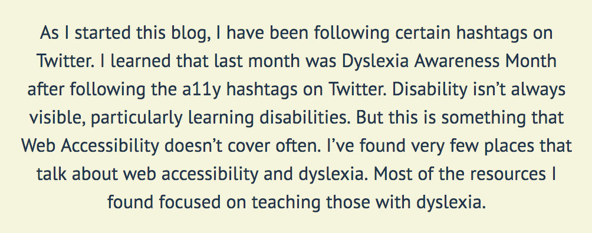
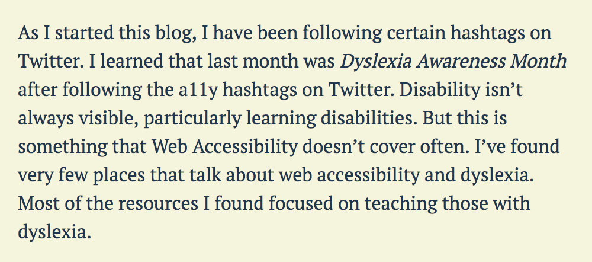

_Content Warning: This blog post contains gifs._

As I started this blog, I began to follow specific hashtags on Twitter. I learned that last month was Dyslexia Awareness Month after following the a11y hashtags on Twitter. I’ve always said that disability isn’t always visible, mainly learning disabilities. However, this is something that Web Accessibility doesn’t cover often. I’ve found very few places that talk about web accessibility and dyslexia. Most of the resources I found focused on teaching those with dyslexia.

I’ve spent the last couple of weeks researching how to make my content more accessible to those who have dyslexia. I am learning along with you in this blog post. Here is what I’ve learned:

## Style your copy properly

There are a few things that can contribute to the readability of your site. A couple I’ve found are text alignment and typography.

### Text alignment

Ensure left alignment. Having a fixed left alignment makes it easier for people to find the next line of text. Proper text alignment helps all people, not only dyslexic users. This is bad:

### Avoid justified text

The uneven spacing between the words trips people up. The reason for this is it causes dyslexic users to lose their place and start over. This is bad:

### Typography

Write in sans serif. Something we do not think about is that serif’s add decoration. Serifs can be distracting, particularly for dyslexic users. Using sans serifs helps dyslexic users who tend to use their memory of shapes for letters. Also, italics can be problematic and blend with regular text. If you want emphasis, use bold text. This is bad (serif and italic):

 and this is good:

I never realized how badly this impacts those with dyslexia. The great news is these fixes are straightforward. I have a few updates that I’d like to make to my site now that I’ve learned about how these issues impact dyslexic users.

## Structure your content

This section is where I hear my Public Relations education come back. I remember my professors scolding any time I wrote verbose sentences or in a passive voice. Public Relations is about making information transparent and readable. We must ensure that your readers understand the point of your content.

<blockquote class="twitter-tweet" data-lang="en">
This sentence was incredibly hard to decipher. It&#39;s gotta be me and not you.... brain so tired from reading and writing all day <a href="https://twitter.com/hashtag/dyslexia?src=hash&amp;ref_src=twsrc%5Etfw">#dyslexia</a> <a href="https://twitter.com/hashtag/NaNoWriMo?src=hash&amp;ref_src=twsrc%5Etfw">#NaNoWriMo</a>
&mdash; Rachel is Writing (@RachelisScience) <a href="https://twitter.com/RachelisScience/status/1061728503383707652?ref_src=twsrc%5Etfw">November 11, 2018</a></blockquote>

Let's break up a few of the things I learned.

### Break up text

Use headings and images to break up large blocks of text. Breaking up long paragraphs gives people a break from a wall of text, which makes it more digestible for everyone. I do this frequently because it helps me to keep my key points clear.

### Avoid Passive Voice

What is the active voice and the passive voice? Active voice is when there’s a definite subject of a sentence that is acting. Passive voice is when the subject is being acted upon. Here is an example of passive voice: “The change was approved by the committee.” Changing it to active voice is simple: “The committee approved the change.” Scientific writing tends to use passive voice, and the result of passive voice is sometimes wordy sentences.

### Avoid Double Negatives

You may think it sounds sexy. However, it makes people second guess what you’re trying to say. Particularly those who have dyslexia. So say it directly. Use a positive instead of a double negative to convey a positive.

### Tools to help with your content

I learned about the [Hemingway app](http://www.hemingwayapp.com/) in my research. I used the Hemingway app while writing this post! By the way, if you are dyslexic, this app may not be the most ideal because it uses a serif font. The app tells you what reading level your writing is and how many characters and words. It’s a fantastic tool, and I’m excited to use it in my writing!

## Don't change your content too quickly

Slideshows already annoy me as someone who doesn’t have dyslexia. Imagine going to a page that has a hero carousel. As you’re halfway through the sentence, it switches on you!

It is even worse for people with dyslexia, who tend to read slower. If you’re changing your content in a carousel, then you should give at least 25% more time than you’d think. Adding the extra time would help accommodate those who read a little bit slower.

What are some alternatives? It might be worth asking if there needs to be a carousel at all. Right now, singular heroes are more on trend than carousels. Can you include one hero image as the focal point of your text? If you have multiple pieces of content you’d like to showcase, provide an option to switch from one to the other manually.

## Provide audio formats of your content

One of the best ways to help out our dyslexic users is to give people alternate formats, particularly audio or video. I can imagine if I had difficulty with a lot of text, having a different version would calm my anxieties. Empathize with your users by giving them the ability to choose how they digest your content. That way if they get frustrated with reading through your content, they can listen instead. Audio formats could also benefit users with visual impairments.

As of this date, I have been using my friend [Kyle Galbraith](https://twitter.com/kylegalbraith)'s tool [parler.io](https://parler.io/). It is a service that automatically creates an audio file for your blog posts, so long as your blog has an RSS feed. Super neat! This tool is currently free to use, and I love it!

<video controls width="590" muted>
<source src="parler-io-demo.mov" />
</video>

If you don't want to use this service and creating your own audio files is outside of your budget, ensure that your web pages are screen reader friendly. From what I understand, dyslexic users sometimes use screen readers to assist them with content, so navigating a page with a screen reader should be intuitive.

## Sources

I need to give credit where credit is due, because I barely had any information on dyslexia for web prior to writing this blog post. Below are the sources I used to research this and learn more information:

- [Five ways to make usable websites for people with dyslexia](https://www.userzoom.com/blog/five-ways-to-make-usable-websites-for-people-with-dyslexia/)
- [6 Surprising Bad Practices That Hurt Dyslexic Users](http://uxmovement.com/content/6-surprising-bad-practices-that-hurt-dyslexic-users/)

What are your thoughts on dyslexia for the web? Do you have Dyslexia? If so, I’d love to hear what helps you as I am learning as I go with this one. Feel free to reach out to me on [Twitter](https://twitter.com/LittleKope/) if you have questions about this blog post.
