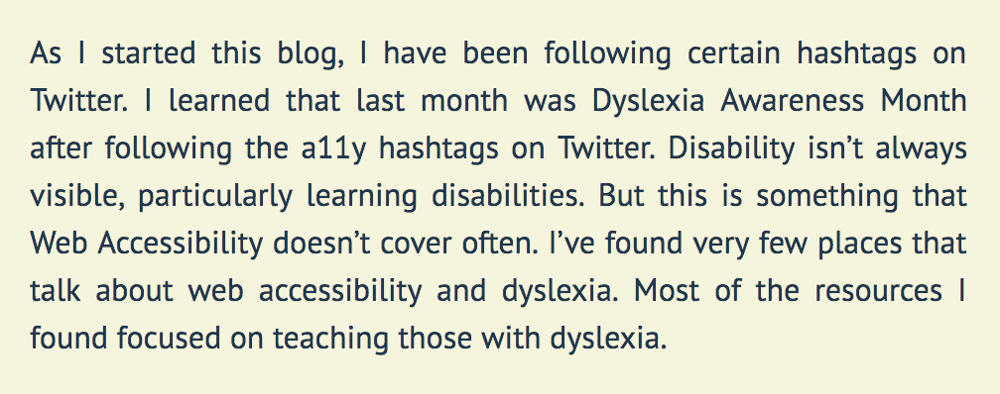
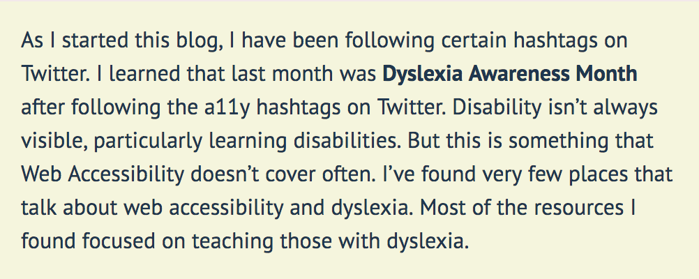

As I started this blog, I have been following certain hashtags on Twitter. I learned that last month was Dyslexia Awareness Month after following the a11y hashtags on Twitter. I've always said that disability isn’t always visible, particularly learning disabilities. But this is something that Web Accessibility doesn’t cover often. I’ve found very few places that talk about web accessibility and dyslexia. Most of the resources I found focused on teaching those with dyslexia. 

I've spent the last couple of weeks doing research on how to make my content more accessible to those who suffer from dyslexia. I am learning along with you in this blog post. Here is what I've learned:

## Style your copy properly
There are a few things that can contribute to the readability of your site. A couple I've found are text alignment and typography.

- **Text alignment**: Ensure left alignment. Having a fixed left alignment makes it easier for people to find the next line of text. This helps all people, not only dyslexic users. This is bad: 

- **Avoid justified text**: The uneven spacing between the words trips people up. The reason for this is it causes dyslexic users to lose their place and start over. This is bad: 

- **Typography**: Write in sans serif. Something we do not think about is the serif's add decoration. This can be distracting, particularly for dyslexic users. Using sans serifs helps dyslexic users who tend to use their memory of shapes for letters. Also, italics can be problematic and blend with normal text. If you want emphasis, use bold text. This is bad (serif and italic): 
 and this is good: 

I've never realized how badly these things impacted those with someone suffering from dyslexia. The great news is these fixes are very simple. I have a few updates that I'd like to make to my site now that I've learned about how these issues .  

## Structure your content so that it is readable
This is where I hear my Public Relations education come back. I remember my professors scolding any time I wrote verbose sentences. Or when I wrote in passive voice. Public Relations is about making information clear and readable. 

- Use headings and images to break up large blocks of text. I do this frequently because in general, it helps me to keep my key points clear. 
- Avoid passive voice. Here is an example of passive voice: "The change was approved by the committee." Changing it to active voice is simple: "The committee approved the change." Scientific writing tends to use passive voice. The result of passive voice is wordy sentences.
- Avoid double negatives. It causes confusion regardless of who you are.

<blockquote class="twitter-tweet" data-lang="en">
This sentence was incredibly hard to decipher. It&#39;s gotta be me and not you.... brain so tired from reading and writing all day <a href="https://twitter.com/hashtag/dyslexia?src=hash&amp;ref_src=twsrc%5Etfw">#dyslexia</a> <a href="https://twitter.com/hashtag/NaNoWriMo?src=hash&amp;ref_src=twsrc%5Etfw">#NaNoWriMo</a>
&mdash; Rachel is Writing (@RachelisScience) <a href="https://twitter.com/RachelisScience/status/1061728503383707652?ref_src=twsrc%5Etfw">November 11, 2018</a></blockquote>

Ensure that your content is readable. I learned about the [Hemingway app](http://www.hemingwayapp.com/) in my research. I used the Hemingway app while writing this post! By the way, if you are dyslexic, this app may not be the most ideal because it uses serif font. The app tells you what reading level your writing is, how many characters, words, etc. It's a fantastic tool and I'm excited to use it in my writing!

## Don't change your content too quickly

This already annoys me as someone who doesn't suffer from dyslexia. Imagine going to a page that has a hero carousel. As you're halfway through the sentence, it switches on you! 

It is even worse for people with dyslexia, who tend to read more slowly. If you're changing your content in a carousel then you should give at least 25% more time than you'd think. This would help accomodate those who read a little bit slower.

It might be worth asking if there needs to be a carousel at all. Can you include one hero image as the focal point of your text? If you have multiple pieces of content you'd like to showcase, provide an option to manually switch from one to the other. 

## Provide audio formats of your content
One of the best ways to help out our dyslexic users is to give people alternate formats, particularly audio or video. Empathize with your users by giving them the ability to choose how they digest your content. That way if they get frustrated with reading through your content, they can listen instead. This could also benefit users with visual impairments.

As of this date, I have been starting to use my friend [Kyle Galbraith](https://twitter.com/kylegalbraith)'s tool [parler.io](https://parler.io/). It is a service that automatically creates an audio file for your blog posts, so long as your blog has an rss feed. Super neat! This tool is currently free to use and I love it!

## Sources

Sources I used to research this and learn more information:
- https://www.userzoom.com/blog/five-ways-to-make-usable-websites-for-people-with-dyslexia/
- http://uxmovement.com/content/6-surprising-bad-practices-that-hurt-dyslexic-users/ 