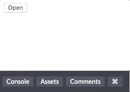
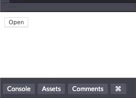

Hey friends! Hope you’ve had a great week! This tweet I wrote a while back inspired me to write this blog post:

<blockquote class="twitter-tweet">
Fun fact about me: I started learning about JavaScript BECAUSE of accessibility, not in spite of it.
&mdash; Lindsey Kopacz 🐞 (@LittleKope) <a href="https://twitter.com/LittleKope/status/1148576284332699651?ref_src=twsrc%5Etfw">July 9, 2019</a></blockquote>

One of the responses was “this would be a good blog post.” So here I am.

In this post I’m going to go over:

1. Background on my first project as the sole front end developer
1. The requirements of that project that led me to get better at JavaScript
1. Creating a popup menu that allowed me to start playing with JavaScript
1. The accessibility issues I faced that I solved using JavaScript
1. Learning about progressive enhancement
1. How I would improve things now

## Background

About 3-4 years ago, while I’d been in tech for a couple of years, I finally knew that I wanted to be a **front end developer**. I talked to my boss about owning the front end development on a project. My boss loved finding fitting projects for developer strengths and their desired growth. The project she assigned to me wasn’t particularly sexy. However, it was perfect for my learning. It was **not** a redesign.

Different, right? You rarely hear about build projects that aren’t redesign. The job: migrate their content to WordPress. The client disliked their previous CMS’s user experience but wanted to keep their design the same. This project allowed me to improve their CSS, accessibility, and performance.

## The requirements

There was one primary requirement that had me in a panic. I was **not** allowed to use jQuery. At the time, I thought it was a silly requirement and couldn't fathom why we weren't allowed to use jQuery. JavaScript frameworks, like Angular and React, were still new to the market. Drupal and WordPress still heavily relied on jQuery.

The other main requirement was that I was not allowed to alter the content markup in any way. We’ll talk more about this in another post, but this ended up being a bit of a blessing for progressive enhancement!

I'm not going to talk **too** much about WordPress or CSS in this post. However, I am going to quickly go over some of the tasks that I remember doing to get things set up with accessibility in mind. At the time, I understood accessibility from a UI developer perspective, but not about the intersection of JavaScript.

## Starting in JavaScript

We had a base theme at our agency, and I used that to get started. The theme was a blank slate with CSS and some JavaScript for accessible navigation. The first time I had to encounter JavaScript was when I created a language dropdown menu.

This website had many language sites, over 20. This menu’s purpose was to switch the language. We kept the existing functionality, which was a menu of links to each languages' homepage. Ideally, I would want to have the language switcher to get the page the user was on. However, remember, we were not changing any of the functionality; it was a migration project.

Starting with the JavaScript, I created a button with an unordered list. Then we are going to use `addEventListener` to toggle a `visually-hidden` class. To read more about visually hidden, check out the [A11y Project's post](https://a11yproject.com/posts/how-to-hide-content/) about it.

<iframe height="450" style="width: 100%;" scrolling="no" title="Language Menu - Step 1" src="//codepen.io/littlekope0903/embed/KKPVjPb/?height=450&theme-id=dark&default-tab=html,result" frameborder="no" allowtransparency="true" allowfullscreen="true">
  See the Pen <a href='https://codepen.io/littlekope0903/pen/KKPVjPb/'>Language Menu - Step 1</a> by Lindsey Kopacz
  (<a href='https://codepen.io/littlekope0903'>@littlekope0903</a>) on <a href='https://codepen.io'>CodePen</a>.
</iframe>

Simple enough, right?

Wrong.

## Accessibility Issues

When we do it this way, we can focus on links that are not visible. Take a look at this gif, and particularly the bottom left corner where you see the links. Do you notice when we focus on the button, we see a blue outline? When we start tabbing again, **all the links** we hid are focusable. We cannot see **where** it the focus of the link is

What I did in the past was **way more** overkill than I needed. I set all the tabindexes of the links inside that menu to be `-1` upon page load. In that event listener, I also checked to see if the class existed and based the tabindex toggle off that. There is a silver lining of me going over the top with my code. I learned a lot about the properties of HTML elements in JavaScript. Which was valuable to me strengthening my skills in JavaScript. All while learning about focus management, which is important for accessibility.

<iframe height="450" style="width: 100%;" scrolling="no" title="Language Menu - Step 2" src="//codepen.io/littlekope0903/embed/KKPzZXM/?height=450&theme-id=dark&default-tab=js,result" frameborder="no" allowtransparency="true" allowfullscreen="true">
  See the Pen <a href='https://codepen.io/littlekope0903/pen/KKPzZXM/'>Language Menu - Step 2</a> by Lindsey Kopacz
  (<a href='https://codepen.io/littlekope0903'>@littlekope0903</a>) on <a href='https://codepen.io'>CodePen</a>.
</iframe>

Ah much better, at least functionally.

When I first started, I thought that `display: none` was always bad for accessibility. But it's not. If something isn't open, **nobody** should be able to access it, not even screen reader users. So I'm going to change it up a bit.

## What I wish I had done:

1. remove the `visually-hidden` class
2. set `.lang-menu` to `display: none` and when I append the `.open` class, change styling to `display: block`
3. Change the toggle classList to toggle the class `open`.

<iframe height="450" style="width: 100%;" scrolling="no" title="Language Menu - Ideal Step 2" src="//codepen.io/littlekope0903/embed/wvwGpzV/?height=450&theme-id=dark&default-tab=html,result" frameborder="no" allowtransparency="true" allowfullscreen="true">
  See the Pen <a href='https://codepen.io/littlekope0903/pen/wvwGpzV/'>Language Menu - Ideal Step 2</a> by Lindsey Kopacz
  (<a href='https://codepen.io/littlekope0903'>@littlekope0903</a>) on <a href='https://codepen.io'>CodePen</a>.
</iframe>

Doing the above steps won't solve the problem entirely, though. Let's talk about progressive enhancements.

## Progressive Enhancements that I wish I had done

Unfortunately, neither of these strategies account for progressive enhancement. If JavaScript doesn’t load or loads slowly, we want people to still able to access the navigation menu. Let’s say JS doesn’t load, what happens to our users for this implementation?

If JavaScript doesn't load and the `ul` element has `display: none`, nobody can **ever** see the language menu. That's because there's no way to toggle the menu open without the event listeners.

There are a few things I would do for progressive enhancement.

1. Add a `no-js` class
1. Remove that class as soon as JavaScript loads.
1. Change up the open/close to focus more on the "close" and load a class in upon JavaScript loading.
1. Create some default styling with `no-js`, so it doesn't look unsightly (I'm not going to do that here)
1. Hide the button visually and from assistive technology, if `no-js` is present.

<iframe height="450" style="width: 100%;" scrolling="no" title="Language Menu - Ideal Progressive Enhancement" src="//codepen.io/littlekope0903/embed/YzKGEWy/?height=450&theme-id=dark&default-tab=html,result" frameborder="no" allowtransparency="true" allowfullscreen="true">
  See the Pen <a href='https://codepen.io/littlekope0903/pen/YzKGEWy/'>Language Menu - Ideal Progressive Enhancement</a> by Lindsey Kopacz
  (<a href='https://codepen.io/littlekope0903'>@littlekope0903</a>) on <a href='https://codepen.io'>CodePen</a>.
</iframe>

## Adding context with ARIA

If you've read my [Demystifying ARIA blog post](/blog/beginning-demystify-aria) you know that I add ARIA only at the end when I need more context. I didn't know anything about ARIA when I first started working as a web developer, so I never added that to the code.

Here are the ARIA attributes that I am going to add:

- `aria-expanded` to indicate to a user whether the menu is open or closed. The value toggles between true and false on the event listener.
- `aria-haspopup` to indicate that the element has a popup context menu or sub-level menu.

<iframe height="450" style="width: 100%;" scrolling="no" title="Language Menu - Ideal Solution with ARIA" src="//codepen.io/littlekope0903/embed/BaBQVQg/?height=450&theme-id=dark&default-tab=js,result" frameborder="no" allowtransparency="true" allowfullscreen="true">
  See the Pen <a href='https://codepen.io/littlekope0903/pen/BaBQVQg/'>Language Menu - Ideal Solution with ARIA</a> by Lindsey Kopacz
  (<a href='https://codepen.io/littlekope0903'>@littlekope0903</a>) on <a href='https://codepen.io'>CodePen</a>.
</iframe>

To test on macOS:

1. open up Safari and turn on a screen reader using cmd + F5.
1. Use VoiceOver Commands to select the button. It should read “Open, Collapsed, Popup button.”
1. Press enter. The screen reader should read “Open, Expanded, Popup Button.”

See the video below:

<video controls>
  <source src="/a11y-aria-js.mov" type="video/mp4">
</video>

These aria attributes give direction to a screen reader user about **how** to interact with the button. It would be even better if I had a more verbose button label with more context telling you what you're opening up, too!

## Conclusion

It's really fun seeing how my code has evolved as an accessibility focused web developer. I am going to make a second post about the other main accessibility issue I came up with for this project. This post was starting to get REALLY lengthy! I needed JavaScript to solve these issues. I also needed JavaScript to learn about Progressive Enhancement.

Stay in touch! If you liked this article:

- Let me know on [Twitter](https://twitter.com/LittleKope) and share this article with your friends! Also, feel free to tweet me any follow up questions or thoughts.
- Support me on [patreon](https://www.patreon.com/a11ywithlindsey)! If you like my work, consider making a $1 monthly pledge. You’ll be able to vote on future blog posts if you make a \$5 pledge or higher! I also do a monthly Ask Me Anything Session for all Patrons!
- [Be the first to learn about my posts](https://pages.convertkit.com/4218bd5fb5/68dc4e412a) for more accessibility funsies!

Cheers! Have a great week!
