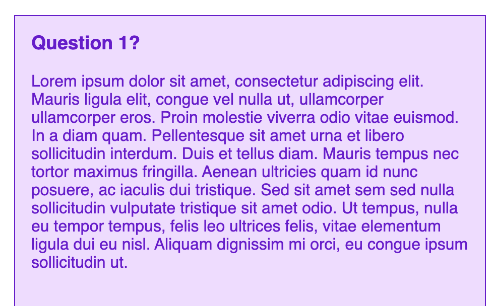

_Content Warning: There are gifs in this post._

Hey friends! Today's writing is going to be a follow up to [How Accessibility Taught Me to be Better At JavaScript](/blog/how-accessibility-taught-better-javascript-part-one). If you have read my content, one of my favorite topics is about JavaScript and Accessibility. I speak about how JavaScript is **actually** necessary to make interactive elements accessible.

In my previous article, I talked about how I created a popup language menu with accessibility in mind. Making something functional and accessible was my first taste of vanilla JavaScript. The code certainly needed improvements, which we went over in the post. However, making the menu accessible started to help me understand JavaScript better.

Today we are going over how I took some cringy “accordion” markup and made it accessible. Remember, an essential requirement was that I was not allowed to alter the content markup in any way. This page was a WordPress post, meaning I couldn’t go in and edit the post to be the markup I wanted it to be.

## Starting out

So, this right here was the starting markup.

<iframe height="450" style="width: 100%;" scrolling="no" title="Really bad markup - Accordion - Starting out" src="https://codepen.io/littlekope0903/embed/zYxRvbm?height=450&theme-id=default&default-tab=html,result" frameborder="no" allowtransparency="true" allowfullscreen="true">
  See the Pen <a href='https://codepen.io/littlekope0903/pen/zYxRvbm'>Really bad markup - Accordion - Starting out</a> by Lindsey Kopacz
  (<a href='https://codepen.io/littlekope0903'>@littlekope0903</a>) on <a href='https://codepen.io'>CodePen</a>.
</iframe>

I like clean HTML, and the inability to alter the markup got under my skin. This markup is a mess. First, it started with an unordered list, which isn’t the worst, but not ideal. Then inside the list item, it has a span for the title of the panel, an h3, another unordered list element, then a singular list item (meaning it’s not even a list?).

I detest this markup so much.

Now that I finished that soapbox, let's talk about a few goals here:

- Hide the panels when we load the page
- Accordion panels open and close on click.
- Accordion panels open and close using the space bar or the enter key.
- Make that span **focusable**

I added a little bit of SCSS to clean up the markup. I also added normalize.css in my CodePen settings.

Now let's get on to how I approached this problem 4 years ago.

## How I approached the problem

As a disclaimer, this is what Lindsey 4 years ago did. There's only one thing I **wouldn't** do; however, even so, I would add more to this code, which I do in the next section.

First, let's grab some variables:

```js
const accordion = document.getElementById('accordion')
```

Then, let's make a conditional statement. If that accordion exists, let's grab some other variables.

```js
if (accordion) {
  const headers = document.querySelectorAll('.accordion__header')
  const panels = document.querySelectorAll('.accordion__panel')
}
```

I added the conditional statement because we loop through that nodeList. I don’t want to be adding event listeners on `null`

Now let's add the event listener

```js{3}
if (accordion) {
  const headers = document.querySelectorAll('.accordion__header')
  headers.forEach(header => header.addEventListener('click', toggleAccordion))

  const panels = document.querySelectorAll('.accordion__panel')
}
```

Then, let's add that function where the `.accordion__header` represents `this` and the `.nextElementSibling` is the `.accordion__panel`

```js
function toggleAccordion() {
  this.nextElementSibling.classList.toggle('visually-hidden')
}
```

If we go to the element inspector and click on the accordion item, we notice the class toggle.


Then let's add the `visually-hidden` class in the SCSS (source: [The A11y Project](https://a11yproject.com/posts/how-to-hide-content/)):

```scss
.visually-hidden {
  position: absolute !important;
  height: 1px;
  width: 1px;
  overflow: hidden;
  clip: rect(1px 1px 1px 1px); /* IE6, IE7 */
  clip: rect(1px, 1px, 1px, 1px);
  white-space: nowrap; /* added line */
}
```

Now let's add the `visually-hidden` class to the panels, so it visually toggles.

```js{6}
if (accordion) {
  const headers = document.querySelectorAll('.accordion__header')
  headers.forEach(header => header.addEventListener('click', toggleAccordion))

  const panels = document.querySelectorAll('.accordion__panel')
  panels.forEach(panel => panel.classList.add('visually-hidden'))
}
```

If you’re not thinking about accessibility, you may only add a click event and call it a day. Because these are not buttons, we have to add keypress events. We need to replicate the functionality of a button. This reason is why using semantic HTML is the best way to help accessibility.

First, we have to add a tabindex of 0 to every header.

```js{4}
if (accordion) {
  const headers = document.querySelectorAll('.accordion__header')
  headers.forEach(header => {
    header.tabIndex = 0
    header.addEventListener('click', toggleAccordion)
  })

  const panels = document.querySelectorAll('.accordion__panel')
  panels.forEach(panel => panel.classList.add('visually-hidden'))
}
```

When we do that, we can see the focus styles whenever we press the `tab` key.


If we press the enter or space key, nothing happens. That's because this isn't a `button` element with built-in [keyboard events](/blog/3-simple-tips-improve-keyboard-accessibility) on click. That's why I preach from time to time about using semantic HTML.

We have to add a `keypress` event on the header elements.

```js{4}
headers.forEach(header => {
  header.tabIndex = 0
  header.addEventListener('click', toggleAccordion)
  header.addEventListener('keypress', toggleAccordion)
})
```

This “works” but not quite how we want it. Because we haven't separated which key we want to toggle the class on, it wouldn't matter if we hit the `k` key or the Space bar.

So first, let's pass the event into the `toggleAccordion` function and `console.log()` that

```js{1-2}
function toggleAccordion(e) {
  console.log(e)
  this.nextElementSibling.classList.toggle('visually-hidden')
}
```

Quick interruption here. Even though I prefer buttons for this, learning how to do it the wrong way taught me a LOT about JavaScript. I learned about event handlers and the event object. As someone who was a newb to JavaScript, I learned a great deal from exploring, even if this wasn't the best way to write the code.

Back to talking about events. When we open this up in the console, we see a bunch of properties on that event.


I see a few things I can use, particularly the `code` or `key`. I'm going to use the `key` property because it's a bit more verbose when I press the space bar.

So I can do this, right?

```js{2,4}
function toggleAccordion(e) {
  if (e.code === 'Enter' || e.code === 'Space') {
    this.nextElementSibling.classList.toggle('visually-hidden')
  }
}
```

Well, no. Because this doesn't account for the `click` event. Click events don't have the `code` property. What types of properties do they have that we can use to make this work for this click event? Let's add the `console.log(e)` back into our function and see what we have available to us.


So now, I check if the `type` is click or `code` is a space or enter.

To make this a bit easier to read, I am going to separate the `code` into a ternary operator that returns true or false. I didn't do that when I was initially doing this, but I wanted to add a little bit of readability into my conditional.

```js{2,3,5}
function toggleAccordion(e) {
  const pressButtonKeyCode =
    e.code === 'Enter' || e.code === 'Space' ? true : false

  if (e.type === 'click' || pressButtonKeyCode) {
    this.nextElementSibling.classList.toggle('visually-hidden')
  }
}
```

And now we can click AND open with a space bar and enter key.


There are a ton of things I would improve upon, which we'll go over next. But if you want to take a look at the code, take a look at the CodePen below:

<iframe height="450" style="width: 100%;" scrolling="no" title="Really bad markup - Accordion - Adding tabindex and events" src="https://codepen.io/littlekope0903/embed/gObvPwg?height=450&theme-id=default&default-tab=html,result" frameborder="no" allowtransparency="true" allowfullscreen="true">
  See the Pen <a href='https://codepen.io/littlekope0903/pen/gObvPwg'>Really bad markup - Accordion - Adding tabindex and events</a> by Lindsey Kopacz
  (<a href='https://codepen.io/littlekope0903'>@littlekope0903</a>) on <a href='https://codepen.io'>CodePen</a>.
</iframe>

## What I would change now

While this **technically** works, it's not the most ideal. I had no idea what progressive enhancement was when I was learning JavaScript. I also had no idea what ARIA was.

So let's start walking through it. If you read part 1, you’ll know that I am a big fan of having a `no-js` class as a way to detect if JavaScript has loaded or not.

```html{1}
<ul id="accordion" class="accordion no-js">
  <!-- Children elements -->
</ul>
```

Then the first thing we do when our JavaScript loaded is removing that class.

```js{2}
const accordion = document.getElementById('accordion')
accordion.classList.remove('no-js')
```

We'll add some default styling if the `no-js` class is present, meaning that JavaScript wouldn't have loaded:

```scss
.accordion {
  &.no-js {
    .accordion__header {
      display: none;
    }

    .accordion__item {
      border-top: 0;
      border-bottom: 0;

      &:first-child {
        border-top: 1px solid;
      }

      &:last-child {
        border-bottom: 1px solid;
      }
    }

    .accordion__panel {
      display: block;
      border-top: 0;
    }
  }
}
```

I've removed the button that isn't technically a button and had everything open by default.



Now, back into the JavaScript. On the headers, we want to set the `aria-expanded` attribute to false and give it a role of button.

```js{3,4}
headers.forEach(header => {
  header.tabIndex = 0
  header.setAttribute('role', 'button')
  header.setAttribute('aria-expanded', false)
  header.addEventListener('click', toggleAccordion)
  header.addEventListener('keypress', toggleAccordion)
})
```

While we are setting roles, I am going to set the panels' role to `region`

```js{4}
if (accordion) {
  // header code
  panels.forEach(panel => {
    panel.setAttribute('role', 'region')
  }
}
```

Next, I'll toggle aria-expanded and remove the toggling of the class in the function. As a note, even though we set the attribute to be a boolean, `getAttribute()` returns a string.

```js{5,8-12}
function toggleAccordion(e) {
  const pressButtonKeyCode =
    e.code === 'Enter' || e.code === 'Space' ? true : false

  const ariaExpanded = this.getAttribute('aria-expanded')

  if (e.type === 'click' || pressButtonKeyCode) {
    if (ariaExpanded === 'false') {
      this.setAttribute('aria-expanded', true)
    } else {
      this.setAttribute('aria-expanded', false)
    }
  }
}
```

We don’t need to visually hide the content because we have the button that controls the information. It's not a good screen reader user experience to read the information they didn't want. I love using `aria-expanded` in CSS to toggle between `display: none` and `display: block` for the panel.

```scss{4-6,10}
.accordion {
  &__header {
    // more scss
    &[aria-expanded='true'] + .accordion__panel {
      display: block;
    }
  }

  &__panel {
    display: none;
    padding: 1rem;
    border-top: 1px solid;

    h3 {
      margin-top: 0;
    }
  }
}
```

I'm going to be adding a few ARIA attribute to help associate the header and the panel together.

- [aria-controls](https://developer.mozilla.org/en-US/docs/Web/Accessibility/ARIA/ARIA_Live_Regions) - This can be confusing for some people. I highly recommend reading [Léonie's post](https://tink.uk/using-the-aria-controls-attribute/)
- [aria-labelledby](https://developer.mozilla.org/en-US/docs/Web/Accessibility/ARIA/ARIA_Techniques/Using_the_aria-labelledby_attribute)

I based this on the [WAI-ARIA authoring practices](https://www.w3.org/TR/wai-aria-practices-1.1/examples/accordion/accordion.html).

First, the headers:

```js{4-5,7-8}
headers.forEach(header => {
  header.tabIndex = 0
  header.setAttribute('role', 'button')
  // This will match the aria-labelledby on the panel
  header.setAttribute('id', `accordion-header-${i + 1}`)
  header.setAttribute('aria-expanded', false)
  // This will match the id on the panel
  header.setAttribute('aria-controls', `accordion-section-${i + 1}`)
  header.addEventListener('click', toggleAccordion)
  header.addEventListener('keypress', toggleAccordion)
})
```

Then we'll take those and make sure they match up accurately with the panels

```js{2-3,5-6}
panels.forEach(panel => {
  // This will match the aria-controls on the header
  panel.setAttribute('id', `accordion-section-${i+1}`)
  panel.setAttribute('role', 'region')
  // This will match the id on the header
  panel.setAttribute('aria-labelledby', `accordion-header-${i+1}`)
}
```

Now let's hear this on a screenreader and hear the final verdict.

<video controls height="500" style="margin: 1rem auto;">
  <source src="/final-screenreader.mov" type="video/mp4" />
</video>

If you want to play around with the code, fork the CodePen and check it out.

<iframe height="450" style="width: 100%;" scrolling="no" title="Really bad markup - Accordion - Progressive Enhancement" src="https://codepen.io/littlekope0903/embed/oNgExXZ?height=450&theme-id=default&default-tab=html,result" frameborder="no" allowtransparency="true" allowfullscreen="true">
  See the Pen <a href='https://codepen.io/littlekope0903/pen/oNgExXZ'>Really bad markup - Accordion - Progressive Enhancement</a> by Lindsey Kopacz
  (<a href='https://codepen.io/littlekope0903'>@littlekope0903</a>) on <a href='https://codepen.io'>CodePen</a>.
</iframe>

## Conclusion

Was this the most ideal markup ever? No. Did this teach me a lot about JavaScript? Yes. Did this teach me the value of using buttons where I have keyboard events built-in? Yes.

Stay in touch! If you liked this article:

- Let me know on [Twitter](https://twitter.com/LittleKope) and share this article with your friends! Also, feel free to tweet me any follow up questions or thoughts.
- Support me on [patreon](https://www.patreon.com/a11ywithlindsey)! If you like my work, consider making a $1 monthly pledge. You’ll be able to vote on future blog posts if you make a \$5 pledge or higher! I also do a monthly Ask Me Anything Session for all Patrons!
- [Be the first to learn about my posts](https://pages.convertkit.com/4218bd5fb5/68dc4e412a) for more accessibility funsies!

Cheers! Have a great week!
