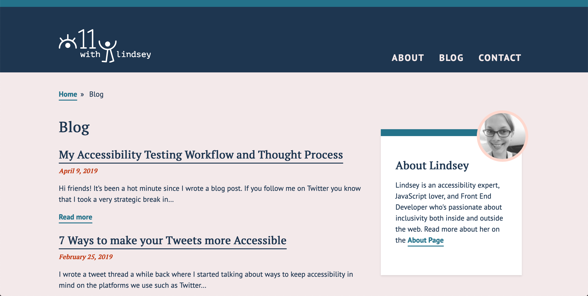
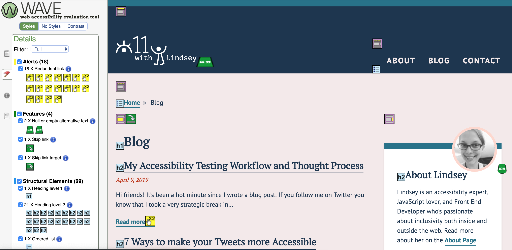
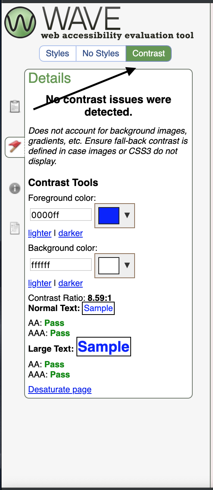
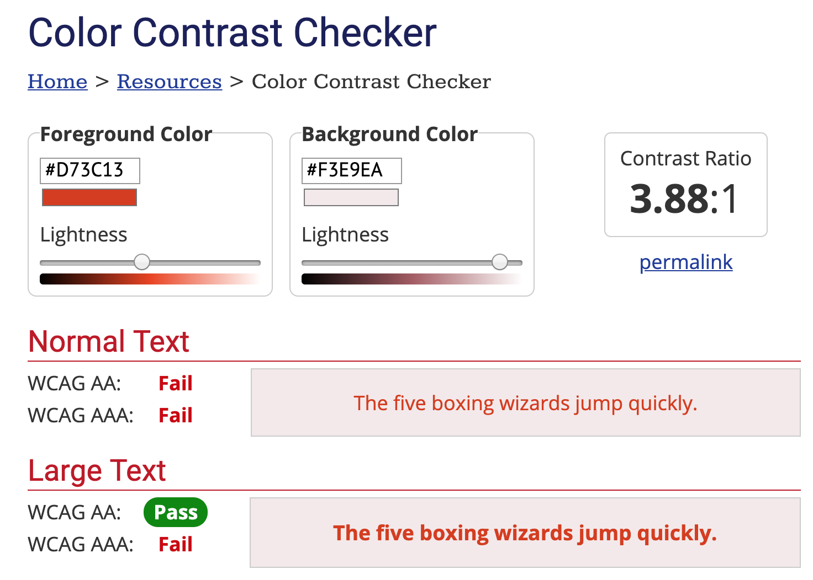

Hi friends! It’s been a hot minute since I wrote a blog post. If you follow me [on Twitter](https://twitter.com/LittleKope/status/1101112031355260928), you know that I took a very strategic break in March to work on getting ahead of things. So now I am up and running, and I asked some followers what they wanted me to write next.

It sounded like people were curious about my web accessibility testing approach! So I’m going to walk you through my thought process, what I test for, how early I check, and how I test. It's like having my web accessibility testing checklist in your back pocket.

## Getting started

My web accessibility testing process begins before I even start writing code. Hopefully, I wasn’t siloed away from the designer and had input in design decisions. Even if I didn’t have input, I start looking at the design and how I can ensure that everything is accessible.

I take a look at the design and assess any potential accessibility issues. For example, if I am looking at the design of my site below:

I’ll start mentally thinking about how I will lay this out in the markup.

- The "Blog" page title will be an `<h1>`
- The date will be a `<time>`
- The blog post titles will have `<h2>` links
- All the blog teasers will be inside of a `<main>` tag

I won’t go further into how I interpret a design because that could be a long post on its own. But thinking through semantic markup is an essential part of my process, and I didn’t want to neglect it. Starting with a good HTML foundation helps tremendously with the testing process.

## Running the site through Wave

While I am working, I usually run my website through the [WebAIM Wave tool](https://chrome.google.com/webstore/detail/wave-evaluation-tool/jbbplnpkjmmeebjpijfedlgcdilocofh?hl=en-US). I will take a peek at it every time I build something new. Using the Wave tool extension works well on my local environments when I want to get a sense of where my issues are. Through this exercise, I learned that I have some redundant links.

Redundant links are something I should address as a web accessibility blogger. I should have fixed this before, but I am leaving it here for the sake of transparency and learning. I may have corrected this by the time I have posted, but the screenshots will still be here.

As you can see here, I have 0 errors (yay) and 18 alerts for redundant links. Alerts are a lower priority than errors, but because I don’t have any errors, I am going to focus on fixing those. What I would do here is create a pull request and fix those up. The thing I enjoy about the Wave tool is that it tells you why it’s important and how to fix the issue.

Some people also use the Lighthouse tools on Google Chrome! I love Lighthouse too, but I tend to use those on live sites as an accessibility auditing tool versus testing as I am building.

## Assess the contrast

The Wave tool that I mentioned above has a contrast checker.

Usually, I have already tested the color combinations that the designer gave me. However, when I receive a style guide with a few colors, sometimes I will implement it without double checking. We are all guilty of this sometimes because we are human. When I first launched this site, there was a contrast issue I missed. On the color of the date element it used to be `#D73C13`, and now it’s `#C03711`. I didn’t follow my designer’s suggestions and put the original color on my background, which is `#F3E9EA`.

Someone kindly pointed out to me that I had some color contrast issues. Once I stopped feeling embarrassed, I used [WebAIM's contrast checker](https://webaim.org/resources/contrastchecker/) to assess it. I fixed this quickly by using the “Lightness” input to make the vermillion darker. I adjusted the color until I received passing marks on the contrast checker.

## Tab through my site

I always click on the URL of the browser and press the `tab` key. We want to ensure that we are still aware of where the focus is. We want to be able to access controls to help us view content. We want to be mindful of anything that requires any interaction.

Here are some examples of problems I've dealt with

- Having a closed hamburger menu and being able to tab to the links inside it. This situation is confusing for a keyboard user as they are not confident what links they are focusing on.
- In desktop view, a user is unable to open a hamburger menu with their keyboard.
- Going to an e-commerce site and seeing a “Related Item” slideshow and being unable to use the arrows.
- Using the "Login" button that pops up a modal, and the focus is still "behind" the modal and cannot reach the form.

Approaching these challenges is a great way to improve your JavaScript skills! I learned a ton about JavaScript this way. I needed the [tabIndex](https://developer.mozilla.org/en-US/docs/Web/API/HTMLElement/tabIndex) property to be `-1` when the links were non-visible. Furthermore, I will use an event listener to toggle the `tabIndex` to `0` when we toggle open a menu. We can also ensure that the product slider arrows are buttons so that they work on click events!

## Screenreader testing

Screen reader testing is the trickiest part for me. I am visually-abled, hence do not **truly** understand how hard it can be.

However, running through a screen reader has been key to helping me find issues I didn’t realize existed. Recently I found a problem in a bar chart data visualization where I had a number formatted “110k.” I feel like this would be better read as “110 thousand.”

Something I still am working on is learning how to use a screen reader better. I use primarily VoiceOver, which is the screen reader for Mac. I've been using [Web Aim's VoiceOver guide](https://webaim.org/articles/voiceover/) to help me improve my screen reader usage. I usually keep it up while I am testing in case I forget a command. One major thing to remember is that most guides say "VO" as a shortcut. "VO" is the equivalent to `control + option` on your Mac.

## Conclusion

This post is getting a bit long because I wanted to ensure that I go through what I do on my personal projects. I want to do a follow-up post about Continuous Integration, all the testing libraries, and how I use react-testing-library for my integration tests. The reality is that most of us are working on teams and we need some automation built into the workflow. That post is coming soon! Stay tuned!

Feel free to let me know what you think on [Twitter](https://twitter.com/LittleKope).
