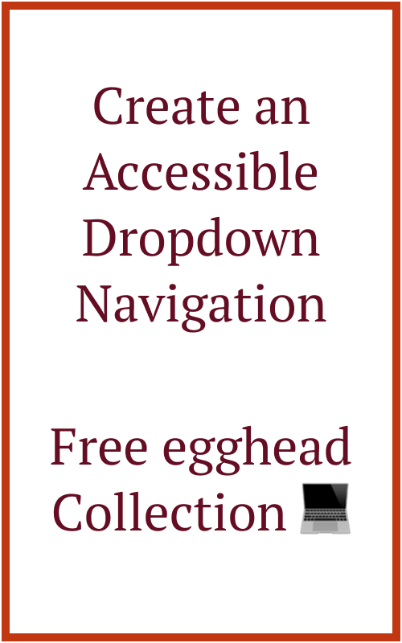
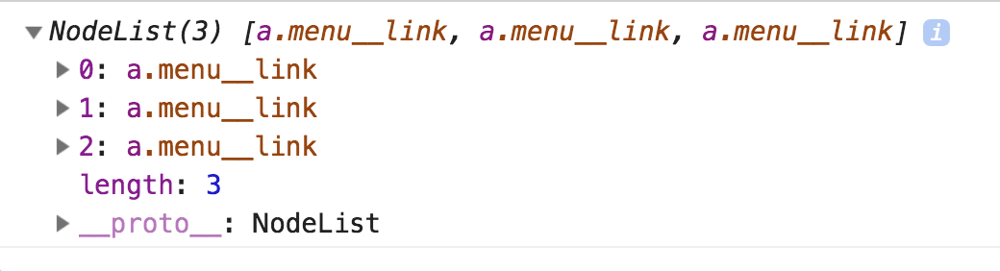
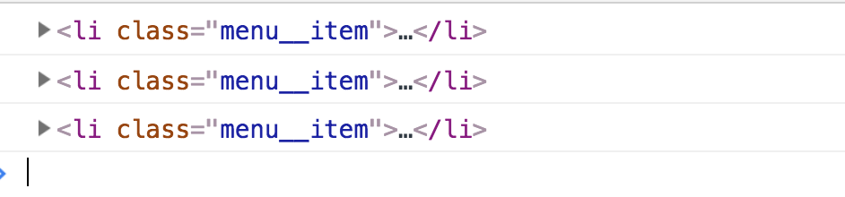
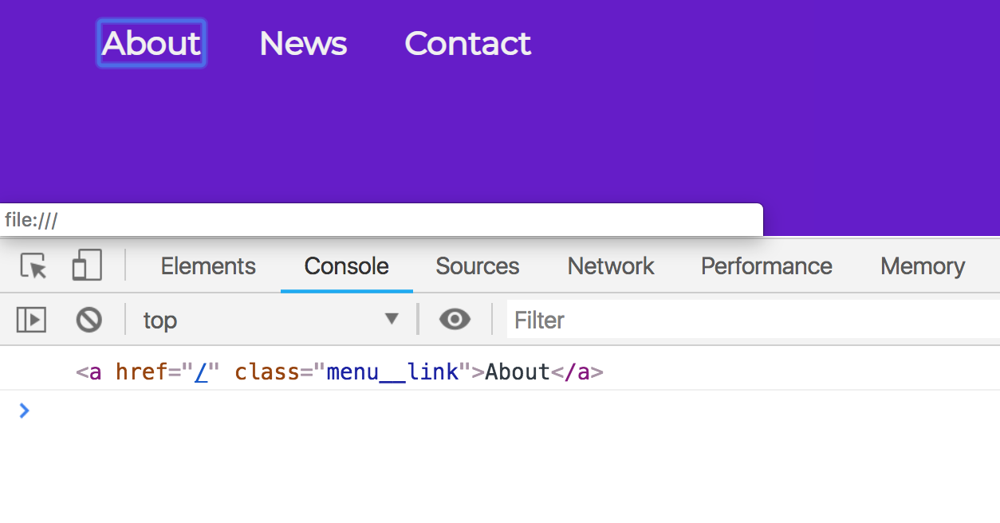
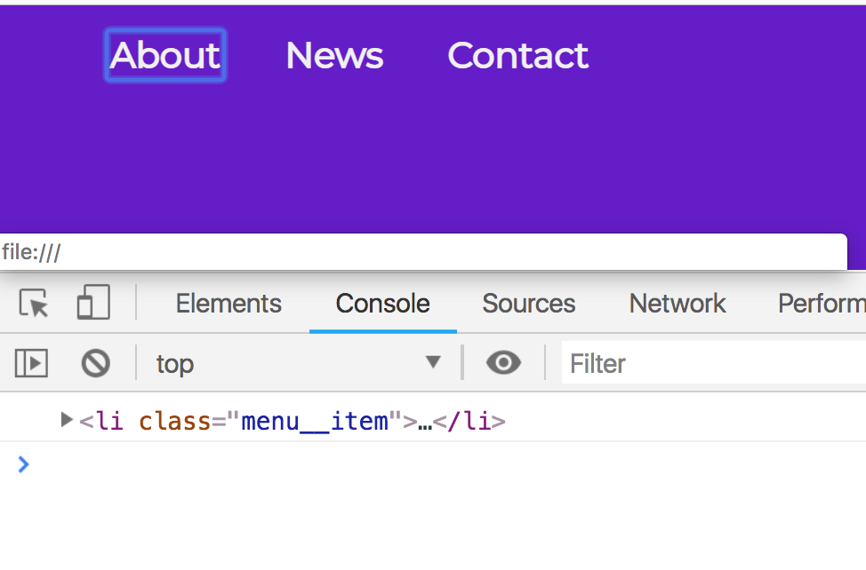
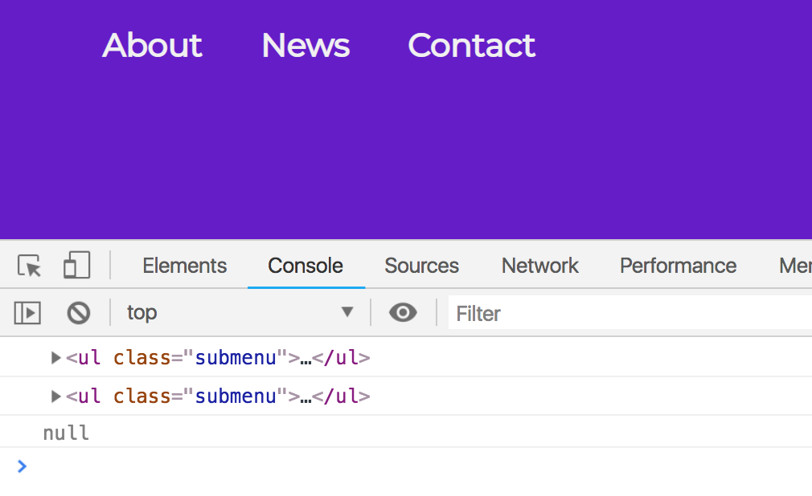
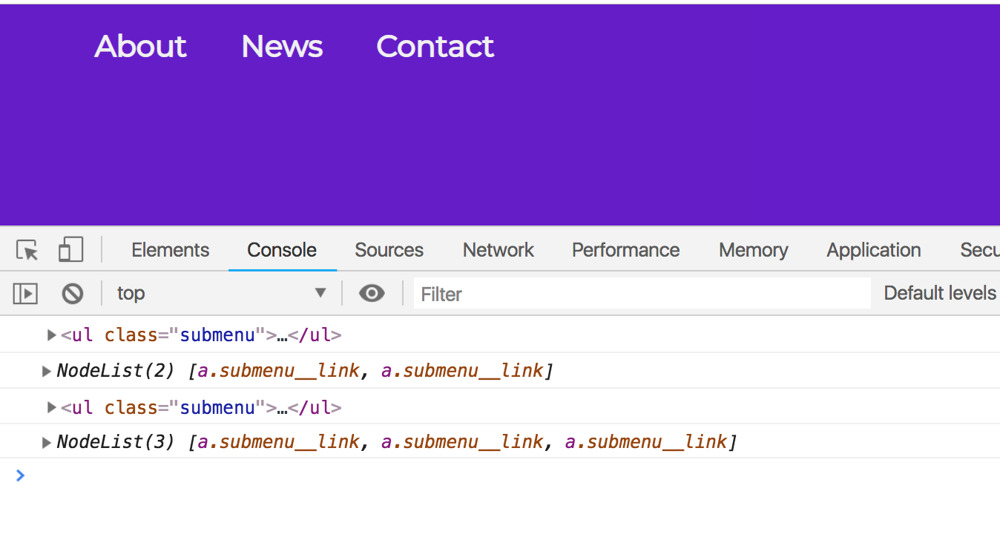
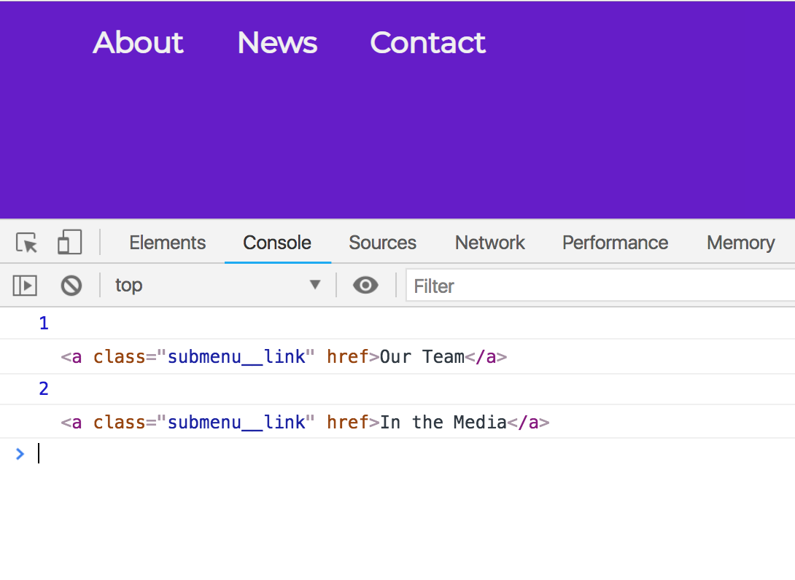

import CallToAction from '../../components/CallToAction/CallToAction'

<CallToAction>

  

  ## Want to see this in action?

  I created a 6 minute video collection!

  [Go To My Free Egghead Collection](https://egghead.io/playlists/create-an-accessible-dropdown-navigation-0447)

</CallToAction>

Hover navigations are pretty simple to do without JavaScript, which is how I usually see them implemented. The HTML and CSS are pretty simple.

HTML:

```html
<nav>
  <ul class="menu">
    <li class="menu__item">
      <a href="/about" class="menu__link">About</a>
      <ul class="submenu">
        <li class="submenu__item">
          <a class="submenu__link" href="/about/our-mission">Our Mission</a>
        </li>
        <li class="submenu__item">
          <a class="submenu__link" href="/about/our-team">Our Team</a>
        </li>
      </ul>
    </li>
    <li class="menu__item">
      <a href="/news" class="menu__link">News</a>
      <ul class="submenu">
        <li class="submenu__item">
          <a href="/news/press-releases" class="submenu__link"
            >Press Releases</a
          >
        </li>
        <li class="submenu__item">
          <a href="/news/blog" class="submenu__link">Blog</a>
        </li>
        <li class="submenu__item">
          <a href="/news/in-the-media" class="submenu__link">In the Media</a>
        </li>
      </ul>
    </li>
    <li class="menu__item">
      <a href="/contact" class="menu__link">Contact</a>
    </li>
  </ul>
</nav>
```

CSS:

```css
.submenu {
  position: absolute;
  left: 0;
  padding: 0;
  list-style: none;
  height: 1px;
  width: 1px;
  overflow: hidden;
  clip: rect(1px 1px 1px 1px); /* IE6, IE7 */
  clip: rect(1px, 1px, 1px, 1px);
}

.menu__item:hover .submenu {
  padding: 0.5rem 0;
  width: 9rem;
  height: auto;
  background: #eedbff;
  clip: auto;
}
```

Note: I have used the [visually-hidden](https://a11yproject.com/posts/how-to-hide-content/) styling instead of `display: none`. This is important for accessibility, and you can read more in the link above.

I've taken out some of the general styling, but this CSS is what contributes to the hover effect. However, as you can see with the gif below, it doesn't work the same way if you use your tab key.


Before we jump into coding, I wanted to share my approach to this problem. First, I want to solve the problem of opening the nav on not only on hover but also on focus. Second, I want to ensure that on focus each submenu "opens" as it does with the hover. Third, I want to make sure that once I tab through the links, that particular submenu closes when I leave it. Now let's get started!

## Replicating the hover effect on focus

Because we have the `:hover` pseudo-class on the `li` element, we should also target our focus on the `li` element. But if you read my blog post on [Keyboard Accessibility](/blog/3-simple-tips-improve-keyboard-accessibility), you'll recognize the concept of tabindexes. `li` elements do not have tabindexes, but links do. What I personally like to do is target the top level links in JavaScript and add a class to their parents on a focus event. Let's walk through that a little further.

```js
const topLevelLinks = document.querySelectorAll('.menu__link')
console.log(topLevelLinks)
```



When I `console.log` the variable, I get a node list of the top menu items. What I like to do is loop through those using a `forEach` loop and then log each of their `parentElement`'s.

```js
topLevelLinks.forEach(link => {
  console.log(link.parentElement)
})
```



Now what I want to do is add a `focus` event listener to the link, and then console.log `this` to ensure to double check that we have the correct context of `this`.

```js
topLevelLinks.forEach(link => {
  link.addEventListener('focus', function() {
    console.log(this)
  })
})
```



I am using an old-school function (instead of an ES6+ arrow function) because I want to ensure the context of `this` is the target. There are plenty of blog posts about this (haha, see what I did there) if you'd like to read more on it. Anyways, now I'd like to have it so that we are targeting the `parentElement` of this, which is the `li`.

```js
topLevelLinks.forEach(link => {
  link.addEventListener('focus', function() {
    console.log(this.parentElement)
  })
})
```



This parent element is what we need to target. What I am going to do is add a class to the li that we logged to the console. Then what I will do is use a CSS class to replicate the styling we have on `:hover`.

```js
topLevelLinks.forEach(link => {
  link.addEventListener('focus', function() {
    this.parentElement.classList.add('focus')
  })
})
```


```css
.menu__item:hover .submenu,
.menu__item.focus .submenu {
  padding: 0.5rem 0;
  width: 9rem;
  height: auto;
  background: #eedbff;
  clip: auto;
}
```


As you'll see, the menu doesn't close after we leave it which is one of our action items that I laid out. Before we do that, let's take a second to learn about the `blur` event and what that means.

## The Blur Event

Per Mozilla docs, the [blur event](https://developer.mozilla.org/en-US/docs/Web/Events/blur) is fired when an element **loses** focus. We want to keep the submenu open until the last submenu item loses focus. So what we need to do is remove the focus class on blur.

The first thing I like to do is within that forEach loop we have, is to check if there is a `nextElementSibling`.

```js
topLevelLinks.forEach(link => {
  link.addEventListener('focus', function() {
    this.parentElement.classList.add('focus')
  })

  console.log(link.nextElementSibling)
})
```



Next what I will do is create a conditional. We only want to run the following code IF there is a submenu. Here is what I did:

```js
topLevelLinks.forEach(link => {
  link.addEventListener('focus', function() {
    this.parentElement.classList.add('focus')
  })

  if (link.nextElementSibling) {
    const subMenu = link.nextElementSibling
    console.log(subMenu)
    console.log(subMenu.querySelectorAll('a'))
  }
})
```



The reason I log both the `subMenu` and the `querySelectorAll` is for visual learning. It's good for me to see that I have both submenu elements targeted correctly, as well as the NodeList for the links within them. So what I want to do here is target the last link in that `querySelectorAll`. Let's put it into a variable to make it more readable.

```js
topLevelLinks.forEach(link => {
  link.addEventListener('focus', function() {
    this.parentElement.classList.add('focus')
  })

  if (link.nextElementSibling) {
    const subMenu = link.nextElementSibling
    const subMenuLinks = subMenu.querySelectorAll('a')
    const lastLinkIndex = subMenuLinks.length - 1
    console.log(lastLinkIndex)
    const lastLink = subMenuLinks[lastLinkIndex]
    console.log(lastLink)
  }
})
```



On each of these last links, we want to add a blur event that removes the class from that `li`. First, let's check out the `link.parentElement` to ensure that we are getting what we expect.

```js
topLevelLinks.forEach(link => {
  link.addEventListener('focus', function() {
    this.parentElement.classList.add('focus')
  })

  if (link.nextElementSibling) {
    const subMenu = link.nextElementSibling
    const subMenuLinks = subMenu.querySelectorAll('a')
    const lastLinkIndex = subMenuLinks.length - 1
    const lastLink = subMenuLinks[lastLinkIndex]

    lastLink.addEventListener('blur', function() {
      console.log(link.parentElement)
    })
  }
})
```


Now that we have what we expect, I am going to do the opposite that I do on the focus event listener.

```js
topLevelLinks.forEach(link => {
  link.addEventListener('focus', function() {
    this.parentElement.classList.add('focus')
  })

  if (link.nextElementSibling) {
    const subMenu = link.nextElementSibling
    const subMenuLinks = subMenu.querySelectorAll('a')
    const lastLinkIndex = subMenuLinks.length - 1
    const lastLink = subMenuLinks[lastLinkIndex]

    lastLink.addEventListener('blur', function() {
      link.parentElement.classList.remove('focus')
    })
  }
})
```


One last thing I am going to do is place the focus event listener within that conditional statement. The reality is that we don't need to add a focus class to an item that doesn't have a submenu.

```js
topLevelLinks.forEach(link => {
  if (link.nextElementSibling) {
    link.addEventListener('focus', function() {
      this.parentElement.classList.add('focus')
    })

    const subMenu = link.nextElementSibling
    const subMenuLinks = subMenu.querySelectorAll('a')
    const lastLinkIndex = subMenuLinks.length - 1
    const lastLink = subMenuLinks[lastLinkIndex]

    lastLink.addEventListener('blur', function() {
      link.parentElement.classList.remove('focus')
    })
  }
})
```

## Additional Challenges

This blog post is getting VERY long, so maybe I'll do a follow-up post next week. The one thing I haven't solved here that I'd like to in my follow-up post is how to go backward in the menu. If you use the `tab` and `shift` key simultaneously, this doesn't work when going back in the menu. If you want an additional challenge, try it out yourself!

Stay in touch! If you liked this article:

- Let me know on [Twitter](https://twitter.com/LittleKope) and share this article with your friends! Also, feel free to tweet me any follow up questions or thoughts.
- Support me on [Patreon](https://www.patreon.com/a11ywithlindsey)! If you like my work, consider making a monthly pledge.
- Take my [10 days of a11y](https://a11y-with-lindsey.ck.page/b4e437f629) free email course.
- [Be the first to learn about my posts](https://pages.convertkit.com/4218bd5fb5/68dc4e412a) for more accessibility funsies!

<CallToAction>

  

  ## Pre-Order Open!

  New e-book for Limited Time Price of $9.97!

  [Pre-order Now](https://a11y-with-lindsey.ck.page/products/pre-order-the-bootcampers-guide-to-web)

</CallToAction>

Cheers! Have a great week!
