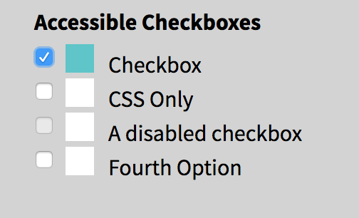
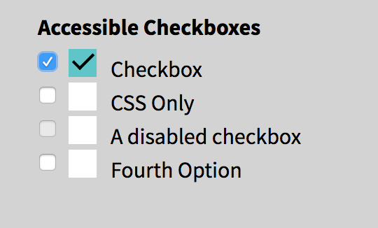
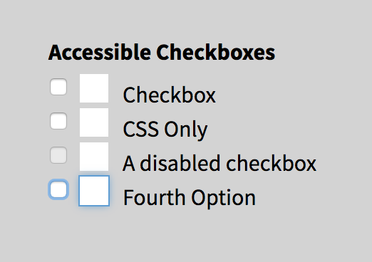
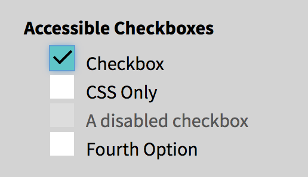

I've seen a ton of designers make these GORGEOUS checkbox styles, but then you see them implemented and you can't even select it using your keyboard. Let's say we got this in our style guide from our designer.


I've seen this implemented before and it looks gorgeous. However, when I press the `tab` key, it zips right past it. If this field is required, you're screwing over a bunch of your users. They use `::before` or `::after` pseudo-elements to make a pretty checkbox and use the `:checked` pseudo-class to determine the styling of the check itself. It looks cool, but the problem is that they use `display: none` on the checkbox input itself. When we do that, the browser ignores.

<video style="margin: 1rem auto" width="590" muted autoplay loop>
<source src="inaccessible-checkboxes.mov">
</video>

Let's walk step by step how I would go through this. Here is what my starting code looks like:


```
<fieldset>
  <legend>Accessible Checkboxes</legend>

  <input type="checkbox" name="Checkbox" id="check_1">
  <label for="check_1">Checkbox</label>

  <input type="checkbox" name="CSS Only" id="css_only">
  <label for="css_only">CSS Only</label>

  <input type="checkbox" name="" id="disabled_sample" disabled>
  <label for="disabled_sample">A disabled checkbox</label>
  
  <input type="checkbox" name="Fourth Option" id="fourth_check">
  <label for="fourth_check">Fourth Option</label>
</fieldset>
```

I would start with a bare-bones checkbox list. Here is the current CSS I have:

```
input[type="checkbox"] {
  position: absolute;
}
input[type="checkbox"] + label {
    display: block;
    position: relative;
    padding: 0 1.5rem;
}
```

## Create a pseudo-element on the label

The first thing I want to do is make sure that I create a pseudo-element that can act in place of my checkbox. What I'll do to achieve this is create a `::before` pseudo-element on the `<label>` element. Now it looks like this:

```
input[type="checkbox"] + label::before {
  content: '';
  position: relative;
  display: inline-block;
  margin-right: 10px;
  width: 20px;
  height: 20px;
  background: white;
}
```


I've left the non-styled original checkbox there on purpose. The reason for this is it makes it easier for me to tell when a checkbox is focused, checked, etc. It helps to hold off on hiding the checkbox until the very last minute. 

## Add styling on the pseudo-element when checked
As of right now, when we try to check the checkbox, it doesn't do anything except the normal behavior. What we have to do is add a little bit of CSS magic. See Below:

```
input[type="checkbox"]:checked + label::before {
  background: #5ac5c9;
}
```



## Add your custom checkmark

If you want to do a checkmark unicode to the `::before` element's content, you can very well do that. However, I want to get a little fancy. Now, we want to make sure that there is an actual checkmark inside of our custom element. I've done this by adding an `::after` pseudo-element. What we are doing here is creating a right angle with two borders and rotating it.

```
input[type="checkbox"]:checked + label::after {
  content: '';
  position: absolute;
  top: 3px;
  left: 27px;
  border-left: 2px solid black;
  border-bottom: 2px solid black;
  height: 6px;
  width: 13px;
  transform: rotate(-45deg);
}
```



An additional challenge, instead of a check, make an "X."

## Add focus styles to the pseudo-element

Great! We are good to go now! Not quite.

We still need to ensure that the pseudo-element "receives focus." What we are going to do now is replicate the focus styling on when the checkbox receives focus. The reason why we don't want to do `display: none` is because removing the display prevents the checkbox from receiving focus at all. I wanted to have some concrete focus styling since they can vary from browser to browser. Below is what I ended up doing because I wanted to replicate the default focus for Chrome, but in all browsers.

```
input[type="checkbox"]:focus + label::before {
  outline: #5d9dd5 solid 1px;
  box-shadow: 0 0px 8px #5e9ed6;
}
```



Now we can hide it the original checkbox! See how helpful keeping it around when we were figuring this out?

```
input[type="checkbox"] {
  position: absolute;
  left: -99999px;
}
```

<video style="margin: 1rem auto" width="590" muted autoplay loop>
<source src="accessible-custom-checkboxes.mov">
</video>

## Add some styling for the disabled checkboxes

One last thing, we should probably make that disabled checkbox stylistically different. This is what I did:

```
input[type="checkbox"]:disabled + label {
  color: #575757;
}

input[type="checkbox"]:disabled + label::before {
  background: #ddd;
}
```



So that's it! You can apply the same type of thing to radio buttons as well.  Let me know on [Twitter](https://twitter.com/littlekope0903) what you think!