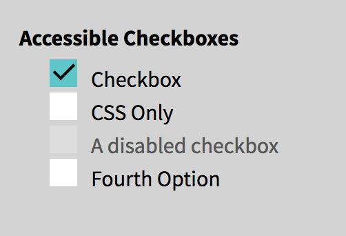
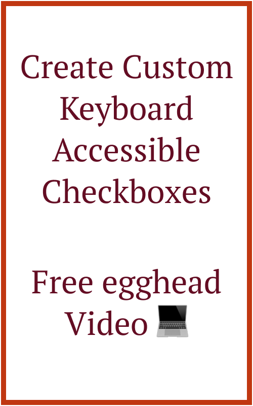
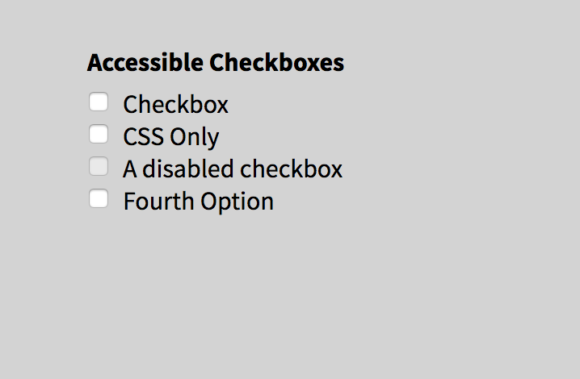
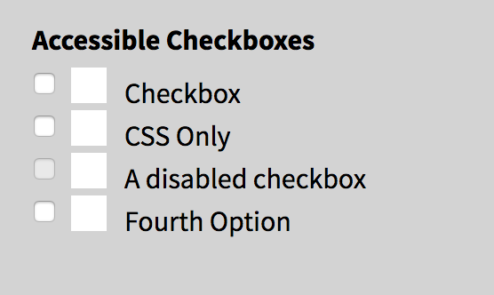
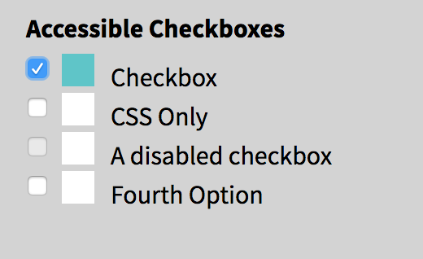
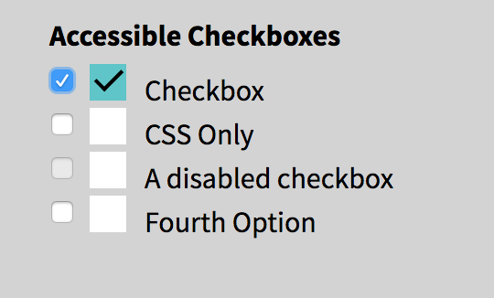
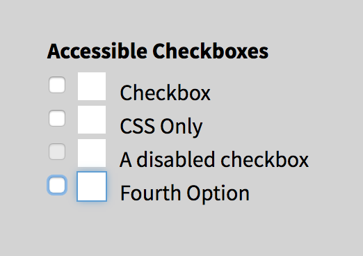
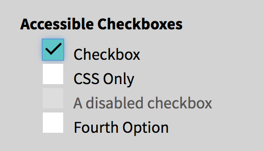
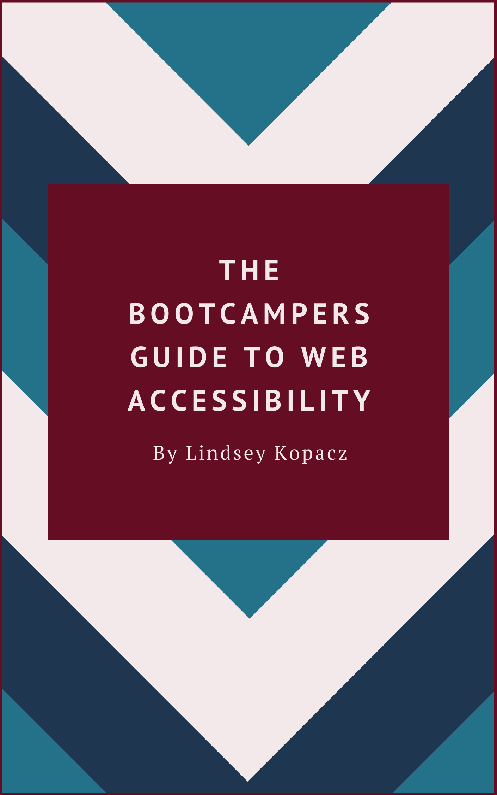

import CallToAction from '../../components/CallToAction/CallToAction'

I've seen a ton of designers make these GORGEOUS checkbox styles, but then you see them implemented and you can't even select it using your keyboard. Let's say we got this in our style guide from our designer.



I've seen this implemented before and it looks gorgeous. However, when I press the `tab` key, it zips right past it. If this field is required, you're screwing over a bunch of your users. They use `::before` or `::after` pseudo-elements to make a pretty checkbox and use the `:checked` pseudo-class to determine the styling of the check itself. It looks cool, but the problem is that they use `display: none` on the checkbox input itself. When we do that, we make the checkbox itself invisible to the browser, making it unusable for those who rely on keyboards to navigate a site.


<CallToAction>

  

  ## Want to see this in action?

  I created a less than 3 minute video lesson!

  [Go To My Free Egghead Lesson](https://egghead.io/lessons/css-create-custom-keyboard-accessible-checkboxes)

</CallToAction>

## Starting point

Let's walk step by step how I would go through this. Here is what my starting code looks like:

```html
<fieldset>
  <legend>Accessible Checkboxes</legend>

  <input type="checkbox" name="Checkbox" id="check_1" />
  <label for="check_1">Checkbox</label>

  <input type="checkbox" name="CSS Only" id="css_only" />
  <label for="css_only">CSS Only</label>

  <input type="checkbox" name="" id="disabled_sample" disabled />
  <label for="disabled_sample">A disabled checkbox</label>

  <input type="checkbox" name="Fourth Option" id="fourth_check" />
  <label for="fourth_check">Fourth Option</label>
</fieldset>
```



I would start with a bare-bones checkbox list. Here is the current CSS I have:

```css
input[type='checkbox'] {
  position: absolute;
}

input[type='checkbox'] + label {
  display: block;
  position: relative;
  padding: 0 1.5rem;
}
```

## Create a pseudo-element on the label

The first thing I want to do is make sure that I create a pseudo-element that can act in place of my checkbox. What I'll do to achieve this is create a `::before` pseudo-element on the `<label>` element. Now it looks like this:

```css
input[type='checkbox'] + label::before {
  content: '';
  position: relative;
  display: inline-block;
  margin-right: 10px;
  width: 20px;
  height: 20px;
  background: white;
}
```



I've left the non-styled original checkbox there on purpose. The reason for this is it makes it easier for me to tell when a checkbox is focused, checked, etc. It helps me to hold off on hiding the checkbox until the very last minute.

## Add styling on the pseudo-element when checked

As of right now, when we try to check the checkbox, it doesn't do anything except the normal behavior. What we have to do is add a little bit of CSS magic using the `:checked` pseudo-class. See Below:

```css
input[type='checkbox']:checked + label::before {
  background: #5ac5c9;
}
```



## Add your custom checkmark

If you want to do a checkmark unicode to the `::before` element's content, you can very well do that. However, I want to get a little fancy. Now, we want to make sure that there is a perpendicular checkmark inside of our custom element. I've done this by adding an `::after` pseudo-element. What we are doing here is creating a right angle with two borders and rotating it.

```css
input[type='checkbox']:checked + label::after {
  content: '';
  position: absolute;
  top: 3px;
  left: 27px;
  border-left: 2px solid black;
  border-bottom: 2px solid black;
  height: 6px;
  width: 13px;
  transform: rotate(-45deg);
}
```



An additional challenge, instead of a check, make an "X."

## Add focus styles to the pseudo-element

Great! Are we good to go now? Well, not quite.

We still need to ensure that the pseudo-element "receives focus." What we are going to do now is replicate the focus styling on when the checkbox receives focus. The reason why we don't want to do `display: none` is because removing the display prevents the checkbox from receiving focus at all. I wanted to have some concrete focus styling since they can vary from browser to browser. Below is what I ended up doing because I wanted to replicate the default focus for Chrome, but in all browsers. It's not the same, but it's close!

```css
input[type='checkbox']:focus + label::before {
  outline: #5d9dd5 solid 1px;
  box-shadow: 0 0px 8px #5e9ed6;
}
```



Now we can hide it the original checkbox! See how helpful keeping it around when we were figuring this out?

```css
input[type='checkbox'] {
  position: absolute !important;
  height: 1px;
  width: 1px;
  overflow: hidden;
  clip: rect(1px 1px 1px 1px); /* IE6, IE7 */
  clip: rect(1px, 1px, 1px, 1px);
}
```

Note: I have used the [visually-hidden](https://a11yproject.com/posts/how-to-hide-content/) styling here. I would normally use a Sass mixin or a class for this.


## Add some styling for the disabled checkboxes

One last thing, we should probably make that disabled checkbox stylistically different. Below is what I did:

```css
input[type='checkbox']:disabled + label {
  color: #575757;
}

input[type='checkbox']:disabled + label::before {
  background: #ddd;
}
```



So that's it! You can apply the same principles to radio buttons as well.

Stay in touch! If you liked this article:

- Let me know on [Twitter](https://twitter.com/LittleKope) and share this article with your friends! Also, feel free to tweet me any follow up questions or thoughts.
- Support me on [Patreon](https://www.patreon.com/a11ywithlindsey)! If you like my work, consider making a monthly pledge.
- Take my [10 days of a11y](https://a11y-with-lindsey.ck.page/b4e437f629) free email course.
- [Be the first to learn about my posts](https://pages.convertkit.com/4218bd5fb5/68dc4e412a) for more accessibility funsies!

<CallToAction>

  

  ## Pre-Order Open!

  New e-book for Limited Time Price of $9.97!

  [Pre-order Now](https://a11y-with-lindsey.ck.page/products/pre-order-the-bootcampers-guide-to-web)

</CallToAction>

Cheers! Have a great week!

**Disclaimer:** I almost didn't post this. Last night as I was scrolling through Twitter, I saw a post that has almost the same tips in it. After asking the Twitterverse if I should post it, I got an overwhelming amount of people saying "YES!" I haven't read the other one, only skimmed, mostly because I didn't want to impact my writing. However, I wanted to link it up for you, in case you wanted to read it: [How to Make Custom Accessible Checkboxes and Radio Buttons](https://webdesign.tutsplus.com/tutorials/how-to-make-custom-accessible-checkboxes-and-radio-buttons--cms-32074).
