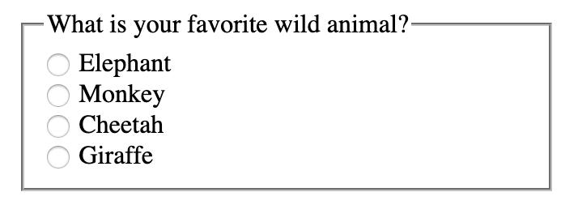
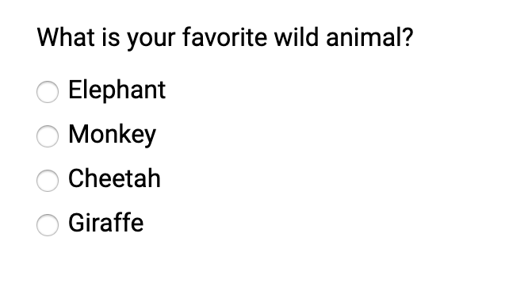
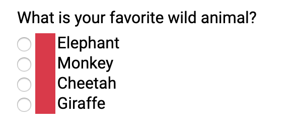
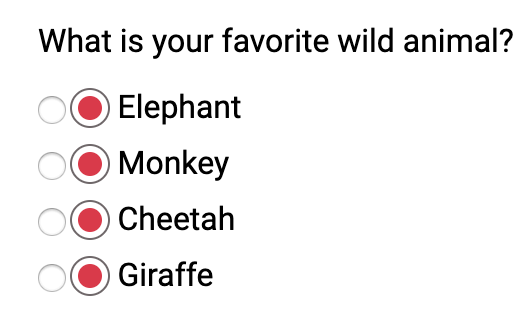
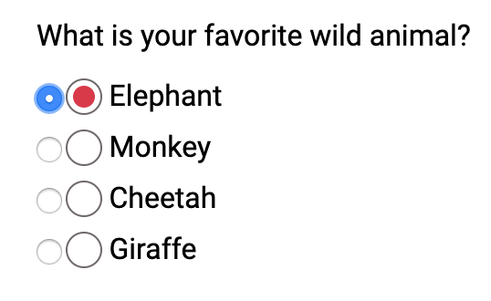

Hey friends! This post feels a bit long overdue, but today I am going to be talking about creating custom keyboard accessible radio buttons! This is a follow up post from [my accessible checkboxes post](/blog/create-custom-keyboard-accesible-checkboxes).

We'll go over:

1. The markup
1. Creating a pseudo-element on the label in CSS
1. Add "selected" styling in CSS
1. Add focus styling
1. Add styling for disabled radio buttons

## Starting out

I decided to create a simple group of radio buttons asking what your favorite animal is

```html
<fieldset style="margin-top:2rem; width: 400px; margin-left:1rem;">
  <legend>What is your favorite Wild Animal?</legend>
  <div class="radio-wrapper">
    <input type="radio" name="animal" id="elephant" />
    <label for="elephant">Elephant</label>
  </div>
  <div class="radio-wrapper">
    <input type="radio" name="animal" id="monkey" />
    <label for="monkey">Monkey</label>
  </div>
  <div class="radio-wrapper">
    <input type="radio" name="animal" id="cheetah" />
    <label for="cheetah">Cheetah</label>
  </div>
  <div class="radio-wrapper">
    <input type="radio" name="animal" id="giraffe" />
    <label for="giraffe">Giraffe</label>
  </div>
</fieldset>
```

The `fieldset` groups all the radio buttons together logically since the radios inputs are all options to the question in the `legend`. Also, remember to associate those form labels with the radio buttons!



I'm going to add some very simple css to clean it up a bit.

```scss
@import url('https://fonts.googleapis.com/css?family=Roboto&display=swap');

* {
  font-family: 'Roboto', sans-serif;
}

fieldset {
  border: none;
}
```

I didn't do anything much here, just added a font and took away the border from the `fieldset`



Now let's get to the fun part! Styling these radio buttons!

## Creating a pseudo-element on the label

First thing I am going to do is add a `::before` pseudo element on the `label` element. I'm going to start out with something basic first, just to see what I am working with.

```scss
$muted-red: #db3846;

input[type='radio'] {
  + label {
    position: relative;
    cursor: pointer;
    margin-left: 20px; /* This will be adjusted */

    &::before {
      content: '';
      position: absolute;
      left: -22px; /* This will be adjusted */
      width: 20px;
      height: 20px;
      background: $muted-red;
    }
  }
}
```

This won't look like anything much right now, right now we just want to see the radio buttons to ensure we are replicating the HTML functionality.



I'm going to add a teensy amount of margin on the `.radio-wrapper`.

```scss{3-5}
$muted-red: #db3846;

.radio-wrapper {
  margin: 0.5rem 0;
}

input[type='radio'] {
  + label {
    position: relative;
    cursor: pointer;
    margin-left: 20px; /* This will be adjusted */

    &::before {
      content: '';
      position: absolute;
      left: -24px; /* This will be adjusted */
      width: 18px;
      height: 18px;
      background: $muted-red;
    }
  }
}
```


Now let's remove that background color and round out the edges.

```scss{11,12,15}
input[type='radio'] {
  + label {
    position: relative;
    cursor: pointer;
    margin-left: 20px; /* This will be adjusted */

    &::before {
      content: '';
      position: absolute;
      left: -24px; /* This will be adjusted */
      border-radius: 50%;
      border: 1px solid #6f686a;
      width: 18px;
      height: 18px;
      background: transparent;
    }
  }
}
```

As a note, I am going to leave the normal radio buttons for debugging purposes.


## Add `:checked` styling in CSS

If you've read my post on [keyboard accessible checkboxes](/blog/create-custom-keyboard-accesible-checkboxes) you know about the `:checked` pseudo class. First we need to put add an `::after` pseudo element on the label.

```scss{18-27}
input[type='radio'] {
  + label {
    position: relative;
    cursor: pointer;
    margin-left: 20px; /* This will be adjusted */

    &::before {
      content: '';
      position: absolute;
      left: -24px; /* This will be adjusted */
      border-radius: 50%;
      border: 1px solid #6f686a;
      width: 18px;
      height: 18px;
      background: transparent;
    }

    &::after {
      content: '';
      position: absolute;
      left: -20px;
      top: 4px;
      border-radius: 50%;
      width: 12px;
      height: 12px;
      background: $muted-red;
    }
  }
}
```

Now this is what that looks like:



Now that we have the styling in place, we are going to move the `background` of the after pseudo element when the radio input is `:checked`

```scss{14-18}
input[type='radio'] {
  + label {
    &::after {
      content: '';
      position: absolute;
      left: -20px;
      top: 4px;
      border-radius: 50%;
      width: 12px;
      height: 12px;
    }
  }

  &:checked {
    + label::after {
      background: $muted-red;
    }
  }
}
```

So now if I check one of those off, it'll be selected!



If you notice though, there is no focus styling. Let's focus on that next (see what I did there)

## Add focus styling

If I were to hide the radio button, you would have no idea if I was focused on it.


```scss
input[type='radio'] {
  &:focus {
    + label::before {
      box-shadow: 0 0px 8px $muted-red;
    }
  }
}
```

I decided to add focus styling that is similar to the main muted red color we have.


Now that that works, I am going remove the opacity from the radio button itself (the input) and remove the `margin-left` from the label!

```scss
input[type='radio'] {
  opacity: 0;

  + label {
    position: relative;
    cursor: pointer;
  }
}
```

And Voilà!


## Conclusion

When we make custom radio buttons, we have to make sure we account for the following:

1. Creating proper HTML structure with associated form labels!
1. Using pseudo elements to create the custom styled element
1. Accounting for the `:checked` pseudo class
1. Ensuring you can focus on the radio button
1. Use `opacity: 0` to hide the radio button

If you want to play around with it, here is the finished CodePen!

<iframe height="445" style="width: 100%;" scrolling="no" title="Starting HTML - Keyboard Accessible Custom Radio Buttons" src="//codepen.io/littlekope0903/embed/jjgRPL/?height=445&theme-id=0&default-tab=css,result" frameborder="no" allowtransparency="true" allowfullscreen="true">
  See the Pen <a href='https://codepen.io/littlekope0903/pen/jjgRPL/'>Starting HTML - Keyboard Accessible Custom Radio Buttons</a> by Lindsey Kopacz
  (<a href='https://codepen.io/littlekope0903'>@littlekope0903</a>) on <a href='https://codepen.io'>CodePen</a>.
</iframe>

Stay in touch! If you liked this article:

- Let me know on [Twitter](https://twitter.com/LittleKope) and share this article with your friends! Also, feel free to tweet me any follow up questions or thoughts.
- Support me on [patreon](https://www.patreon.com/a11ywithlindsey)! If you like my work, consider making a $1 monthly pledge. You’ll be able to vote on future blog posts if you make a \$5 pledge or higher! I also do a monthly Ask Me Anything Session for all Patrons!
- [Be the first to learn about my posts](https://pages.convertkit.com/4218bd5fb5/68dc4e412a) for more accessibility funsies!

Cheers! Have a great week!
