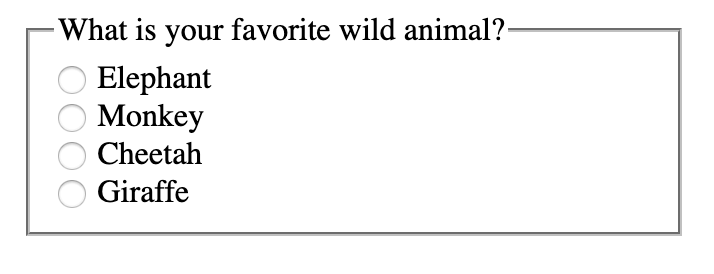
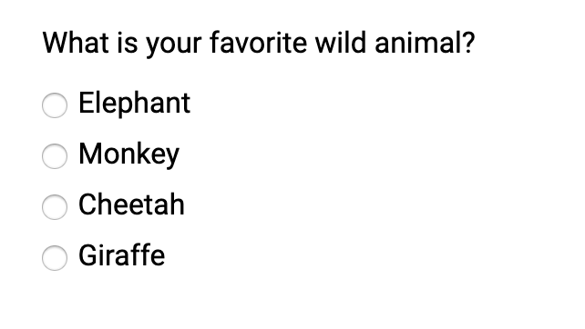
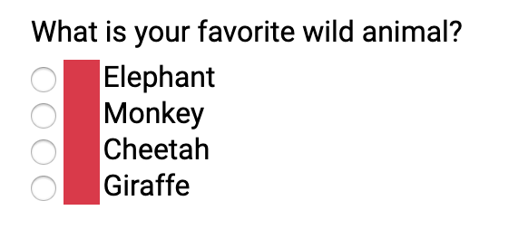
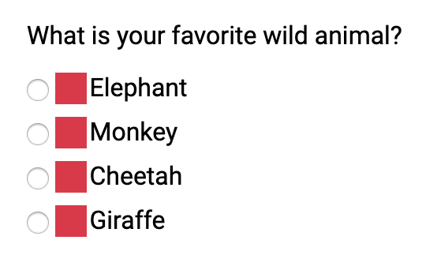
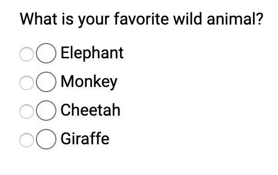
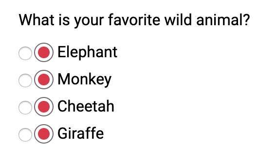
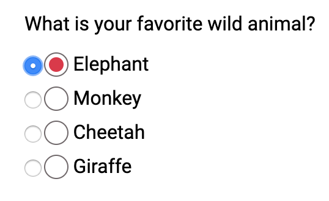
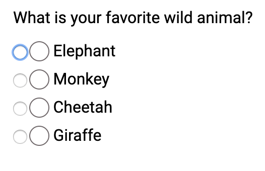
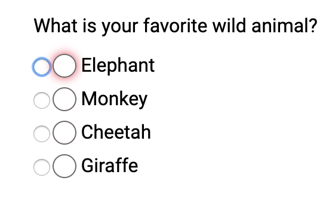

_Content Warning: This blog post contains gifs._

import CallToAction from '../../components/CallToAction/CallToAction'

Hey friends! Today we'll be creating custom keyboard accessible radio buttons! This blog post is a follow-up post from [my accessible checkboxes post](/blog/create-custom-keyboard-accesible-checkboxes).

We'll go over:

1. The markup
1. Creating a pseudo-element on the label in CSS
1. Add "selected" styling in CSS
1. Add focus styling

## Starting out

I decided to create a simple group of radio buttons asking what your favorite animal is

```html
<fieldset>
  <legend>What is your favorite Wild Animal?</legend>
  <div class="radio-wrapper">
    <input type="radio" name="animal" id="elephant" />
    <label for="elephant">Elephant</label>
  </div>
  <div class="radio-wrapper">
    <input type="radio" name="animal" id="monkey" />
    <label for="monkey">Monkey</label>
  </div>
  <div class="radio-wrapper">
    <input type="radio" name="animal" id="cheetah" />
    <label for="cheetah">Cheetah</label>
  </div>
  <div class="radio-wrapper">
    <input type="radio" name="animal" id="giraffe" />
    <label for="giraffe">Giraffe</label>
  </div>
</fieldset>
```

The `fieldset` groups all the radio buttons together logically. The radios inputs are all options to the question in the `legend`. Also, remember to associate those form labels with the radio buttons! If you don't know what that means, I suggest taking a look at my [introduction to accessible labeling](/blog/introduction-accessible-labeling).



I'm going to add some straightforward SCSS to clean it up a bit.

```scss
@import url('https://fonts.googleapis.com/css?family=Roboto&display=swap');

* {
  font-family: 'Roboto', sans-serif;
}

fieldset {
  border: none;
}
```

I didn’t do anything much here; I added a font and took away the border from the `fieldset`.



Now let's get to the fun part! Styling these radio buttons!

## Creating a pseudo-element on the label

First thing I am going to do is add a `::before` pseudo-element on the `label` element. I'm going to start with something basic first.

```scss
$muted-red: #db3846;

input[type='radio'] {
  + label {
    position: relative;
    display: inline-block;
    cursor: pointer;
    margin-left: 20px; /* This will be adjusted */

    &::before {
      content: '';
      position: absolute;
      display: inline-block;
      left: -22px; /* This will be adjusted */
      width: 20px;
      height: 20px;
      background: $muted-red;
    }
  }
}
```

The radio buttons won't look like anything much right now. We only want to see the radio buttons to ensure we are replicating the HTML functionality.



I'm going to add a teensy amount of margin on the `.radio-wrapper`.

```scss{3-5}
$muted-red: #db3846;

.radio-wrapper {
  margin: 0.5rem 0;
}

input[type='radio'] {
  + label {
    position: relative;
    display: inline-block;
    cursor: pointer;
    margin-left: 20px; /* This will be adjusted */

    &::before {
      content: '';
      position: absolute;
      left: -24px; /* This will be adjusted */
      width: 18px;
      height: 18px;
      background: $muted-red;
    }
  }
}
```



Now let's remove that background color and round out the edges.

```scss{13,14,17}
input[type='radio'] {
  + label {
    position: relative;
    display: inline-block;
    cursor: pointer;
    margin-left: 20px; /* This will be adjusted */

    &::before {
      content: '';
      position: absolute;
      display: inline-block;
      left: -24px; /* This will be adjusted */
      border-radius: 50%;
      border: 1px solid #6f686a;
      width: 18px;
      height: 18px;
      background: transparent;
    }
  }
}
```

As a note, I am going to leave the standard radio buttons for debugging purposes.



## Add `:checked` styling in CSS

If you've read my post on [keyboard accessible checkboxes](/blog/create-custom-keyboard-accesible-checkboxes) you know about the `:checked` pseudo-class. First, we need to put add an `::after` pseudo-element on the label.

```scss{20-30}
input[type='radio'] {
  + label {
    position: relative;
    display: inline-block;
    cursor: pointer;
    margin-left: 20px; /* This will be adjusted */

    &::before {
      content: '';
      position: absolute;
      display: inline-block;
      left: -24px; /* This will be adjusted */
      border-radius: 50%;
      border: 1px solid #6f686a;
      width: 18px;
      height: 18px;
      background: transparent;
    }

    &::after {
      content: '';
      position: absolute;
      display: inline-block;
      left: -20px;
      top: 4px;
      border-radius: 50%;
      width: 12px;
      height: 12px;
      background: $muted-red;
    }
  }
}
```

Now, this is what that looks like:



Now we have the styling in place. Let's only add the `background` of the `::after` pseudo-element when the radio input is `:checked`.

```scss{15-19}
input[type='radio'] {
  + label {
    &::after {
      content: '';
      position: absolute;
      display: inline-block;
      left: -20px;
      top: 4px;
      border-radius: 50%;
      width: 12px;
      height: 12px;
    }
  }

  &:checked {
    + label::after {
      background: $muted-red;
    }
  }
}
```

So now if I select a radio button, it'll have a background color!



If you notice, though, there is no focus styling. Let's focus on that next (see what I did there)

## Add focus styling

If I were to hide the radio button, you would have no idea if I focused on it.



```scss
input[type='radio'] {
  &:focus {
    + label::before {
      box-shadow: 0 0px 8px $muted-red;
    }
  }
}
```

I decided to add a similar muted red for the focus styling.



To finish up, I will:

- remove the `opacity` from the radio button itself (the input)
- remove the `margin-left` from the label!

```scss
input[type='radio'] {
  opacity: 0;

  + label {
    position: relative;
    display: inline-block;
    cursor: pointer;
  }
}
```

And Voilà!


## Conclusion

When we make custom radio buttons, we have to make sure we account for the following:

1. Creating proper HTML structure with associated form labels!
1. Using pseudo-elements to create the custom-styled element
1. Accounting for the `:checked` pseudo-class
1. Ensuring you can focus on the new radio button
1. Use `opacity: 0` to hide the radio button

If you want to play around with it, here is the finished CodePen!

<iframe
  height="445"
  style="width: 100%;"
  scrolling="no"
  title="Starting HTML - Keyboard Accessible Custom Radio Buttons"
  src="//codepen.io/littlekope0903/embed/jjgRPL/?height=445&theme-id=0&default-tab=css,result"
  frameborder="no"
  allowtransparency="true"
  allowfullscreen="true"
>
  See the Pen{' '}
  <a href="https://codepen.io/littlekope0903/pen/jjgRPL/">
    Starting HTML - Keyboard Accessible Custom Radio Buttons
  </a>{' '}
  by Lindsey Kopacz (
  <a href="https://codepen.io/littlekope0903">@littlekope0903</a>) on{' '}
  <a href="https://codepen.io">CodePen</a>.
</iframe>

**EDIT:**

I wanted to give a shout out to some feedback/help from some cool people from Twitter for helping me polish a few things. In particular, I wanted to shout out [Elizabeth Schafer](https://twitter.com/elizschafer) for forking this and making some tweaks for windows high contrast mode! Super cool!

<iframe
  height="450"
  style="width: 100%;"
  scrolling="no"
  title="Keyboard Accessible Custom Radio Buttons"
  src="//codepen.io/eschafer/embed/wVmwoy/?height=450&theme-id=dark&default-tab=css,result"
  frameborder="no"
  allowtransparency="true"
  allowfullscreen="true"
>
  See the Pen{' '}
  <a href="https://codepen.io/eschafer/pen/wVmwoy/">
    Keyboard Accessible Custom Radio Buttons
  </a>{' '}
  by Elizabeth Schafer (<a href="https://codepen.io/eschafer">@eschafer</a>) on{' '}
  <a href="https://codepen.io">CodePen</a>.
</iframe>

Stay in touch! If you liked this article:

- Let me know on [Twitter](https://twitter.com/LittleKope) and share this article with your friends! Also, feel free to tweet me any follow up questions or thoughts.
- Support me on [Patreon](https://www.patreon.com/a11ywithlindsey)! If you like my work, consider making a monthly pledge.
- Take my [10 days of a11y](https://a11y-with-lindsey.ck.page/b4e437f629) free email course.
- [Be the first to learn about my posts](https://pages.convertkit.com/4218bd5fb5/68dc4e412a) for more accessibility funsies!

<CallToAction>

  

  ## Order now!

  The Bootcamper’s Guide to Web Accessibility is now available.

  [Order Now](https://a11y-with-lindsey.ck.page/products/pre-order-the-bootcampers-guide-to-web)

</CallToAction>

Cheers! Have a great week!
