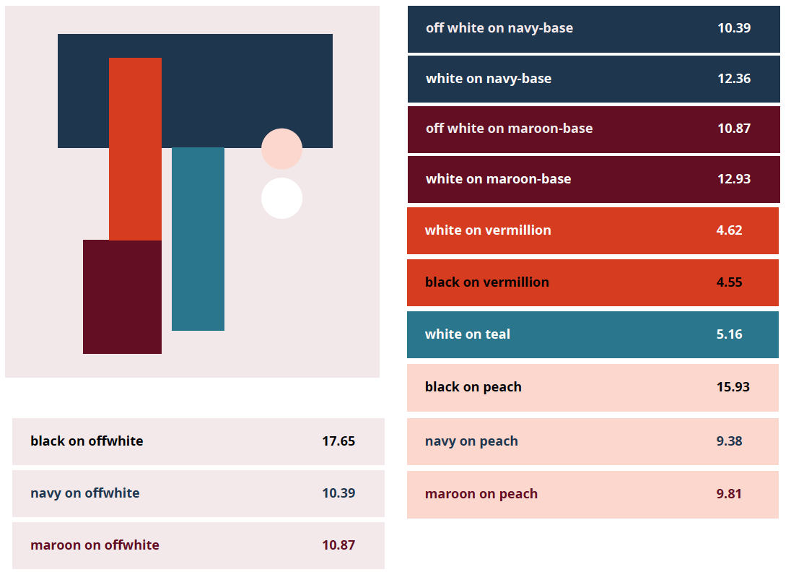

This topic has the potential to be a touchy one for marketing departments and designers. There have been plenty of approved designs I have received, just to find their new branding's color scheme is not accessible. Sometimes our clients or organizations fall in love with their new brand and design, and asking them to change on the branding or the design is actually like asking them to change the new identity they just fell in love with. The ironic part is there are usually accessibility requirements on the clients' SOW, but the designers didn't know that their colors were inaccessible. 

## Rule of thumb

We can get a little more nitty gritty here, and we will. However, from both a technical and non-technical perspective there is one major rule of thumb when talking about color: **do not depend on color to communicate meaning**.

There are plenty of technical things I could talk about here, but let's talk about color and meaning in regards to Football, the all-American sport. Back in 2015, there was a "Color Rush" campaign for the NFL. The campaign was to celebrate the 50th anniversary of the league's first-ever game shown in color. Seems pretty fun right? 

Then came [the Jets-Bills game](https://www.cbssports.com/nfl/news/look-bills-jets-game-is-complete-torture-for-color-blind-people/), which was a nightmare for the 13 million (at time of the report) Americans who suffer from Red/Green colorblindness. 

<blockquote class="twitter-tweet" data-lang="en">
heres what the bills jets game looks like for red green color blind people <a href="https://t.co/TAjoQpOfCj">pic.twitter.com/TAjoQpOfCj</a>
&mdash; kurt (@kurtwearshats) <a href="https://twitter.com/kurtwearshats/status/664992830629281792?ref_src=twsrc%5Etfw">November 13, 2015</a></blockquote>

Ultimately, your design may look spectacular to you, but it may be painfully frustrating for your users. Particularly if you're using color to determine meaning.

## Having proper contrast

According to [National Institute of Health, National Eye Institute](https://nei.nih.gov/health/color_blindness/facts_about), as many as 8 percent of men and 0.5 percent of women with Northern European ancestry have the common form of red-green color blindness. However, color contrast isn't important only for those that suffer from colorblindness. This can also impact people with aging and/or sleepy eyes or even people trying to read a site on a mobile device outside in the sun. 

<blockquote class="twitter-tweet" data-lang="en">
As my vision declines, there is not one single day that goes by that I don&#39;t curse asshole web-designers who use grey type.
&mdash; son of an asylum seeker, father of an immigrant (@doctorow) <a href="https://twitter.com/doctorow/status/908702406338240512?ref_src=twsrc%5Etfw">September 15, 2017</a></blockquote>

The above tweet makes me laugh, mostly because I am relatively young (29), with 20/20 vision and only wear glasses at the computer to reduce eye strain. I have *missed* links that were gray on gray before. 

So what is the proper contrast? Proper contrast is 3:1 for large text and 4.5:1 for smaller text. When I first saw these evaluations, I thought to myself: What the heck does small or large mean, that's subjective!? Well, they do actually define it. Large text is anything larger than 14 point (typically 18.66px) and bold or larger, or 18 point (typically 24px) or larger. Anything smaller is... small text.

## Tools to use 
1. [WebAim contrast checker](https://webaim.org/resources/contrastchecker/). Let's be real, I don't know how to manually check hues and contrast on my own. That is way above my analytical and artistic skills. But in order to assess contrast, I use this contrast checker. I simply put in the hex value of the Foreground Color (text color) and Background color, and it will tell me what the contrast is. Another thing I like is if you're playing with color contrast, you can adjust it to be lighter or darker to stay within the brand while knowing for certain that your color usage is acceptable.

2. [Color contrast analyzer](https://chrome.google.com/webstore/detail/color-contrast-analyzer/dagdlcijhfbmgkjokkjicnnfimlebcll?hl=en). I love this tool to analyze background image contrast with text. Something that's really difficult is assuring that contrast is appropriate on images. Automated tools usually don't do the trick here because they will look for the hex value of the background, not analyze the hues and contrast of the image itself. My biggest problem with it is that it doesn't really tell you passing or failing and it took me awhile to figure out how to use it. Still, it's better than nothing!

3. [NoCoffee Vision Stimulator](https://chrome.google.com/webstore/detail/nocoffee/jjeeggmbnhckmgdhmgdckeigabjfbddl?hl=en-US). This tool isn't for contrast per se', but it helps you assess what your website may look like with a variety different vision disabilities. This goes from varieties like color blindness to cataracts. At the minimum, it's a very useful tool to developing empathy and ensuring inclusiveness.

## How to start evaluating your brand

While I am not a designer and don't have the same workflows as a designer might, I worked with designer [Raquel Breternitz](https://www.linkedin.com/in/raquel-breternitz/) on this color scheme and my logo. It worked really well for us and I wanted to share how we worked together to create an accessible design.

Of course, because my blog was going to be about accessibility, I was very adamant and clear about those requirements, which may not be the case for many clients. However, Raquel would ask what I presume to be normal questions about my brand, what my message is, what are elements of my brand and personality I'd like to emphasize, etc. We also had a Pinterest board where we would brainstorm about color schemes and I would pick the ones I liked the best. I don't know much about how designers work with clients, but I suspect that this is the overall theme, although maybe the Pinterest board is more for individuals vs organizations.

Once I picked my favorite color schemes, she went above and beyond when she sent me deliverables. She gave me about 5 - 6 colors and would use a variety of them together with text and background. For each one, she would tell me what the color contrast of that combination was. It gave me a lot of confidence that all the colors I was using was at proper contrast and I was using colors appropriately. If you'd like to take a look at some of the samples that we went through,  you can [download the color schemes](./ColorSchemes.zip).

## How to convince a client to change their brand

Oftentimes, we as developers don't get to directly work with the designers of our projects. I've been in a lot of scenarios where I was siloed away from a designer and unable to give them feedback or flag concerns I had. I was just plopped a design and was told to make it happen.

How does one approach the conversation when you receive inaccessible color contrast? I'm not going to lie to you, this part I still struggle with and it certainly isn't easy. We don't want to insult the designer or act like they ignored SOW requirements. In both personal and professional settings, blaming others is usually a no-no. I'd like to think that flaws with accessible design are usually unintentional. However, sometimes a designer did build an accessible design, but the client requests something inaccessible and ignores me when the designer or the developer flag the contrast issues.

When I have an instance where a client minimizes contrast, there are several things I do. First, if there are requirements in their SOW, I have a leg up to tell them that it's part of our requirements and that there are legal and business incentives to keep those requirement. Regardless of whether they have accessibility in their SOW, I explain what that means to the end user, instead of using jargon like "WCAG 2.0" or "Section 508 compliance." Even in the Federal Government, using jargon doesn't really help your client understand what that means to their end users.

In the case of color contrast, it would depend on the audience. I really like to use the football example above if I am speaking with an audience that loves that sport. At a minimum, they can understand how frustrating it could be if you couldn't understand which team got a touchdown, which team fumbled, who intercepted whom. If you relate it to web, I usually like to explain it to them by saying that we want to make sure that people can distinguish items regardless of their ability.

I plan on writing more about color, because I personally find the science of visual perception fascinating. I hope this is a great start. Feel free to reach out to me on [Twitter](https://twitter.com/littlekope0903) if you have questions.