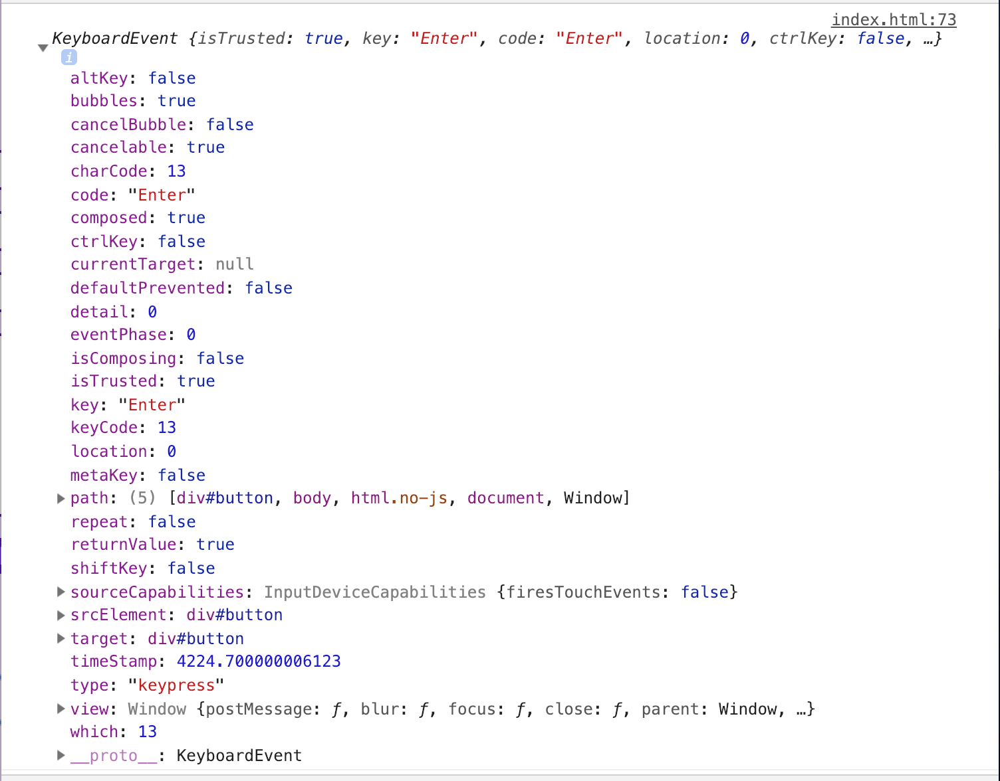

_Content Warning: This blog post contains gifs._

If you didn’t know this already, I usually cross post all these on [DEV](https://dev.to). When I cross-posted about why accessibility isn’t an edge case, I got a comment wishing accessibility was more straightforward to implement. I didn’t find learning to make accessible solutions to be that challenging once I was up to date on HTML and CSS best practices, so I was genuinely curious about where they found it difficult. When [they answered](https://dev.to/marek/comment/882m), it seemed like the primary pain point was ARIA.

I’ve seen a ton of confusion about ARIA and when it should and shouldn’t be used. What do these ARIA attributes even mean? Is there a list of all the attributes? I am thinking about making this into a series, maybe going over a few ARIA attributes a week and how they can be used, whether I like them, etc. Before I get into the weeds about all the ARIA attributes though, I really need to get a few things straight about what ARIA is used for, and what I don’t think you should use it for.

## What the hell is ARIA?

ARIA is a bunch of attributes that you can add to your elements to give them extra context and meaning. This can be useful for a lot of things. Here is what I find helpful about ARIA:

- Telling you when you are loading dynamic content
- Alerting a user when something important pops up
- Telling screen readers when the state changes
- Adding some extra context if needed

The documentation on ARIA is pretty damn intimidating. Even as an accessibility person, I find it a bit daunting. The way I learned about ARIA is by opening up a well-used application like Twitter. I then inspected the elements and searched in the HTML for `aria` and looked at all the attributes. I then turned on my screen reader and actually listened to what was actually announced when I reached that particular element. For example, when I use VoiceOver on Mac and open up the homepage of Twitter, this is the markup of my profile picture in the upper right-hand corner:

```html
<a
  href="/settings"
  id="user-dropdown-toggle"
  role="button"
  aria-haspopup="true"
>
  <!-- Children Elements -->
</a>
```

**NOTE: For readability, I have removed some of the attributes and classes from the markup**

I spot two ARIA attributes at first glance: `role="button"` and `aria-haspopup="true"`. So what does this mean when I use my screenreader.

<figure>
  
  <figcaption>First thing VoiceOver says.</figcaption>
</figure>

<figure>
  
  <figcaption>Second thing VoiceOver says.</figcaption>
</figure>

If you see what is read, you’ll notice the words “Pop up button.” Because the markup is a link, without those attributes, it would read as just a link. I honestly think that this markup could be changed to a `<button>` because, at the time of this reading, I cannot use the link to go to the `href` attribute value (/settings) and acts like a button. But the **context** of knowing this is a popup may be super helpful to a screen reader.

I will say, I am usually hesitant to use ARIA when I first start building things out. You may have noticed I critiqued this markup about what I would change, and it is for this reason that I try to avoid using ARIA unless it is necessary to add context. This is why in my technical posts where I am coding something from scratch, you likely won’t see ARIA attributes at first. I have quite a few reasons for that which leads me to...

## What ARIA is NOT?

The first time I presented about ARIA at a meetup, a blind developer was in attendance and he grilled me. It wasn’t fun. The reason for this is because a lot of times ARIA should never be the focus of accessibility, especially nowadays that we have HTML5. HTML5 solves a lot of the semantic issues screen readers used to face.

Here is what ARIA is NOT:

- A replacement for semantic HTML

Hmm, that’s actually all I can think of. Let’s break this into an example to make more sense of what I mean. If you don’t like the default styling of the `<button>`, but you like all the built-in button features, this HTML will not magically make all the button defaults work:

```html
<div role="button">
  Open Menu
</div>
```

Let’s say you have a click event for that button. If you read my article about [3 Simple Tips to Improve Keyboard Accessibility](/blog/3-simple-tips-improve-keyboard-accessibility), you know that buttons have some default functionality built in. Without doing anything else, all this does is announce this as a button with a screen reader. However, you are unable to focus on it without a keyboard. So the next step is to make sure that we have a `tabindex` on it. Let’s try that.

```html
<div tabindex="0" role="button">
  Open Menu
</div>
```

Can we now use a click event on it? Let’s try it out. Let’s update the HTML to include an ID to make it easier to target with JavaScript:

```html
<div tabindex="0" id="button" role="button">
  Open Menu
</div>
```

Now, I’ll write some basic JavaScript here just to see if it works.

```js
const button = document.getElementById('button')
button.addEventListener('click', () => alert('clicked!'))
```


As you can see from the gif, the ARIA role or tabindex didn’t fix it. We have to listen for a keypress event on the button. I’m going to debug this with you so we can walk through how much extra work this is.

```js
button.addEventListener('keypress', e => {
  console.log(e)
})
```

Result of the console log:


Let’s think about what we are doing here. I am adding a keypress event on the button and checking out what properties we have in the event object. This is important because if we want to replicate a button, we have to take note of **what key** we are pressing when we have the keypress event. The built-in HTML button behavior works on both keypresses Enter and Space bar. When we look at the console log, we want to use `e.code`. So here’s what I’ll update with a conditional.

```js
button.addEventListener('keypress', e => {
  if (e.code === 'Enter' || e.code === 'Space') {
    alert('pressed!')
  }
})
```


So, while this isn’t the most challenging thing to do, it’s way easier to change the `<div>` into a `<button>`. You can use CSS to get rid of the default styling, and overall you’ll make your life a lot easier accessibility wise!

## Conclusion

The way I like to think about ARIA is **context**. Sometimes you don’t need additional background - the HTML is surely enough. Sometimes it could be better though, especially if it’s a custom widget. I’ll do more about ARIA in the future regarding specific attributes and what they do - mainly because the documentation can be a bit daunting. Cheers to that!

Feel free to reach out to me on [Twitter](https://twitter.com/LittleKope/) if you have questions about this blog post!
