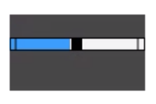
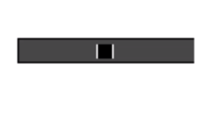
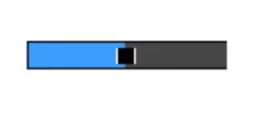
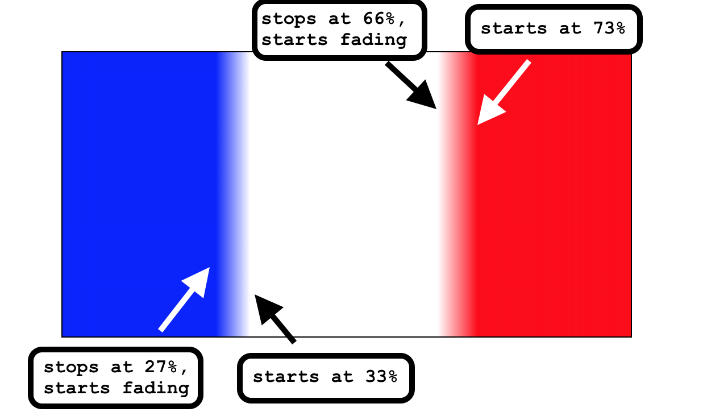

I’ve always loved exploring how to make semantic, accessible elements aesthetically pleasing. And yes, it is possible. Challenging myself to do this has improved my CSS skills.

Today we are going to talk about `input[type="range"]`. These inputs where you select a value from a slider that has a thumb on it. You start with HTML that looks like this:

```html
<div class="wrapper">
  <input type="range" min="0" max="100" />
</div>
```

Selecting a purpose for an input range slider has many possibilities. You could use it for volume decibel. You could use it for an audio player. You could use it in a survey when rating from 1-10. Many times, when people make these features custom, they don't think to use the semantic features. They make a bunch of divs, and don't think about the keyboard or screen reader accessibility.

## Considerations

Today I am going to be playing around with CSS to show you some of the possibilities. A lot of what I do in this post is a form of exploration. I learned a lot about `linear-gradient` from research for this post, and we’ll be going over how I perceived it.

When I go through these steps, I am considering the following:

1. **Browser support** - I don't talk about browser support often. But according to the [POUR]() principles, your site and application must be **robust**. In the post, we’ll be going over many pseudo-elements for robust browser support.
2. **Providing a fallback** - linear-gradient isn't always supported. It looks neat, but we have to ensure we have a clear way of presenting the range even if it's not possible
3. **Don't use JavaScript to hack** - just because you can doesn't mean you should.

## Starting out

When we first create that HTML, the appearance is pretty unimpressive.


The first thing we want to do is start with a clean slate in our CSS. We are going to add a `position: relative;` on our `wrapper` class. Then we add an `appearance: none;` to our range input. If you check out the [Mozilla docs](https://developer.mozilla.org/en-US/docs/Web/CSS/appearance), prepending `-webkit-` should cover us for Firefox, Chrome, and edge.

```css
.wrapper {
  position: relative;
  margin: 1rem;
}

input[type='range'] {
  -webkit-appearance: none;
}
```


There are a few things that I am going to “normalize” before I start going into the pseudo-elements. I am adding a width and a transparent background. For this particular item, I am going to add a `max-width` as well.

```css{3-5}
input[type='range'] {
  -webkit-appearance: none;
  max-width: 7rem;
  width: 100%;
  background: transparent;
}
```

## Browser Specific Pseudo Elements

You'd think that you could just add a bunch of properties like height, background color, and margin, like this:

```css{6-8}
input[type='range'] {
  -moz-appearance: none;
  -webkit-appearance: none;
  max-width: 7rem;
  width: 100%;
  margin: 0;
  height: 0.9rem;
  background: #464646;
}
```

However, if you use something like BrowserStack, you'll see something like this in IE11.



Depending on what your analytics say for your audience's browser usage, this may be moot. And take that knowledge and apply it how you please. But I believe in robust browser support, so I’m going to cover the following pseudo-elements:

- `::-webkit-slider-runnable-track`
- `::-moz-range-track`
- `::-ms-track`

Note: if you want to use these pseudo-elements, you have to create the selectors separately. That’s because if a browser isn’t supported, it’ll ignore the entire block.

```css
input[type='range']::-webkit-slider-runnable-track {
  height: 0.9rem;
  margin: 0;
  width: 100%;
  cursor: pointer;
  background: #464646;
}

input[type='range']::-moz-range-track {
  height: 0.9rem;
  margin: 0;
  width: 100%;
  cursor: pointer;
  background: #464646;
}

input[type='range']::-ms-track {
  height: 0.9rem;
  margin: 0;
  width: 100%;
  cursor: pointer;
  color: transparent;
  background: #464646;
}

input[type='range']::-ms-fill-lower {
  background: transparent;
}
```

In Chrome:


In Firefox:


In Edge:


In IE11:



The main difference between the properties inside the blocks is the `::-ms-track` pseudo-element needs a `color: transparent`. We also need to have a `::-ms-fill-lower` otherwise it looks like this:



When we add all these in, we have a starting out point for our volume slider:

<iframe height="450" style="width: 100%;" scrolling="no" title="Volume Slider - Starting out" src="https://codepen.io/littlekope0903/embed/KKpMvXM?height=450&theme-id=default&default-tab=css,result" frameborder="no" allowtransparency="true" allowfullscreen="true">
  See the Pen <a href='https://codepen.io/littlekope0903/pen/KKpMvXM'>Volume Slider - Starting out</a> by Lindsey Kopacz
  (<a href='https://codepen.io/littlekope0903'>@littlekope0903</a>) on <a href='https://codepen.io'>CodePen</a>.
</iframe>

Now we get to play around with the part I explored the most - linear gradient.

## Using linear-gradient

Linear gradient confused me for the longest time. Because I focus on accessibility more than CSS, I never learned all the fun CSS functions. I want a volume bar that shows a triangle going from the lowest step to the highest step while giving a screen reader user the ability to control volume decibel.

Our goal would be to have something that looks similar to this:


`linear-gradient` is a CSS function that transforms a background from one or many colors into another. This function takes on many arguments and can be very simple or very complex.

From the most basic standpoint, here is what to consider when you're creating a linear gradient:

- The angles and the direction of the gradient
- What colors you want in the gradient.
- What percent points you want the "fade" to start and stop. More formally, we call these color stops.

I have a few examples that I played with that I show in the following CodePens.

First a rainbow:

<iframe height="450" style="width: 100%;" scrolling="no" title="Linear Gradient - Blurry Rainbow" src="https://codepen.io/littlekope0903/embed/povBzqX?height=450&theme-id=default&default-tab=css,result" frameborder="no" allowtransparency="true" allowfullscreen="true">
  See the Pen <a href='https://codepen.io/littlekope0903/pen/povBzqX'>Linear Gradient - Blurry Rainbow</a> by Lindsey Kopacz
  (<a href='https://codepen.io/littlekope0903'>@littlekope0903</a>) on <a href='https://codepen.io'>CodePen</a>.
</iframe>

A few of my observations:

- If there's no direction or angle specified, it assumes a horizontal (0deg) angle and top to bottom direction.
- If you don’t specify where the colors stop, the gradient assumes even distribution.

Now a French Flag:

<iframe height="450" style="width: 100%;" scrolling="no" title="Linear Gradient - French Flag" src="https://codepen.io/littlekope0903/embed/LYEvPay?height=450&theme-id=default&default-tab=css,result" frameborder="no" allowtransparency="true" allowfullscreen="true">
  See the Pen <a href='https://codepen.io/littlekope0903/pen/LYEvPay'>Linear Gradient - French Flag</a> by Lindsey Kopacz
  (<a href='https://codepen.io/littlekope0903'>@littlekope0903</a>) on <a href='https://codepen.io'>CodePen</a>.
</iframe>

My first observation: I associate linear gradients as fades. But if you want a straight line, you have to put the “stop” to be at equal values.

<!-- prettier-ignore -->
```css
.flag--fr {
  background: linear-gradient(
    /* The gradient is going toward the right */
    to right,
    /* It starts at blue and stops in full opacity at 33% */
    blue 33%,
    /* White starts in full opacity at 33% */
    white 33%,
    /* White ends in full opacity at 66% */
    white 66%,
    /* Red starts in full opacity at 66%
    and will continue till the background is over */
    red 66%
  )
}
```

What if we want to start playing with fades and make it more blurry?

<iframe height="450" style="width: 100%;" scrolling="no" title="Linear Gradient - blurry French Flag" src="https://codepen.io/littlekope0903/embed/yLyrBQm?height=450&theme-id=default&default-tab=css,result" frameborder="no" allowtransparency="true" allowfullscreen="true">
  See the Pen <a href='https://codepen.io/littlekope0903/pen/yLyrBQm'>Linear Gradient - blurry French Flag</a> by Lindsey Kopacz
  (<a href='https://codepen.io/littlekope0903'>@littlekope0903</a>) on <a href='https://codepen.io'>CodePen</a>.
</iframe>

There is a gap between the stops at full opacity, and in between that gap, there is a fade. Fun stuff!

<!-- prettier-ignore -->
```css
.flag--fr {
  background: linear-gradient(
    to right,
    /* Blue stops at 27%, starts to
    fade into the next color */
    blue 27%,
    /* White starts at 33% */
    white 33%,
    /* White stops at 66%, starts to
    fade into next color */
    white 66%,
    /* Red starts at 73% */
    red 73%)
}
```



I'm still a complete newb to this stuff, so I bet I am missing many details. But this is my "explain like I'm five" version of this.

So, this feels like a tangent, but I promise it's not. We are going to use what we learned to create a volume range. We want to visually indicate that the volume is getting higher when we increase the range value. So we are going to take the code we were using at the end of the Starting Out section, and add a linear-gradient to it. Remember, these lines won't be blurry. We'll need to make sure that the percentage of the gradient matches.

<!-- prettier-ignore -->
```css{7-11,20-24,35-39}
input[type=range]::-webkit-slider-runnable-track {
  height: 0.9rem;
  margin: 0;
  width: 100%;
  cursor: pointer;
  background: #464646;
  background: linear-gradient(
    to bottom right,
    transparent 50%,
    #464646 50%
  );
}

input[type=range]::-moz-range-track {
  height: 0.9rem;
  margin: 0;
  width: 100%;
  cursor: pointer;
  background: #464646;
  background: linear-gradient(
    to bottom right,
    transparent 50%,
    #464646 50%
  );
}

input[type=range]::-ms-track {
  height: 0.9rem;
  margin: 0;
  width: 100%;
  cursor: pointer;
  color: transparent;
  background: #464646;
  border: 0;
  background: linear-gradient(
    to bottom right,
    transparent 50%,
    #464646 50%
  );
}
```

Now, this looks like a right triangle, with the 90degrees mark being at the bottom right-hand corner.


My SCSS linter will yell at me about having 2 background properties. But I like having the background as a solid color as a fallback. If the browser doesn’t support linear-gradient, we have a browser fallback.

## Designing the thumb

Now, with my goal, I want the thumb to be narrow and taller. CSS wise, this is relatively simple. Here’s the list of the pseudo-elements to make sure the thumb works across browsers:

- `::-webkit-slider-thumb`
- `::-moz-range-thumb`
- `::-ms-thumb`

Again, we have to separate these all out into their separate selectors, the same as the track.

We want to set the `-webkit-appearance: none;` and set height, width, border, and background. For Chrome, we add a negative `margin-top` to balance out the positioning. The rest have no `margin-top`.

```css
input[type='range']::-webkit-slider-thumb {
  -webkit-appearance: none;
  height: 1.5rem;
  width: 0.5rem;
  background: #ffffff;
  border: 1px solid;
  margin-top: -5px;
}

input[type='range']::-moz-range-thumb {
  -webkit-appearance: none;
  height: 1.5rem;
  width: 0.5rem;
  background: #ffffff;
  border: 1px solid;
  margin-top: 0;
}

input[type='range']::-ms-thumb {
  -webkit-appearance: none;
  height: 0.75rem;
  width: 0.5rem;
  background: #ffffff;
  border: 1px solid;
  margin-top: 0;
}
```

Now we will see the track is tall and white with a black border.


Now we can just round out the edges and add a pointer cursor.

```css{8-9,18-19,29-30}
input[type='range']::-webkit-slider-thumb {
  -webkit-appearance: none;
  height: 1.5rem;
  width: 0.5rem;
  background: #ffffff;
  border: 1px solid;
  margin-top: -5px;
  border-radius: 3px;
  cursor: pointer;
}

input[type='range']::-moz-range-thumb {
  -webkit-appearance: none;
  height: 1.5rem;
  width: 0.5rem;
  background: #ffffff;
  margin-top: 0;
  border-radius: 3px;
  cursor: pointer;
}

input[type='range']::-ms-thumb {
  -webkit-appearance: none;
  height: 0.75rem;
  width: 0.5rem;
  background: #ffffff;
  border: 1px solid;
  margin-top: 0;
  border-radius: 3px;
  cursor: pointer;
}
```

The source that helped me out a lot with this section: [CSS Tricks](https://css-tricks.com/styling-cross-browser-compatible-range-inputs-css/#article-header-id-1)

## Adding custom focus states

I want to remove the focus styles (gasp!) from the entire input, and put it on the thumb itself. I couldn't figure out how to get rid of it on Firefox, so if you know, tweet at me and let me know!

I am going to remove the outline on the entire input, and instead all box shadows to the input range on focus:

```css
input[type='range']:focus {
  outline: none;
}

input[type='range']:focus::-webkit-slider-thumb {
  box-shadow: 0px 0px 7px 3px #0065c4;
}

input[type='range']:focus::-moz-range-thumb {
  box-shadow: 0px 0px 7px 3px #0065c4;
}

input[type='range']:focus::-ms-thumb {
  box-shadow: 0px 0px 7px 3px #0065c4;
}
```

<iframe height="450" style="width: 100%;" scrolling="no" title="Volume Slider" src="https://codepen.io/littlekope0903/embed/PowVaJd?height=450&theme-id=default&default-tab=css,result" frameborder="no" allowtransparency="true" allowfullscreen="true">
  See the Pen <a href='https://codepen.io/littlekope0903/pen/PowVaJd'>Volume Slider</a> by Lindsey Kopacz
  (<a href='https://codepen.io/littlekope0903'>@littlekope0903</a>) on <a href='https://codepen.io'>CodePen</a>.
</iframe>

## When it gets hairy

If you want the area between the thumb and the start of the range to be a different color, it can begin to get complicated. This differentiation indicates progress, not to be confused with the progress element.


Unfortunately, using pseudo-elements, we only have support for Edge, IE, and Firefox. There is the pseudo-element `::-ms-fill-lower` and `::-moz-range-progress`, but none for Chrome. I’ve played with doing this in JavaScript, but it sounds like a performance nightmare and too much math.

You can check out the CodePen where I use these pseudo-elements.

<iframe height="450" style="width: 100%;" scrolling="no" title="Slider with Progress Bar (Supports Mozilla, Edge, &amp; IE)" src="https://codepen.io/littlekope0903/embed/rNabEbm?height=450&theme-id=default&default-tab=css,result" frameborder="no" allowtransparency="true" allowfullscreen="true">
  See the Pen <a href='https://codepen.io/littlekope0903/pen/rNabEbm'>Slider with Progress Bar (Supports Mozilla, Edge, &amp; IE)</a> by Lindsey Kopacz
  (<a href='https://codepen.io/littlekope0903'>@littlekope0903</a>) on <a href='https://codepen.io'>CodePen</a>.
</iframe>

## Conclusion

Thanks for reading and learning with me! I hope I've helped you explore and also realize that aesthetic and accessibility are not mutually exclusive. You just have to take some time and think it through.

Stay in touch! If you liked this article:

- Let me know on [Twitter](https://twitter.com/LittleKope) and share this article with your friends! Also, feel free to tweet me any follow up questions or thoughts.
- Support me on [Patreon](https://www.patreon.com/a11ywithlindsey)! If you like my work, consider making a $1 monthly pledge. You’ll be able to vote on future blog posts if you make a \$5 pledge or higher! I also do a monthly Ask Me Anything Session for all Patrons!
- Take my [10 days of a11y](https://a11y-with-lindsey.ck.page/b4e437f629) free email course.
- [Be the first to learn about my posts](https://pages.convertkit.com/4218bd5fb5/68dc4e412a) for more accessibility funsies!

Cheers! Have a great week!
