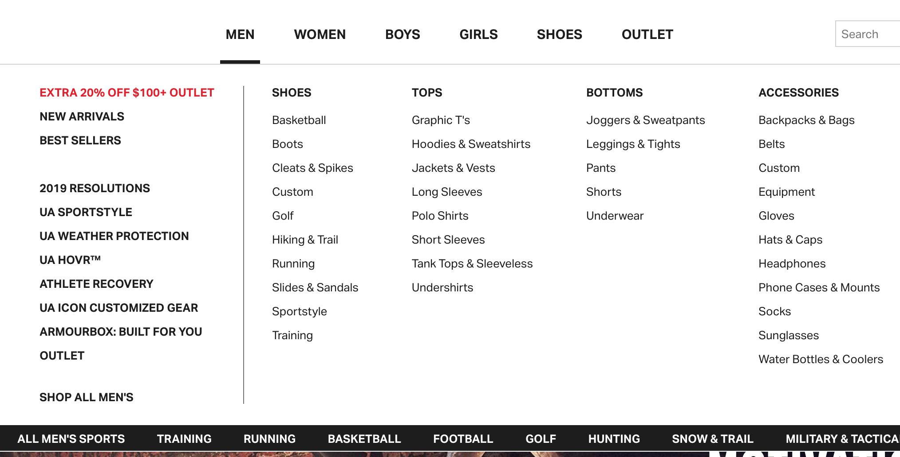

This post was inspired by a few things. First, a few months ago Rian Rietveld announced she was [resigning as the WordPress accessibility lead](https://rianrietveld.com/2018/10/09/i-have-resigned-the-wordpress-accessibility-team/). I read through the post, and the reason seemed to be mainly about Gutenberg. It seemed that despite all the wpa11y’s team’s warnings, they were pushing to release it while it was almost unusable for those who need assistive devices. I found there to be a tremendous opportunity to educate communities and help to others learn.

In Rian’s blog post, a few things stuck out to me as main problems (these are directly from her site):
- "The codebase of Gutenberg is difficult for all of us, because no one in the wpa11y team is a skilled React developer. So it was hard to implement changes and write PRs ourselves."
- "There was no React developer with accessibility experience in the community."

Then more recently (last week as of this writing), Chris Coyier came out with an article [The Great Divide](https://css-tricks.com/the-great-divide/) which illustrates how there’s a great divide in Front End Developers - the ones that are a11y/HTML/CSS focused and ones that are JS focused. It caused quite a stir, particularly when a11y was paired with the HTML/CSS side. Ultimately, I thought the article was good, but I believe that accessibility is a multifaceted issue that isn’t limited to HTML/CSS. And Dan Abramov pointed this out, and I agree with his sentiment. I didn’t agree with how unnecessarily heated it got, but that’s a topic for another time.

<blockquote class="twitter-tweet" data-lang="en">
Nitpick: I think it would be great to avoid juxtaposing e.g. “JavaScript” with “accessibility” as if those skillsets were somehow at odds. <a href="https://t.co/8OSjWoP2E1">pic.twitter.com/8OSjWoP2E1</a>
&mdash; Dan Abramov (@dan_abramov) <a href="https://twitter.com/dan_abramov/status/1087398276817666048?ref_src=twsrc%5Etfw">January 21, 2019</a></blockquote>

I’ve never been the type to avoid JavaScript like the plague. In fact, that would probably be bad because I write JavaScript every single day for my day job. But there seems to be this myth that JavaScript and accessibility are enemies. I wanted to accumulate my own list of how vanilla JavaScript when appropriately used, can actually **enhance** accessibility, not harm it.

## Menus and Megamenus 

Menus are a great place to think through your JavaScript because almost all sites have them. I usually use vanilla JavaScript to open and close menus on focus. I wrote about that in my blog post about [building a basic keyboard accessible navigation](/blog/create-accessible-dropdown-navigation) that uses vanilla JavaScript. You can also use them to toggle the state of `aria-expanded` when submenus are open. I’ll be writing a bit more about ARIA in a future post, but just know that `aria-expanded` will tell a screenreader the state of something that opens and closes.

Something I mentioned in my previous post about [manual accessibility testing](/blog/4-things-always-manually-test) is thinking through MegaMenus. I suggested thinking through an e-commerce store and how one makes it easier for someone who is using a keyboard to navigate it. I thought that if I were looking for women’s clothing, I wouldn’t want to `tab` through all **49** links of the Men’s section to get there.

What are some things we could do? Maybe create a button to close the menu that focuses on the top of the content (similar to how a Skip to Content link would). We may want to create a button that says something like “Skip to ‘Women’s.” Maybe we only want to include these links IF we use our keyboard to navigate and don’t want to put those in if someone is using their mouse. These are all questions we can think through to make things easier.

## Accordions 

I know there are a ton of accordions libraries out there, but I tend to code them myself or use CodePens for inspiration. If you walk through the problem of how you want to interact with it, what keys you want to trigger, how to write your HTML, it’s enjoyable to start solving this problem! A lot of times when I see Accordions that are coded by hand, the JavaScript only works with clicks. Not only that, but a lot of times you cannot focus on the arrow that opens the accordion section. Sometimes there are even hidden links within the accordion that get focused on without you being able to see it.

I once had to create a keyboard accessible accordion and wasn’t allowed to edit the markup due to client requirements. The markup was basically an entire unordered list. `<li>` have a tabindex of `-1` which means they are not focusable. I wanted to add `<button>`s to allow myself to add some focusability and built-in JavaScript, but because I wasn’t allowed to touch the markup I had to update the tabindex’s and create some `keypress` events as well. There’s a more straightforward way to do it, and I plan to make a pretty yet accessible JavaScript accordion in a future post.

Take a look at this codepen. It works beautifully with clicks. However, at the time of this writing, I couldn’t seem to use my keyboard to access it.

<iframe height="265" style="width: 100%;" scrolling="no" title="Accordion react component with animation " src="//codepen.io/sedlukha/embed/WPeemb/?height=265&theme-id=0&default-tab=css,result" frameborder="no" allowtransparency="true" allowfullscreen="true">
  See the Pen <a href='https://codepen.io/sedlukha/pen/WPeemb/'>Accordion react component with animation </a> by Artur Sedlukha
  (<a href='https://codepen.io/sedlukha'>@sedlukha</a>) on <a href='https://codepen.io'>CodePen</a>.
</iframe>

## Modals

Have you ever had a modal popup and the focus is still “behind” it? You are tabbing and tabbing to try to get out of it, but unfortunately, it’s going through all the links in the menu instead of helping you get out and read the page.

I personally have issues with popup modals from a User Experience perspective, regardless of accessibility. I don’t like to have my train of thought be interrupted. However, it is actually an effective sales and marketing tactic, and therefore as developers, we have to ensure that we are making them accessible.

When you pop up a modal with or without a user asking, is the focus on other items behind it? Can you even see where we focused without looking at the bottom of the screen? When the modal pops up after a certain amount of time on the site, do you also ensure that the focus is on that modal? How is someone supposed to exit the modal and use the rest of the site if they aren’t interested? What if they are interested? How are they going to get to the sign up for that coupon or email newsletter?

<iframe height="265" style="width: 100%;" scrolling="no" title="Modal Popup " src="//codepen.io/jsayner/embed/xvEca/?height=265&theme-id=0&default-tab=css,result" frameborder="no" allowtransparency="true" allowfullscreen="true">
  See the Pen <a href='https://codepen.io/jsayner/pen/xvEca/'>Modal Popup </a> by Jordan Sayner
  (<a href='https://codepen.io/jsayner'>@jsayner</a>) on <a href='https://codepen.io'>CodePen</a>.
</iframe>

If you take a look at the above codepen, you’ll notice that the focus does not immediately go to the modal once we click on it.

You’re probably already using JavaScript to make that modal popup, so why not add a few extra lines of code to make sure it’s easy for the user to sign up or exit out? I’ll probably do an egghead.io video and a separate blog post showing how I would think through this, but it’s something to think through.

## Interactivity 
 
Have you ever thought through how you want to code through a slider that you have to click to move manually? You’re likely using JavaScript and adding click events to them. Are they focusable? Hint: there should be `<button>`s if they aren’t already and if you’d like to read more on this check out my post on [3 Simple Tips to Improve Keyboard Accessibility](/blog/3-simple-tips-improve-keyboard-accessibility). This will make it focusable and respond to click events!

Is there a feature that uses your mouse to interact with it? Is this an essential feature of your site? You’re already using JavaScript for that, and if you’re using it for click events, might as well think through `keypress` events, focus and all of that!

## Conclusion
Something I also mentioned in my previous post is that Accessibility is empathy-driven. I think the beauty of combining JavaScript and accessibility is it lends itself to being an empathy exercise. You think through questions like “What would I like this MegaMenu to be if I were a user who was unable to use a mouse? What would make my life easier navigating through this?”

My goal is to have blog posts going through each of these concepts in more depth. But I want you to know that JavaScript isn’t the enemy of accessibility. Instead, lack of empathy is. With some empathy and your awesome JavaScript skills, you CAN make your sites accessible!

If you want to learn more about JavaScript and Accessibility, be sure to [subscribe to my newsletter](http://eepurl.com/dJTkXg) about the course I'll be coming out with! Feel free to reach out to me on [Twitter](https://twitter.com/littlekope0903) if you have questions about this blog post.