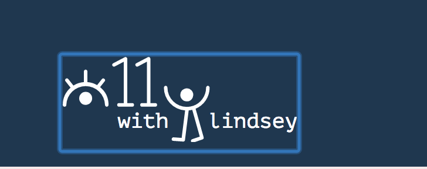
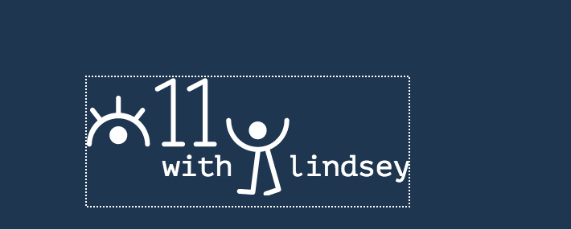
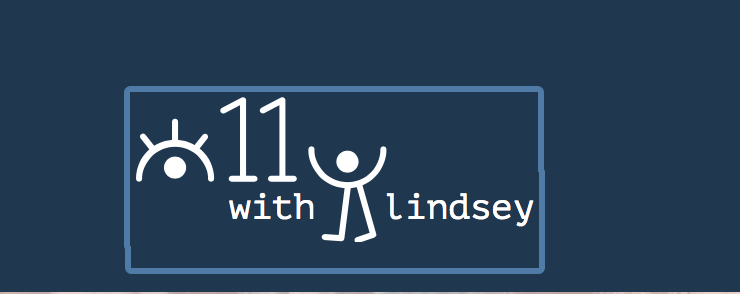
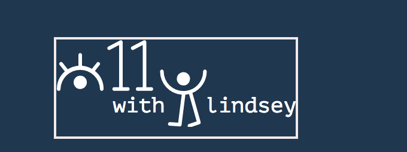

I wanted to write a blog post about one of my favorite accessibility topics - keyboard accessibility! I test this so much without even trying because as a developer I use my keyboard so much. I use it to navigate around apps, within a web page, and scrolling through my millions of tabs on my browser (who else is guilty of that haha).


##What is Keyboard Accessibility
Keyboard accessibility is ensuring that you’re not 100% reliant on your mouse at any given time. This means you’re able to get around the webpage using your keyboard. Have you ever tried that? I’m so accustomed to using my keyboard to navigate now because I hate using mouses, but I am always shocked when I hear both technical and non-technical people alike look at me in shock because they hadn’t thought about the fact that you could actually use a keyboard to navigate through a page.

Aside from my preference of using a keyboard, why is this important for accessibility? Some people suffer from motor tremors that make it difficult for muscle control. Some are hardly able to use their hands. Blind people frequently use the keyboard in conjunction with their screen reader. Even those people who have to use more advanced assistive technologies, most of them emulate the functionality of a normal keyboard. So this means that making our sites and applications accessible to keyboards can solve a variety of accessibility issues! And if you think about it early enough and don’t hack around too much, it’s usually a very fun process!


##Tip 1: Stop using divs and use semantic HTML
I’ve seen a lot of people create beautifully designed interactive apps. I click on a fancy hamburger icon and the menu appears beautifully with a subtle animation from the top of the screen. I go to the blog page and start using the select list to filter through topics. The select list has a clean and elegant drop down of a. Then I try to use my `tab` key…

What gives? My focus indicator passes RIGHT past the hamburger icon. Does this mean I cannot open the menu? Is there another way to open the menu that I am unaware of? I go to that fancy select list to find a topic and I cannot even open it up. Imagine how you might feel if you literally depend on your keyboard? I am having a fit while writing this because it ticks me off when people don’t pay attention to this. Thank you for listening to my soapbox.

Why are these items not working on our keyboard? Let’s take a look at that HTML for that menu.
```
<div class="hamburger-menu">
  <span class="line"></span>
  <span class="line"></span>
  <span class="line"></span>
</div>
<nav>
  <ul>
    <li><a href="#">Item 1</a></li>
    <li><a href="#">Item 2</a></li>
    <li><a href="#">Item 3</a></li>
  </ul>
</nav>
```

Why isn't this the best way to do it for accessibility? Because of something called tabindex. The simplest definition of tabindex without getting overly complex is it defines whether the item is focusable. What does focusable mean? It means you can access it with your keyboard! 

Tabindexes take on an integer value. However, to keep this simple and for the purposes of educating about best practice, we are going to narrow it down to 2 values that are most often used: `0` and `-1`. To cut to the chase, `0` = focusable and `-1` = not focusable. 

By default in all browsers, links, buttons and form elements are all focusable. This means that their tabindex is 0. What is the default tabindex of a div? Can you make a guess based on my inability to focus on it?

PSA: When you try to make a `<div>` something similar to a button without adjusting the tabindex, it will not be accessible to a keyboard. It also won't announce nicely on a screenreader by default, even if you do give it a `tabindex="0"`. You are better off using HTML how it was defined and making the hamburger menu into a `<button>` element. Most people don't like doing that because of the button's default browser styling. But guess what? You can solve that with CSS! Win-Win! Another benefit is because of the default behaviors and event listeners of buttons, you don't have to hack a div to act **exactly** as a button would.

This is how I would reformat the above HTML (see below for CSS associated with `.visually-hidden`:
```
<button class="hamburger-menu">
  <span class="line"></span>
  <span class="line"></span>
  <span class="line"></span>
  <span class="visually-hidden">Menu</span>
</button>
<nav>
  <ul>
    <li><a href="#">Item 1</a></li>
    <li><a href="#">Item 2</a></li>
    <li><a href="#">Item 3</a></li>
  </ul>
</nav>
```


## Tip 2: Always provide an option to skip the Main Navigation
Because I am all about empathy here, let's talk about what this means from a human standpoint. Imagine you are unable to use a mouse for whatever reason. You are coming to a website the first time and want to comb through the navigation to see where you want to go. You find the page using your keyboard.

Imagine getting to the page and having to tab through the entire navigation again, when you just want to explore the content. This might not be a big deal for my menu, which only has 3 links. But let's be real here, mega menus are all over the web! If those mega menus are even accessible (hahaha just so you know, a lot of them aren't), that sounds like a pain in the butt. 

The way to get around this is VERY low hanging fruit. The FIRST piece of HTML should be a link that says "Skip to main content." The `href` value should be a bookmark value that matches the id of the main wrapper. Here is how I do it on my current blog:

```
<a class="focusable visually-hidden" href="#main-content">Skip to main content</a>
...
<nav class="menu-main" style="align-self: flex-end;">
  <ul class="menu">
    <li class="menu-item"><a href="/about">About</a></li>
    <li class="menu-item"><a href="/blog">Blog</a></li>
    <li class="menu-item"><a href="/contact">Contact</a></li>
  </ul>
</nav>
...
<main id="main-content">
...
</main>
```

As you can see here, the href value is `#main-content` and it matches the id of the `<main>` element. This makes it so if someone clicks on this link they go straight to the main content area, instead of having to use the tab key through the entire navigation. This is also helpful to people who are already familiar with the site or those who clicked on a link to your site from another source.

Something I do on my site only show the link if you have focused on it. That way it only appears the first time you hit the tab key. Here is the CSS I have associated with `.focusable` and `.visually-hidden`:

```
.visually-hidden {
  position: absolute;
  left: -10000px;
  top: auto;
  width: 1px;
  height: 1px;
  overflow: hidden;
}

.focusable.visually-hidden:focus {
  position: relative;
  left: 0;
  width: auto;
  height: auto;
  overflow: auto;
} 
```

Implementing this to your site should be pretty simple. You can even copy and paste my HTML for my link as well as the classes to your CSS. 

## Tip 3: Don't remove focus indicators
What are focus indicators? By default, they are usually browser specific outlines around elements with a tabindex of 0. In Google Chrome, default focus looks like this:



In Firefox, default focus looks like this:



In Safari, default focus looks like this:



Instead of removing the focus indicator because your designer thinks they are ugly, you can design high contrast ones to make it more on brand with your website. This is what I did:



Please, whatever you do though, do not write `outline: none;` in your CSS. Thank you for coming to my TED Talk.

I hope these tips help you get started on keyboard accessibility. Feel free to reach out to me on [Twitter](https://twitter.com/littlekope0903) if you have questions.

