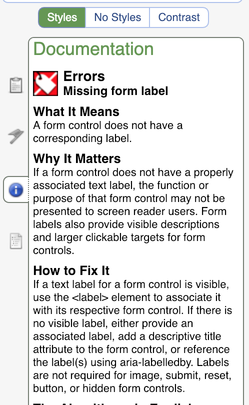

When I was a Drupal developer, a great deal of interest went into Automated Accessibility Testing. I very much loved working on automation especially when it was incorporated into our Continuous Integration. This would fail builds that introduced accessibility errors, which was a great way to ensure that we were thinking about accessibility from the start and not adding new problems. However, I feel like we like to automate our problems away and it cannot fix everything for you. Automated accessibility testing catches those nitpicky HTML errors so that you can focus on the more significant and subjective items manually. 

Accessibility is empathy-driven, and you can not automate empathy. Automation certainly makes a lot of things easier, like catching a text input without an associated label, but here are a few things that I do to ensure that my sites are accessible as possible.

## Go through the Website with my Keyboard
This is usually the first thing I test. You can start navigating the website using the `tab` key. This is something I don’t actually go out of my way to test because I always use my keyboard to navigate these days, so I am already testing and finding issues by default. Here are a few of the things that I think about when I am testing with my keyboard:
- Can I get through my navigation with ease?
- Is this a mega menu? If so, is there a way to quickly skip to the next top-level link and browse through those? For example, when I am on an e-commerce clothing site navigating through the menu. If I am on the “men’s” top-level menu link and looking for women’s clothing, I don’t want to go through all the menu links “Jackets,” “Bottoms,” “Accessories,” and “Watches” for men. I'd like to jump to the Women's top-level menu link instead.
- For things that pop up like modals, is there a way to quickly exit out of them that is intuitive? For example, is there a “No Thanks” link or a way to exit with the “Esc” key?
- How do I interact with accordions?
- Can I interact with Select Lists? This is important to test as a lot of people design these to not use the default HTML for them.
- Is there any moment that I press my tab key that I am unsure where I am at? Am I focusing on items that aren’t visible on the screen?

In the below gif, you see that when we focus on the top menu links, it doesn’t even expand the submenu. It does expand it when we hover over the top menu links though. In this example, automated accessibility testing may not have caught this flaw, but if someone tabbed through the menu, they might find it.

I could go on, but these are the considerations I usually think about. I would recommend pairing with a UX expert if you have the ability to, but if not use your best judgment.

## Turn on your screen reader

Did you know that on MacOS there is a built-in screen reader? Did you know that NVDA is a free screen reader for Windows? We should at a very minimum open up our screen reader and ensure that it doesn’t miss crucial information.

The first thing I would do is familiarize yourself with the [basic screen reader commands](https://developer.paciellogroup.com/blog/2015/01/basic-screen-reader-commands-for-accessibility-testing/). This will help you tremendously because you do need more than just the `tab` key to navigate through a page.

Ask yourself these questions:
- Is it obvious how to navigate through my interactive features? If not, does the screen reader explain it?
- Does the screenreader go through the logical order of the page and how I’d imagine my sighted users would go through it?

[Kent C Dodds](https://twitter.com/kentcdodds) wrote his most viral tweet to date, and it was all about empathy for those using screen readers.

<blockquote class="twitter-tweet" data-lang="en">
I would like to introduce you to my most viral tweet: <a href="https://t.co/lDrKUqmC6Z">https://t.co/lDrKUqmC6Z</a>  I&#39;m proud of the fact that it&#39;s promoting something important rather than a silly meme.
&mdash; Kent C. Dodds (@kentcdodds) <a href="https://twitter.com/kentcdodds/status/1083392902716219392?ref_src=twsrc%5Etfw">January 10, 2019</a></blockquote>

We think we are being fresh and modern, but sometimes things like multiple emojis, fancy font, and other random oddities can negatively impact screenreaders. It’s always good to catch that before you deploy something out.

Once you’ve familiarized yourself with the basic screenreader commands, go through your site with a blindfold. That will make things crystal clear about whether or not they are accessible.

## Make sure your alt text makes sense

Technically, if you have alt text or empty alt text, you won’t flag on an accessibility report. But does your alt text make sense?

If you want to have a bit more info on this, I highly recommend reading my previous post about alt text - [Writing alternative text that matters](/blog/writing-alternative-text-matters). I go through this in much more detail, but I would keep reviewing the alt text of your images on your manual testing checklist.

## Go through the Wave Tool
This is technically somewhat automated, but I always like to double check my site with the [Wave Tool](https://chrome.google.com/webstore/detail/wave-evaluation-tool/jbbplnpkjmmeebjpijfedlgcdilocofh?hl=en-US). It’s just a habit that I still do to make sure that anything that comes up on my automated testing is no surprise. I really like this tool; I know there are a ton of other ones out there, but I always come back to this one. One of my favorite things about it is it documents what the error means, why it matters, and how to fix the error.

## Conclusion
While automated accessibility testing is a great tool that makes our life a ton more manageable, I am always an advocate for manually testing the items that can be a little more nuanced. Also, manually testing is a great place to get your UX experts involved. This will help you and your teammate figure out the best behavior to make your application as minimally frustrating to all your users, not just your users with disabilities.

What do you manually test? Let me know on [Twitter](https://twitter.com/littlekope0903) or tweet me if you have questions about this blog post.
