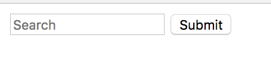
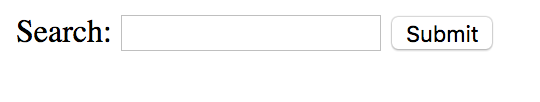

_This post contains affiliate links. If you buy something through those links I may earn a small commission at no cost to you. This helps pay for the costs associated with running a11y with Lindsey. I promise to only recommend products I use and love!_

Back in fall of 2016, I spoke for the first time about accessibility. While planning my presentation and looking for a relevant case study, I stumbled upon something that was quite relevant for the time - the presidential candidates’ donation sites. Considering Section 508 applies to government agencies, I figured that their sites would be super accessible. Boy, was I wrong.

The biggest issue on both Trump and Clinton’s sites were inaccessible forms. I did an evaluation of the forms of the candidates’ donation sites and if I remember correctly (it was almost 2 years ago), both had issues with all forms having missing form labels. While I don’t know what the development cycle is for candidate sites, I would assume the strategy is something like “get the site online as quickly as possible so we can start receiving donations.”

One of the most common accessibility issues I’ve seen is fields missing labels. The great news is it’s one of the simplest accessibility issues to fixes.

##The Empathetic Side of Forms

Before we go into how to solve this issue, I want to describe a scenario to you. Imagine you are without vision and care deeply about a certain candidate's campaign. You are highly dependent on a screen reader to help you navigate a site. You go to your preferred candidate’s donation site, but then you’re stumped. There are a bunch of fields, but nothing is telling you which field is which. You don’t know where to put your credit card information or where to put your billing address. What do you do? Do you take a guess and then deal with all the validation errors when you get it wrong? Or do you give up?

I imagine that I’d try if I was very passionate about that candidate, but considering how difficult the site was making it donate my own hard earned money, I’d probably give up at that point. I doubt I am the only person who would give up, at least that's what research indicates.


There is significant research that shows us that making things confusing for another user causes them to have a higher bounce rate. I am currently reading Donald Miller's book, [Building a StoryBrand](https://www.amazon.com/gp/product/0718033329/ref=as_li_tl?ie=UTF8&camp=1789&creative=9325&creativeASIN=0718033329&linkCode=as2&tag=a11ywithlinds-20&linkId=00e119a69d54ba4bd1cc3cd46c434146), and yesterday I was reading about how confusing users, creating noise and having an unclear message causes a user to go to a brand's competitors that have a more clear message. From what he describes, the amount of energy that it takes to navigate confusion causes calorie burn, and we do not want to waste precious calories. The way her describes it is about surviving and thriving, you should definitely pick up his book and read for yourself. 

While this is a book on marketing messaging and not accessibility, I couldn't help but relate that to this case study I did 2 years ago. How does inaccessibility of forms directly relate to "noise," which causes your visually impaired users to leave? This leads me to the business side of it all. 

##The Business Side of Forms

Let’s reflect on the above scenario for a second, but from the business side of it. How much money did we miss out on by not including something like form labels on our donation form? According to the [National Federation of the Blind](https://nfb.org/blindness-statistics), in 2015, 7,297,100 or 2.3% of the American population reported having a visual disability. Over 7 million people - think about that. That’s a lot of money potential. 

While I believe the reason to create accessible forms is that you don’t want to create a frustrating experience for your users, I know that it’s not really convincing to tell your boss or your clients “Hey we just need to be nicer and more empathetic!” But lost dollars might raise some eyebrows.


Let's start to think about our call to actions and how many of those actions are forms. Newsletter signups, surveys, credit card information--all of these are forms that can ultimately impact our bottom line. There could be a tremendous cost if we do not address these users. This is not an "edge case" (insert eye roll emoji here). This is actually a costly endeavor. 

##The quickest way to create accessible forms: provide form labels

There is more about forms to make them even more accessible, which I will cover in other blog posts. But if I can summarize form accessibility, I would say Labels, labels, labels!

Something that I see frequently is designers and developers putting the placeholder attribute as a substitute for the label.  See the screenshot and markup below for the **wrong** way.



```
<input placeholder="Search" type="text">
<input name="Submit" type="submit">
```

A lot of designs withhold a label and use the placeholder (what’s inside the input) as a visual cue or implication of the label. However, without a physical label in the markup, a visually impaired user cannot identify what the field input is. The placeholder text was created to be that, a placeholder. Using it as a label does not give assistive technology the context to know that the placeholder has a different meaning now. 

Not only must there be a label, but the label must be **associated** with the field. If you have a label that isn't "attached" to the field it's associated with, it defeats the purpose. If it is imperative to a design to not have a label, you can visually hide it which I will talk about in another blog post.

In order to associate a label with a field, you must have an `id` attribute on the input and use that value `for` the for attribute on the label. See below.



```
<label for="search-field">Search:</label>
<input placeholder="Search" type="text" id="search-field">
<input name="Submit" type="submit">
```


There are also people who say you can add an `aria-label` to the input in order to label it, and that is true. However, I always prefer semantic HTML over aria-labels. If you can solve a problem with HTML5, why would you do something else? Below is how [dev.to](https://dev.to) does it and it accomplishes the same goal:
```
<input type="text" placeholder="search" aria-label="search">
```


This is the simplest way to make sure that your forms are accessible. There are more topics to talk about like accessible form validation, ensuring required fields are both visually and semantically labeled as such, etc. However, this simple tip will greatly improve your forms, just by simply telling users clearly which field is which.

Stay tuned for more information about accessible forms. Feel free to reach out to me on [Twitter](https://twitter.com/littlekope0903) if you have questions about this blog post.


