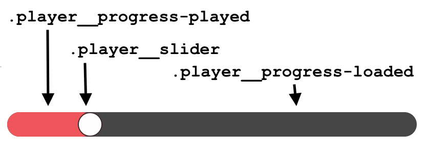

_EDIT: I resigned from the podcast in late August 2019. The accessibility lessons I learned are still relevant if you'd like to start a podcast, but in full transparency, this post is technically out of date._

If you haven’t noticed, I haven’t been around! It’s been a month since I posted, and there’s been a good reason for that. Kelly Vaughn, Ali Spittel, Emma Bostian, and I started the Ladybug Podcast. This podcast came to fruition with much labor. As a result, I’ve been figuring out how to balance this blog with that side project! Don’t worry, though, this isn’t going away. My blog is my passion project!

Now that you know where I’ve been, I’ve learned a lot about podcasting and how it intersects with accessibility. I knew some of these things at a high level, but in this post, we’re going to get a little bit more in-depth.

## Transcripts are a MUST

When we started planning this podcast, it was no doubt we wanted to have transcripts. Transcripts can be time and financially expensive, and many people see them as a “nice to have.” However, I’m here to tell you that they are a must-have.

Transcripts have a ton of benefits:

1. Deaf and hard of hearing folks can access your excellent content.
1. Some people prefer reading than listening. I cannot tell you how many abled folks have told me they appreciated having transcripts.
1. It helps those whose first language may not be English.
1. If people are reading your transcripts, this means they are spending a ton of time on your site. Session duration improves SEO.

> Being a content creator means that you try to make your content available to as many people as possible. You don't want to alienate a potential audience member because you decided to ignore their needs.

We went through a few attempts to get transcripts. I wanted to share the options we tried and the pros and cons of each option.

### Having someone do it for you

Hiring someone was the first thing we tried because it was the only option we knew. We didn’t have time to go through our entire audio and write it out. So we decided to hire someone who did that for us. We used Fiverr, which I had never tried before. Hiring someone has pros and cons, however.

Pros:

- Paying a real person and supporting someone else.
- Catches errors in real-time

Cons:

- Expensive
- Because they are a human, it takes a few days to get them back, which isn’t ideal for a quick turn around.
- Language differences.

### Using Artificial Intelligence

The other option is to use AI software to parse through your audio and provide a transcript for you. We tried [Trint](https://app.trint.com) and [Otter AI](https://otter.ai), which are both great tools. AI also has some pros and cons.

Pros:

- Get your transcript back in minutes or hours. Otter AI took about 10 minutes.
- Cheaper
- Gets better as they learn your speakers

Cons:

- Especially at first, you have to edit it. We didn't want to have random words in there, so we took some time to listen to the tool as it read the transcript to us.
- I feel a little guilty when I use Machine Learning to replace a job that a person could do.

### What we ended up doing

Because of the quick turn around we needed, we ended up going with AI. We got a deal with OtterAI and ended up using that one. Do what works best for you in the end, all options are great ones!

## A11y Considerations for Custom Podcast Players

As you may or may not know, we used [GatsbyJS](http://gatsbyjs.org) to build out the LadyBug Podcast site. I took responsibility for making an accessible podcast player. I learned so much about how to use React to create all the audioElement events. Shout out to [Syntax.fm](https://syntax.fm/) for having a player that I could explore. The first thing I did was add a `ref` to an `<audio>` element.

<!--prettier-ignore-->
```jsx
class Player extends React.Component {
  render() {
    const { show } = this.props;

    return (
      <audio
        ref={audio => (this.audio = audio)}
        src={show.audio}
      />
    )
  }
}
```

If I go into the code and add a `console.log`

<!--prettier-ignore-->
```jsx{4}
class Player extends React.Component {
  render() {
    const { show } = this.props;
    console.log(this.audio)

    return (
      <audio
        ref={audio => (this.audio = audio)}
        src={show.audio}
      />
    )
  }
}
```

This gives me the ability to access all the methods of the audio. I can use them on my custom player in the form of buttons, radio buttons, and a slider.

In the podcast player, I used the following methods:

- [HTMLMediaElement.currentTime](https://developer.mozilla.org/en-US/docs/Web/API/HTMLMediaElement/currentTime) - This tells you current time in the audio, in seconds.
- [HTMLMediaElement.playbackRate](https://developer.mozilla.org/en-US/docs/Web/API/HTMLMediaElement/playbackRate) - This tells you the speed at which you are playing. We can set this property when we press a button to increase the speed!
- [HTMLMediaElement.volume](https://developer.mozilla.org/en-US/docs/Web/API/HTMLMediaElement/volume) - This tells you the current volume level.
- [HTMLMediaElement.play()](https://developer.mozilla.org/en-US/docs/Web/API/HTMLMediaElement/play) - This plays the audio.
- [HTMLMediaElement.pause()](https://developer.mozilla.org/en-US/docs/Web/API/HTMLMediaElement/pause) - This pauses the audio.
- [HTMLMediaElement.duration](https://developer.mozilla.org/en-US/docs/Web/API/HTMLMediaElement/duration) - This tells you the total length of the audio, in seconds.

Once you add the `ref` to the audio, you can use `this.audio` to control anything with the audio. You can append the method or property name to `this.audio`. It’s neat! You can use that as well to control React state 🤯! I won’t be going too much into all the states in this blog post. I recommend you check out [our source code](https://github.com/ladybug-podcast/ladybugpodcast/blob/master/src/components/player.js) as well as the [Syntax.fm source code](https://github.com/wesbos/Syntax/blob/master/components/Player.js) if you want to learn more.

### Button Labelling

Button labels are the most critical part of the player being accessible. Remember, we are “hacking” the audio player. We must ensure screen reader, keyboard, and mouse users can access the player. The latter is what abled folks center on, so if you’re doing this, I want to make sure you account for all experiences.

I used the `react-icons/fa` package to get the icons for our player. We used `FaPlay`, `FaPause`, `FaUndo`, and `FaRedo` for the play, pause, rewind 15 seconds, and fast-forward 15 seconds buttons. These icons are SVG icons, but I wanted to make sure there was text in the markup. To do this, we ensured the following:

1. We used the semantic `<button>` instead of a `<div>` to support keyboard events. Read my [3 Simple Tips to Improve Keyboard Accessibility](/blog/3-simple-tips-improve-keyboard-accessibility) post for more information.
1. We ensured not to use icon fonts, which was already taken care of us through the `react-icons` library.
1. We ensured there was **actual text** inside the buttons, which SVG doesn't do for us. We can visually hide that text using CSS, but it still must be there.

<!--prettier-ignore-->
```html
<button class="player__icon">
  <svg>
    <!--paths and things-->
  </svg>
  <span class="sr-only">play</span>
</button>
```

### Creating a slider

I was searching around for an accessible player that shows the slider. I found the [Able Player](https://ableplayer.github.io/ableplayer/demos/) and started observing how they did things. Making this accessible was one of the hardest things I’ve done, and it’s still rather buggy. The code ended up being many divs with aria labels and lots of event handling. The side project conundrum is that done is better than perfect. Looking back, I wish I had made it a slider using [the range input](https://developer.mozilla.org/en-US/docs/Web/HTML/Element/input/range). Lessons learned - stay tuned for a future blog post when I update that slider!

For now, I'll go through my thought process of what I wanted to do with the slider. Below is the source code........

```jsx
<div
  className="player__progress"
  onClick={this.scrub}
  ref={x => (this.progress = x)}
>
  <div className="player__progress-loaded" />
  <div
    className="player__progress-played"
    style={{ width: `${(currentTime / duration + 0.015) * 100}%` }}
  />
  <div
    orientation="horizontal"
    onKeyDown={this.moveSlider}
    tabIndex="0"
    className="player__slider"
    role="slider"
    aria-label="audio timeline"
    aria-valuemin="0"
    aria-valuemax={duration}
    aria-valuetext={renderValueText(currentTime)}
    aria-valuenow={renderValueNow(currentTime)}
    style={{ left: `${(currentTime / duration - 0.01) * 100}%` }}
  />
</div>
```

I have 3 children divs of the player: `.player__progress-loaded`, `.player__progress-played`, and `.player__slider`. Let's look at what these correspond to:



- `.player__progress-loaded` corresponds to the width of the entire slider. This div has no semantic value to a screen reader user.
- `.player__progress-played` is the visual representation of the total amount played.
- `.player__slider` is the most important element for accessibility. It tells the screen reader user what time it currently is, and allows us to move it with our keyboard.

Now let's take a look at some of the events and style here:

```jsx{11,17}
class Player extends React.Component {
  // skip to render part of the component

  render() {
    const { isPlaying, currentTime, duration, playbackRate } = this.state
    const { show } = this.props

    return (
      <div
        className="player__progress"
        onClick={this.scrub}
        ref={x => (this.progress = x)}
      >
        <div className="player__progress-loaded" />
        <div
          className="player__progress-played"
          style={{ width: `${(currentTime / duration + 0.015) * 100}%` }}
        />
        <div
          orientation="horizontal"
          onKeyDown={this.moveSlider}
          tabIndex="0"
          className="player__slider"
          role="slider"
          aria-label="audio timeline"
          aria-valuemin="0"
          aria-valuemax={duration}
          aria-valuetext={renderValueText(currentTime)}
          aria-valuenow={renderValueNow(currentTime)}
          style={{ left: `${(currentTime / duration - 0.01) * 100}%` }}
        />
      </div>
    )
  }
}
```

For the `onClick` event, we want to ensure that we change the `currentTime` in the audio to be wherever we clicked. If you can, look at [the code](https://github.com/ladybug-podcast/ladybugpodcast/blob/master/src/components/player.js#L125) yourself, fork it, and console log all the things to see what’s happening. If you click anywhere on the `.player__progress` div, you’ll change the `currentTime`.

For the `.player__progress-played` div, we have the styling. The component's width is the percentage of the way through the episode.

Now for the slider itself:

```jsx{19}
class Player extends React.Component {
  // skip to render part of the component

  render() {
    const { isPlaying, currentTime, duration, playbackRate } = this.state
    const { show } = this.props

    return (
      <div
        className="player__progress"
        onClick={this.scrub}
        ref={x => (this.progress = x)}
      >
        <div className="player__progress-loaded" />
        <div
          className="player__progress-played"
          style={{ width: `${(currentTime / duration + 0.015) * 100}%` }}
        />
        <div
          orientation="horizontal"
          onKeyDown={this.moveSlider}
          tabIndex="0"
          className="player__slider"
          role="slider"
          aria-label="audio timeline"
          aria-valuemin="0"
          aria-valuemax={duration}
          aria-valuetext={renderValueText(currentTime)}
          aria-valuenow={renderValueNow(currentTime)}
          style={{ left: `${(currentTime / duration - 0.01) * 100}%` }}
        />
      </div>
    )
  }
}
```

...and then a couple of [helper functions](https://github.com/ladybug-podcast/ladybugpodcast/blob/master/src/utils/util.js), one of which I adapted from Syntax's site.

Holy batman that's a lot of ARIA attributes! Let's dissect this for a second:

1. `role="slider"` - This tells the screen reader user that un-semantic div has some meaning!
1. `aria-valuetext` - This is the human-readable version of the value of the slider. For example, in the screenshot above - it was "5 minutes, 51 seconds"
1. `aria-valuenow` - defines the current value for a range widget (which the slider is)
1. `aria-valuemin` - a required attribute that defines the minimum value for a range widget
1. `aria-valuemax` - a required attribute that defines the maximum value for a range widget

Below is how VoiceOver on macOS reads the slider:

"5 minutes, 51 seconds, audio timeline, slider". So the `aria-valuetext`, the `aria-label` and then the `role`.

With `this.moveSlider`, if you press a Left or Right arrow and respectively rewinds or fast-forwards 5 seconds. Take a look at [the source code](https://github.com/ladybug-podcast/ladybugpodcast/blob/e0cfce0159d1f516812465fbeafaaf5ecd47ef5a/src/components/player.js#L137) to see how we did that.

### How I want to redo the slider

As stated before, this was a little buggy. A few things that are buggy:

1. Browser support (I got a comment from a listener, but haven't checked it out yet)
1. I couldn’t figure out dragging the slider with your mouse.

So, for whatever reason, I assumed (don't assume folks, it's dangerous) that you could not custom style a range input.

I was wrong. You totally can.

## Conclusions

Starting a podcast has been a very positive experience all around. I’m sure we’ll talk about the more general lessons we learned starting a podcast on the Ladybug podcast!

Two key takeaways from this post:

1. Always have transcripts. It's worth the time and financial cost to include others. It is not an edge case.
1. Hack the audio player with caution and ensure that you over-test.

If you're interested in the LadyBug Podcast, be sure to [subscribe](https://link.chtbl.com/ladybugpodcast) to have them downloaded!

Stay in touch! If you liked this article:

- Let me know on [Twitter](https://twitter.com/LittleKope) and share this article with your friends! Also, feel free to tweet me any follow up questions or thoughts.
- Support me on [patreon](https://www.patreon.com/a11ywithlindsey)! If you like my work, consider making a $1 monthly pledge. You’ll be able to vote on future blog posts if you make a \$5 pledge or higher! I also do a monthly Ask Me Anything Session for all Patrons!
- [Be the first to learn about my posts](https://pages.convertkit.com/4218bd5fb5/68dc4e412a) for more accessibility funsies!

Cheers! Have a great week!
