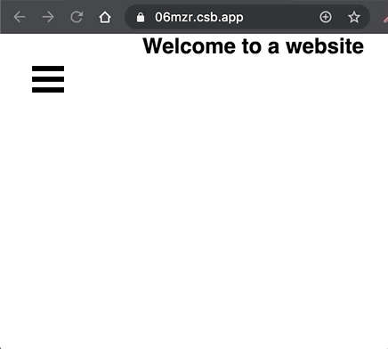
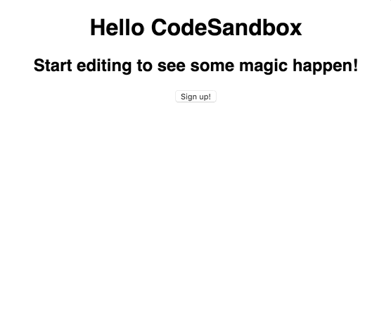
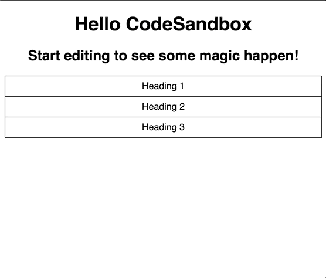

I've been wanting to write this blog post ever since I wrote [a11y and JS - A Seemingly Unconventional Romance](./blog/a11y-js-seemingly-unconventional-romance). I love JavaScript, and I primarily work in React. Something I see often is folks (rightly) critique that React Apps are incredibly inaccessible. According the the [WebAIM Million report](https://webaim.org/projects/million/#frameworks), "the adoption of [React] corresponded with [5.7%] more accessibility errors than the average home page."

WebAIM Million tests the sample using the WAVE stand-alone API, and is catching all the crawlable issues. I'm not going to use this blog post to talk about those issues, but if you're interested in learning more about that I've created a [Email Course](https://a11y-with-lindsey.ck.page/b4e437f629) on the topic.

There are two points that I want to drive home about JavaScript frameworks:

> First, at the end of the day, Front End JavaScript Frameworks render HTML. Second, JavaScript frameworks don't produce inaccessible HTML. Web developers produce inaccessible HTML.

I'd recommend before you read this blog post, brushing up on how to fix some common HTML errors.

But for those that are well versed on how to write accessible HTML in React, I wanted to give my peers and colleagues a quick reference of how to use some well supported React packages to create accessible interactive comoponents.

This blog post writes under the assumption that you are familiar with the basic terms of React and understand the syntax of JSX. If you are not familiar with it, I suggest that you read through the following resources:

1. Read through the [React docs](https://reactjs.org/docs/getting-started.html) and play around with their [Tutorial](https://reactjs.org/tutorial/tutorial.html)
1. Have a familiarity with [React Hooks](https://reactjs.org/docs/hooks-intro.html)
1. Understand using the [spread operator](https://reactjs.org/docs/jsx-in-depth.html#spread-attributes) into a React Component.
1. Understand the map array method. https://developer.mozilla.org/en-US/docs/Web/JavaScript/Reference/Global_Objects/Array/map

I use CodeSandbox for all of my examples. If you like to learn by doing and don't feel like setting up your environment, I highly recommend forking my examples, play with the styling, and manually test the components.

## React Hamburger Menu

_NOTE: This is using react-burger-menu version 2.6.13. I'll do my best to keep this blog post up to date_

One react library I like to use if I am in a pinch is the [react-burger-menu](https://github.com/negomi/react-burger-menu). Fun fact, my first contribution to open source was to this library! And of course, it was an accessibility improvement. Naturally 💁🏼‍♀️.

What are some features of an accessible hamburger menu?

1. The hamburger button has clear focus state
1. The hamburger button has some text that labels it, even if it's visually-hidden
1. You cannot focus on the links inside the menu when the menu is closed. This happens very often when we have a menu that slides in.
1. The menu closes on ESC keypress
1. There is an easy way to close the menu - whether there's a Close button inside the menu, or you tab back to the hamburger button and use that to close it.

Below I've created a quick demo of what we expect the functionality to be:

<!-- {/* <video controls>
  <source src="/hamburger.mp4" type="video/mp4" />
</video> */} -->

How to install:

1. If you're on your local: In your project directory, enter `npm i react-burger-menu` in command line. If you are in CodeSandbox, go to the "Dependencies" section and add `react-burger-menu` as a dependency.

There are many different hamburger menu animation styles you can use. I chose `slide` for this example, but you can see how all the options animate in the [demo](https://negomi.github.io/react-burger-menu/).

2. In `src` directory, create a component called `BurgerMenu.js`. Go to the Import the desired Menu animation (here's a list of the animation [options](https://github.com/negomi/react-burger-menu#animations)) and use that component to add links to your menu. I am adding the `noOverlay` prop to my Menu because I personally don't like the look of overlays.

<!-- ```jsx
import React from 'react'
import { slide as Menu } from 'react-burger-menu'

const BurgerMenu = () => {
  return (
    <Menu noOverlay>
      <a className="menu-item" href="/">
        Home
      </a>
      <a className="menu-item" href="/about">
        About
      </a>
      <a className="menu-item" href="/contact">
        Contact
      </a>
    </Menu>
  )
}

export default BurgerMenu
``` -->

3. Add it to the `App.js` component

<!-- ```jsx
import React from 'react'
import './styles.css'
import BurgerMenu from './components/BurgerMenu'

export default function App() {
  return (
    <div className="App">
      <BurgerMenu />
      <div>
        <header>
          <h2 style={{ margin: 0 }}>Welcome to a website</h2>
        </header>
      </div>
    </div>
  )
}
``` -->

4. Create a CSS file and import it into your react component. Add some CSS to position some of the elements, give background colors to the close cross button and the hamburger bars, etc.

<!-- ```jsx{4}
import React from 'react'
import { slide as Menu } from 'react-burger-menu'

import './burger.css'
```

And the css

```css
.bm-burger-button {
  position: fixed;
  width: 36px;
  height: 30px;
  left: 36px;
  top: 36px;
}

.bm-burger-bars {
  background: #000;
}

.bm-cross-button {
  height: 24px;
  width: 24px;
}

.bm-cross {
  background: #bdc3c7;
}

.bm-menu-wrap {
  position: fixed;
  height: 100%;
}

.bm-menu {
  background: #373a47;
  padding: 2.5em 1.5em 0;
  font-size: 1.15em;
}

.bm-item-list {
  padding: 0.8em;
}

.bm-item {
  display: block;
  color: #bdc3c7;
}
``` -->

Something I always do, even if a library says it's accessible is go through some basic manual testing with both my keyboard and VoiceOver.

1. Go through on a keyboard 👍



2. Go through the hamburger menu using VoiceOver on Safari.

<!-- {/* <video controls>
  <source src="/hamburger-voiceover-test.mov" type="video/mp4" />
</video> */} -->

Voiceover goes to menu items that are hidden. What we need to do is hide the content we need to add aria-hidden and toggle it. Because this attribute is not included in the library, we are going to add an effect (`useEffect`) on the parent component to add that attribute to the appropriate element when the component has mounted. _Learn more about [useEffect](https://reactjs.org/docs/hooks-effect.html)_

In the App.js parent component, we want to set the `aria-hidden` attribute on the `bm-menu-wrap` class:

<!-- ```jsx{2-7}
export default function App() {
  React.useEffect(() => {
    const menuWrap = document.querySelector('.bm-menu-wrap')
    if (menuWrap) {
      menuWrap.setAttribute('aria-hidden', true)
    }
  }, [])

  return (
    <div className="App">
      <BurgerMenu />
      <div>
        <header>
          <h2 style={{ margin: 0 }}>Welcome to a website</h2>
        </header>
      </div>
    </div>
  )
}
``` -->

After reading the [`react-burger-menu` docs](https://github.com/negomi/react-burger-menu#state-change), I saw `onStateChange` so we are going to use that to toggle the aria-hidden attribute dependent on the isOpen state.

```jsx
<Menu noOverlay onStateChange={toggleMenu}>
  {/* All the links */}
</Menu>
```

<!-- ```jsx
const toggleMenu = state => {
  console.log(state)
}
``` -->

I prefer using destructuring to save a couple lines of code. _Read more about destructuring assignment in the [MDN Docs](https://developer.mozilla.org/en-US/docs/Web/JavaScript/Reference/Operators/Destructuring_assignment) (go to the "Unpacking fields from objects passed as function parameter" section)._

<!-- ```jsx
const toggleMenu = ({ isOpen }) => {
  console.log(isOpen)
}
``` -->

Then I use the `isOpen` state to control the aria-hidden attribute value.

<!-- ```jsx
const toggleMenu = ({ isOpen }) => {
  const menuWrap = document.querySelector('.bm-menu-wrap')
  isOpen
    ? menuWrap.setAttribute('aria-hidden', false)
    : menuWrap.setAttribute('aria-hidden', true)
}
``` -->

Now we want to make sure that everything is working how we would expect a screen reader.

On VoiceOver:

<!--
<video controls>
  <source src="/hamburger-voiceover-test-pass.mov" type="video/mp4" />
</video> -->

As a note:

As of this writing, the Menu doesn't work if you add a menu using unordered lists of list items. I found why that is in the code, and I plan on making a PR when I finally have some spare time 😁. I personally prefer to write my menus using unordered lists, but I wanted to be sure I made that disclaimer so you didn't have to go through the debugging pain that I did.

<!--
<iframe
  src="https://codesandbox.io/embed/peaceful-dew-06mzr?fontsize=14&hidenavigation=1&theme=dark"
  style="width:100%; height:500px; border:0; border-radius: 4px; overflow:hidden;"
  title="a11y-react-burger-menu"
  allow="accelerometer; ambient-light-sensor; camera; encrypted-media; geolocation; gyroscope; hid; microphone; midi; payment; usb; vr"
  sandbox="allow-forms allow-modals allow-popups allow-presentation allow-same-origin allow-scripts"
/> -->

## React Modal

_NOTE: This is using react-modal version 3.11.2. I'll do my best to keep this blog post up to date_

The top of the react community documentation shows that the top focus of the `react-modal` library is accessibility.

First, let's go over what makes a modal accessible:

- Can't focus inside of the modal until it's open. If someone cannot see where they are focused, this is a poor user experience.
- When modal is open, focus trapping occurs. This means that we when we reach the bottom of the modal, we go to the top of the modal content. This ensures focus won't be anywhere else on the screen except inside the modal and it won't be "behind" it.
- closes on esc
- upon close, focuses on the thing it was on last

Below I've created a quick demo of what we expect the functionality to be:



1. If you're on your local: In your project directory, enter `npm i react-modal` in command line. If you are in CodeSandbox, go to the "Dependencies" section and add `react-modal` as a dependency.
1. In `src` directory, create a component called `Modal.js`. Import `ReactModal` and create the base of your function component.

<!-- ```jsx
import React from 'react'
import ReactModal from 'react-modal'

const Modal = () => {
  return (
    <ReactModal>
      <p>Hey</p>
    </ReactModal>
  )
}

export default Modal
``` -->

Attach the Modal to the root of your app (this toggles aria-hidden on the root when it's open, which helps with focus trapping)

<!-- ```jsx{4}
import React from 'react'
import ReactModal from 'react-modal'

ReactModal.setAppElement('#root')

const Modal = () => {
  return (
    <ReactModal>
      <p>Hey</p>
    </ReactModal>
  )
}

export default Modal
``` -->

add `useState` hook to the Modal component and use the hook to destructure an `isOpen` variable and `setIsOpen` function. The initial state of the modal being open is `false` (because we don't want to start with an open modal)

<!-- ```jsx{1,7}
import React, { useState } from 'react'
import ReactModal from 'react-modal'

ReactModal.setAppElement('#root')

const Modal = () => {
  const [isOpen, setIsOpen] = useState(false)
  return (
    <ReactModal>
      <p>Hey</p>
    </ReactModal>
  )
}

export default Modal
``` -->

1. Next we want to create an `openModal` and `closeModal` function that sets the state appropriately.

<!-- ```jsx{4-5}
const Modal = () => {
  const [isOpen, setIsOpen] = useState(false)

  const openModal = () => setIsOpen(true)
  const closeModal = () => setIsOpen(false)

  return (
    <ReactModal>
      <p>Hey</p>
    </ReactModal>
  )
}
``` -->

1. Now we want to add some props to `ReactModal` to make it work the way we want to. The most important ones we want to pass are `isOpen` and `onRequestClose`. `isOpen` should take on the `isOpen` state and `onRequestClose` should take the `closeModal` function. The latter is important to ensure that the Modal closes on the ESC key.

<!-- ```jsx{8}
const Modal = () => {
  const [isOpen, setIsOpen] = useState(false)

  const openModal = () => setIsOpen(true)
  const closeModal = () => setIsOpen(false)

  return (
    <ReactModal isOpen={isOpen} onRequestClose={closeModal}>
      <p>Hey</p>
    </ReactModal>
  )
}
``` -->

1. This is great, but how are we supposed to open the Modal 😂? Let's create a button to open the modal and pass the `onClick` prop the `openModal` function. I'm going to place this button right before the ReactModal component, but because React must have a singular parent element, I am going to use a React Fragment. Read more about [Fragments](https://reactjs.org/docs/fragments.html)

<!-- ```jsx{9}
const Modal = () => {
  const [isOpen, setIsOpen] = useState(false)

  const openModal = () => setIsOpen(true)
  const closeModal = () => setIsOpen(false)

  return (
    <>
      <button onClick={openModal}>Open Me!</button>
      <ReactModal isOpen={isOpen} onRequestClose={closeModal}>
        <p>Hey</p>
      </ReactModal>
    </>
  )
}
``` -->

1. As it is, this Modal closes on the escape key. But I want to create a button that always inside the modal to close it to make it obvious to non keyboard users.

<!-- ```jsx{11}
const Modal = () => {
  const [isOpen, setIsOpen] = useState(false)

  const openModal = () => setIsOpen(true)
  const closeModal = () => setIsOpen(false)

  return (
    <>
      <button onClick={openModal}>Open Me!</button>
      <ReactModal isOpen={isOpen} onRequestClose={closeModal}>
        <button onClick={closeModal}>Close</button>
        <p>Hey</p>
      </ReactModal>
    </>
  )
}
``` -->

Make it adaptable with children props and a button text.

<!-- ```jsx{1,9,12}
const Modal = ({ children, openButtonText }) => {
  const [isOpen, setIsOpen] = useState(false)

  const openModal = () => setIsOpen(true)
  const closeModal = () => setIsOpen(false)

  return (
    <>
      <button onClick={openModal}>{openButtonText}</button>
      <ReactModal isOpen={isOpen} onRequestClose={closeModal}>
        <button onClick={closeModal}>Close</button>
        <div>{children}</div>
      </ReactModal>
    </div>
  )
}
``` -->

And on our App component, let's add the Modal component and the props!

<!-- ```jsx
import React from 'react'
import Modal from './components/Modal'
import './styles.css'

export default function App() {
  return (
    <div className="App">
      <h1>Hello CodeSandbox</h1>
      <h2>Start editing to see some magic happen!</h2>
      <Modal openButtonText="Sign up!">
        <form>
          <div>
            <label for="email-input">Email:</label>
            <input type="email" id="email-input" name="email" />
          </div>
          <div>
            <label for="password-input">Password:</label>
            <input type="password" id="password-input" name="password" />
          </div>
        </form>
      </Modal>
    </div>
  )
}
``` -->

(Make a note about the children prop)
Now we manually test, because while many libraries say they're accessible, we should always ensure that there are no bugs.

<!-- {/* <iframe
  src="https://codesandbox.io/embed/a11y-react-modal-k4p4q?fontsize=14&hidenavigation=1&theme=dark"
  style="width:100%; height:500px; border:0; border-radius: 4px; overflow:hidden;"
  title="a11y-react-modal"
  allow="accelerometer; ambient-light-sensor; camera; encrypted-media; geolocation; gyroscope; hid; microphone; midi; payment; usb; vr"
  sandbox="allow-forms allow-modals allow-popups allow-presentation allow-same-origin allow-scripts"
/> */} -->

<!-- Add videos -->

> Note: I wanted to do the "harder" ones first. The reason I consider the previous two harder is because they take a smidge of configuration and you have to know where the loopholes are. The next two sections will be less complicated as they take no configuration out of the box. All you need to do is follow the documentation. I'll pretty much be walking you through my understanding of the docs and what the standard features are.

## React Accordion

To get up an accessible accordion in a since I use `react-accessible-accordion`, which is promising as "accessible" is in the name. Here are the features of an accessible accordion:

- The Accordion Headings are buttons that open and close on `space` or `enter`
- Pressing the tab key moves to the next focusable element.
- Cannot access the inside of a closed accordion with the keyboard.
- Up & Down Arrow goes to the Previous & Next Accordion header when focused on another accordion header

Desired keyboard interactions:



1. If you're on your local: In your project directory, enter `npm i react-accessible-accordion` in command line. If you are in CodeSandbox, go to the "Dependencies" section and add `react-accessible-accordion` as a dependency.
1. In `src` directory, create a component called `Accordion.js`. We'll be importing a bunch of components from the library, as shown below.

<!-- ```jsx
import React from 'react'
import {
  Accordion as AccordionComponent,
  AccordionItem,
  AccordionItemHeading,
  AccordionItemButton,
  AccordionItemPanel,
} from 'react-accessible-accordion'
``` -->

1. and create the base of your function component.

<!-- ```jsx
import React from 'react'
import {
  Accordion as AccordionComponent,
  AccordionItem,
  AccordionItemHeading,
  AccordionItemButton,
  AccordionItemPanel,
} from 'react-accessible-accordion'

const Accordion = () => (
  <AccordionComponent>
    <AccordionItem>
      <AccordionItemHeading>
        <AccordionItemButton>Heading 1</AccordionItemButton>
      </AccordionItemHeading>
      <AccordionItemPanel>
        Lorem ipsum dolor sit amet, consectetur adipiscing elit. Aenean dapibus
        malesuada feugiat. Etiam commodo purus in ex pharetra vulputate. Nam
        mattis, lacus quis tristique dapibus, ante dolor vehicula est, sit amet
        feugiat risus neque ac odio. Pellentesque et vulputate magna. Nam
        suscipit condimentum dictum.
      </AccordionItemPanel>
    </AccordionItem>
    <AccordionItem>
      <AccordionItemHeading>
        <AccordionItemButton>Heading 2</AccordionItemButton>
      </AccordionItemHeading>
      <AccordionItemPanel>
        Fusce dapibus, libero sed finibus placerat, nunc augue pulvinar libero,
        in vehicula nisl nisi ac nunc. Vestibulum convallis magna id lacus
        rhoncus, in efficitur ante vehicula. Donec vel finibus ipsum, non
        gravida orci. Maecenas ornare urna vitae porta dignissim. In hac
        habitasse platea dictumst.
      </AccordionItemPanel>
    </AccordionItem>
    <AccordionItem>
      <AccordionItemHeading>
        <AccordionItemButton>Heading 3</AccordionItemButton>
      </AccordionItemHeading>
      <AccordionItemPanel>
        Vestibulum id volutpat ante, pharetra pharetra nunc. In suscipit turpis
        vel molestie consectetur. Duis eu congue massa. Duis eu ligula dictum,
        consectetur elit vitae, tristique nibh.
      </AccordionItemPanel>
    </AccordionItem>
  </AccordionComponent>
)

export default Accordion
``` -->

Now let's add it to the App component so we can see what we are working with.

<!-- ```jsx
import React from 'react'
import './styles.css'

import Accordion from './components/Accordion'

export default function App() {
  return (
    <div className="App">
      <h1>Hello CodeSandbox</h1>
      <h2>Start editing to see some magic happen!</h2>
      <Accordion />
    </div>
  )
}
``` -->

I want to make this Accordion more reusable, so instead of hardcoding the accordion headings and content, I want to pass a data array using a prop. Then we can map through the data and make our code cleaner.

<!-- ```js
const data = [
  {
    heading: 'Heading 1',
    body:
      'Lorem ipsum dolor sit amet, consectetur adipiscing elit. Aenean dapibus malesuada feugiat. Etiam commodo purus in ex pharetra vulputate. Nam mattis, lacus quis tristique dapibus, ante dolor vehicula est, sit amet feugiat risus neque ac odio. Pellentesque et vulputate magna. Nam suscipit condimentum dictum. ',
  },
  {
    heading: 'Heading 2',
    body:
      'Fusce dapibus, libero sed finibus placerat, nunc augue pulvinar libero, in vehicula nisl nisi ac nunc. Vestibulum convallis magna id lacus rhoncus, in efficitur ante vehicula. Donec vel finibus ipsum, non gravida orci. Maecenas ornare urna vitae porta dignissim. In hac habitasse platea dictumst. ',
  },
  {
    heading: 'Heading 3',
    body:
      'Vestibulum id volutpat ante, pharetra pharetra nunc. In suscipit turpis vel molestie consectetur. Duis eu congue massa. Duis eu ligula dictum, consectetur elit vitae, tristique nibh.',
  },
]
``` -->

Now to add that array to our Accordion component

<!-- ```jsx{6}
export default function App() {
  return (
    <div className="App">
      <h1>Hello CodeSandbox</h1>
      <h2>Start editing to see some magic happen!</h2>
      <Accordion data={data} />
    </div>
  )
}
``` -->

And then refactor our Accordion to map through the data.

<!-- ```jsx
const Accordion = ({ data }) => (
  <AccordionComponent allowZeroExpanded={allowZeroExpanded}>
    {data.map(({ heading, body }, i) => (
      <AccordionItem key={i}>
        <AccordionItemHeading>
          <AccordionItemButton>{heading}</AccordionItemButton>
        </AccordionItemHeading>
        <AccordionItemPanel>{body}</AccordionItemPanel>
      </AccordionItem>
    ))}
  </AccordionComponent>
)
``` -->

And that's all you need to do. Let's test to make sure all the features are working.

A few cleanup items and personal preferences.

when I have more than one prop, I like to create an object of props and spread them into the component. I personally want to set `allowZeroExpanded` to `true`. So I will add the `data` array as a property to an object we'll call accordionProps. We will also add a `allowZeroExpanded` with a value of true.

<!-- ```js
const accordionProps = {
  data: [
    {
      heading: 'Heading 1',
      body:
        'Lorem ipsum dolor sit amet, consectetur adipiscing elit. Aenean dapibus malesuada feugiat. Etiam commodo purus in ex pharetra vulputate. Nam mattis, lacus quis tristique dapibus, ante dolor vehicula est, sit amet feugiat risus neque ac odio. Pellentesque et vulputate magna. Nam suscipit condimentum dictum. ',
    },
    {
      heading: 'Heading 2',
      body:
        'Fusce dapibus, libero sed finibus placerat, nunc augue pulvinar libero, in vehicula nisl nisi ac nunc. Vestibulum convallis magna id lacus rhoncus, in efficitur ante vehicula. Donec vel finibus ipsum, non gravida orci. Maecenas ornare urna vitae porta dignissim. In hac habitasse platea dictumst. ',
    },
    {
      heading: 'Heading 3',
      body:
        'Vestibulum id volutpat ante, pharetra pharetra nunc. In suscipit turpis vel molestie consectetur. Duis eu congue massa. Duis eu ligula dictum, consectetur elit vitae, tristique nibh.',
    },
  ],
  allowZeroExpanded: true,
}
``` -->

then we can add them in using the spread operator.

<!-- ```jsx
<Accordion {...accordionProps} />
``` -->

would be the same as

<!-- ```jsx
<Accordion
  data={accordionProps.data}
  allowZeroExpanded={accordionProps.allowZeroExpanded}
/>
``` -->
<!--
<iframe
  src="https://codesandbox.io/embed/a11y-accordion-react-8524z?fontsize=14&hidenavigation=1&theme=dark"
  style="width:100%; height:500px; border:0; border-radius: 4px; overflow:hidden;"
  title="a11y-accordion-react"
  allow="accelerometer; ambient-light-sensor; camera; encrypted-media; geolocation; gyroscope; hid; microphone; midi; payment; usb; vr"
  sandbox="allow-forms allow-modals allow-popups allow-presentation allow-same-origin allow-scripts"
/> -->

## React Tabs

- Can only access the content of the tab that's visible.
- right arrow and left arrow keys switch the tab

Getting started.

1. If you're on your local: In your project directory, enter `npm i react-tabs` in command line. If you are in CodeSandbox, go to the "Dependencies" section and add `react-tabs` as a dependency.
1. In `src` directory, create a component called `Tabs.js`. We'll be importing a bunch of components from the library, as shown below.

<!-- ```jsx
import React from 'react'
import { Tab, Tabs as TabsComponent, TabList, TabPanel } from 'react-tabs'
``` -->

1. and create the base of your function component.

<!-- ```jsx
const Tabs = () => (
  <TabsComponent>
    <TabList>
      <Tab>Item 1</Tab>
      <Tab>Item 2</Tab>
      <Tab>Item 3</Tab>
    </TabList>
    <TabPanel>Hi from item 1</TabPanel>
    <TabPanel>Hi from item 2</TabPanel>
    <TabPanel>Hi from item 3</TabPanel>
  </TabsComponent>
)

export default Tabs
``` -->

Now let's add it to the App component so we can see what we are working with.

<!-- ```jsx
import React from 'react'
import './styles.css'

import Tabs from './components/Tabs'

export default function App() {
  return (
    <div className="App">
      <h1>Hello CodeSandbox</h1>
      <h2>Start editing to see some magic happen!</h2>
      <Tabs />
    </div>
  )
}
``` -->

We are going to do the same thing that we did for the Accordion component, and add a data prop and make that an array. We will map through to make all the tabs and panels.

<!-- ```js
const data = [
  {
    heading: 'Item 1',
    body: 'Hi from item 1',
  },
  {
    heading: 'Item 2',
    body: 'Hi from item 2',
  },
  {
    heading: 'Item 3',
    body: 'Hi from item 3',
  },
]
``` -->

and refactoring with maps

<!-- ```jsx
const Tabs = ({ data }) => (
  <TabsComponent>
    <TabList>
      {data.map(({ heading }, i) => (
        <Tab key={i}>{heading}</Tab>
      ))}
    </TabList>
    {data.map(({ body }, i) => (
      <TabPanel key={i}>{body}</TabPanel>
    ))}
  </TabsComponent>
)
``` -->

then test

<!-- {/* <iframe
  src="https://codesandbox.io/embed/a11y-tabs-s205s?fontsize=14&hidenavigation=1&theme=dark"
  style="width:100%; height:500px; border:0; border-radius: 4px; overflow:hidden;"
  title="a11y-tabs"
  allow="accelerometer; ambient-light-sensor; camera; encrypted-media; geolocation; gyroscope; hid; microphone; midi; payment; usb; vr"
  sandbox="allow-forms allow-modals allow-popups allow-presentation allow-same-origin allow-scripts"
/> */} -->

## Sources & React/JavaScript Resources

a11y Matters - https://www.a11ymatters.com/pattern/mobile-nav/
W3C WAI Modal Features: https://www.w3.org/TR/wai-aria-practices/examples/dialog-modal/dialog.html
Accordion Features: https://www.w3.org/TR/wai-aria-practices/examples/accordion/accordion.html
Tabs Features: https://www.w3.org/TR/wai-aria-practices/examples/tabs/tabs-1/tabs.html

All the React resources mentioned

## Conclusion
