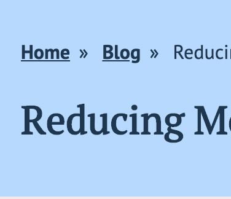

Hey friends! In this post, I am going to walk you through a newer media query (to me): `prefers-reduced-motion`.

Quick confession: I know CSS fundamentals, but I am pretty behind on all the new stuff that has been coming out. Because my focus is usually on accessibility, I am focusing far more on HTML and JavaScript. When I focus on CSS, it's ensuring proper color contrast or custom focus states. Sometimes I use CSS to make [checkboxes keyboard accessible](/blog/create-custom-keyboard-accesible-checkboxes). I always associated media queries with responsive design. I never thought of media queries as an accessibility enhancement.

In this post, we are updating my blog by:

1. Adding the `prefers-reduced-motion` query
1. Adding a user-controlled setting for reducing motion.

## Understanding `prefers-reduced-motion`

Animations, zooming, and panning can be problematic for people who have vestibular disorders. These disorders can cause motion sickness and vertigo. These are uncomfortable feelings that you don't want to deal with ever, let alone on a website. From what I understand, the [vestibular system](https://a11yproject.com/posts/understanding-vestibular-disorders/) is in your inner ear and helps to control balance.

According to [vestibular.org](https://vestibular.org/understanding-vestibular-disorder), up to 35% of adults aged 40 years or older in the United States have experienced some form of vestibular dysfunction. So this is not a small problem.

My major takeaways from the web accessibility perspective:

1. Be careful with your animations.
1. Be careful with your gifs.
1. Use `prefers-reduced-motion`.
1. Allow a user to control reduce motion.

### How you do it

Implementing the query is pretty simple:

```css
@media screen and (prefers-reduced-motion: reduce) {
  /* Reduced Motion Code */
}
```

There are a few places I have some animations for my links.

First, there are my links where I have a border-bottom that moves down when you hover over it.


Then there is my call to action link that scales 1.1x larger when we hover over it.


I was talking to [Andy Bell](https://twitter.com/andybelldesign/), and he gave me [some suggestions](https://github.com/andybelldesign/stalfos/blob/feature/v2/src/utilities/_reset.scss#L71) on implementation.

```css
@media screen and (prefers-reduced-motion: reduce) {
  * {
    animation-play-state: paused !important;
    transition: none !important;
    scroll-behavior: auto !important;
  }
}
```

After implementing the changes, we have the hover effects, but none of the transitions.


This strategy technically works well. However, I want to remove the hover effect altogether and keep the link as an underline. I may also play with the scale.

```css{8-12}
@media screen and (prefers-reduced-motion: reduce) {
  * {
    animation-play-state: paused !important;
    transition: none !important;
    scroll-behavior: auto !important;
  }

  a {
    padding-bottom: 0;
    border-bottom: none;
    text-decoration: underline;
  }
}
```

With that change, now all my links are just a simple underline.



Without the transition animation, the call to action links are a bit jarring going from `scale(1)` to `scale(1.1)` on hover. So I changed it to `scale(1.05)`.

```css{14-28}
@media screen and (prefers-reduced-motion: reduce) {
  * {
    animation-play-state: paused !important;
    transition: none !important;
    scroll-behavior: auto !important;
  }

  a {
    padding-bottom: 0;
    border-bottom: none;
    text-decoration: underline;
  }

  .blog__more-link a {
    text-decoration: none;
  }

  .blog__more-link a:hover {
    transform: scale(1.05);
  }

  .hero__cta a {
    text-decoration: none;
  }

  .hero__cta a:hover {
    transform: scale(1.05);
  }
}
```


### How to test on a mac

This setting is primarily available on macOS.

1. Go to System Preferences
1. Go to Accessibility
1. Go to Display
1. Check "Reduce Motion"

Easy Peasy! As soon as this post is published, you should be able to test this on my blog!

## Creating a user controlled option to reduce motion

[Andy Bell's dark mode post](https://andy-bell.design/wrote/create-a-user-controlled-dark-or-light-mode/) inspired me to add the user-controlled option. We want to have the user's preferences take priority. We also want to account for people who don't have these settings available to them.

Here's how we are going to do this:

1. Create a checkbox with the label "reduce motion."
1. Add a `checked` state and a method to toggle that state in my Gatsby App.
1. Use that state to control a `data-user-reduced-motion` attribute.
1. Apply the CSS using the above attribute.
1. Store that in `localStorage`, so we preserve the user settings.

### Creating a `<ReduceToggle />` Component

This component is an HTML checkbox with a label. As a disclaimer, I am using a `class` component and not hooks. I still like writing classes sometimes, and it was easier for my thought process. Keep an eye out for a hook version!

```jsx
import React from 'react'

class ReduceToggle extends React.Component {
  render() {
    return (
      <div className="toggle">
        <input id="reduce-motion" type="checkbox" />
        <label htmlFor="reduce-motion">Reduce Motion</label>
      </div>
    )
  }
}

export default ReduceToggle
```

The only thing I've done here is to create a checkbox input with an [associated form label](/blog/introduction-accessible-labeling). Something you may have noticed is that instead of for, React uses `htmlFor`.

After that, I place it in my `<Header />` component above the menu. I'll worry about styling finesse later; I know it'll break my layout, and that's ok. We are only worried about functionality right now.

### Adding in the states

We want to go ahead and add a `checked` state to our constructor.

```jsx{4-10}
import React from 'react'

class ReduceToggle extends React.Component {
  constructor(props) {
    super(props)

    this.state = {
      checked: false,
    }
  }

  render() {
    return (
      <div className="toggle">
        <input id="reduce-motion" type="checkbox" />
        <label htmlFor="reduce-motion">Reduce Motion</label>
      </div>
    )
  }
}

export default ReduceToggle
```

Now we are going to add that state to the checkbox itself.

<!--prettier-ignore-->
```jsx{13,20}
import React from 'react'

class ReduceToggle extends React.Component {
  constructor(props) {
    super(props)

    this.state = {
      checked: false,
    }
  }

  render() {
    const { checked } = this.state

    return (
      <div className="toggle">
        <input
          id="reduce-motion"
          type="checkbox"
          checked={checked}
        />
        <label htmlFor="reduce-motion">Reduce Motion</label>
      </div>
    )
  }
}

export default ReduceToggle
```

Next, we want to add a `toggleChecked` method for the `onChange` event.

<!--prettier-ignore-->
```jsx{12-14,25}
import React from 'react'

class ReduceToggle extends React.Component {
  constructor(props) {
    super(props)

    this.state = {
      checked: false,
    }
  }

  toggleChecked = event => {
    this.setState({ checked: event.target.checked })
  }

  render() {
    const { checked } = this.state

    return (
      <div className="toggle">
        <input
          id="reduce-motion"
          type="checkbox"
          checked={checked}
          onChange={this.toggleChecked}
        />
        <label htmlFor="reduce-motion">Reduce Motion</label>
      </div>
    )
  }
}

export default ReduceToggle
```

I always like to double-check that the state is working using [React Developer Tools](https://github.com/facebook/react-devtools). To do this:

- I inspect the element
- Go to the React Tab
- Find the `ReduceToggle` component
- Ensure the state is working correctly!


Now we know the state is working. Let's toggle the `data-user-reduced-motion` attribute value on the `documentElement`. I'm going to add that in the `componentDidUpdate` lifecycle method.

<!--prettier-ignore-->
```jsx{12-22}
import React from 'react'

class ReduceToggle extends React.Component {
  constructor(props) {
    super(props)

    this.state = {
      checked: false,
    }
  }

  componentDidUpdate() {
    const { checked } = this.state

    if (checked) {
      document.documentElement
        .setAttribute('data-user-reduced-motion', true)
    } else {
      document.documentElement
        .setAttribute('data-user-reduced-motion', false)
    }
  }

  toggleChecked = event => {
    this.setState({ checked: event.target.checked })
  }

  render() {
    const { checked } = this.state

    return (
      <div className="toggle">
        <input
          id="reduce-motion"
          type="checkbox"
          checked={checked}
          onChange={this.toggleChecked}
        />
        <label htmlFor="reduce-motion">Reduce Motion</label>
      </div>
    )
  }
}

export default ReduceToggle
```


### Adding CSS to the `data-user-reduced-motion`

Word of warning. It's tempting to jump into the CSS and copy and paste all the things. I recommend doing this one step at a time. I made the mistake of trying to do it all at once and spent a lot more time debugging than I wanted to. So first let's go back to the goals of what we want.

> We want user preference to rule over system preferences. We'll add the system preferences as a **progressive enhancement**.

Gatsby is a Static Site Generator, so if JavaScript doesn't load, most of my static site should load. However, if JavaScript doesn't load, we want to fallback on system preferences when the `data-user-reduced-motion` attribute doesn't exist. So we are going to add a little bit to the query that we did in the first section about the media query itself. So we are using the `:not()` CSS pseudo-class to do that.

```css{2,8,14,18,22,26}
@media screen and (prefers-reduced-motion: reduce) {
  :root:not([data-user-reduced-motion]) * {
    animation-play-state: paused !important;
    transition: none !important;
    scroll-behavior: auto !important;
  }

  :root:not([data-user-reduced-motion]) a {
    padding-bottom: 0;
    border-bottom: none;
    text-decoration: underline;
  }

  :root:not([data-user-reduced-motion]) .blog__more-link a {
    text-decoration: none;
  }

  :root:not([data-user-reduced-motion]) .blog__more-link a:hover {
    transform: scale(1.05);
  }

  :root:not([data-user-reduced-motion]) .hero__cta a {
    text-decoration: none;
  }

  :root:not([data-user-reduced-motion]) .hero__cta a:hover {
    transform: scale(1.05);
  }
}
```

Then we add the CSS **outside** the query for if the `data-user-reduced-motion="true"`.

```css
:root[data-user-reduced-motion='true'] * {
  animation-play-state: paused !important;
  transition: none !important;
  scroll-behavior: auto !important;
}

:root[data-user-reduced-motion='true'] a {
  padding-bottom: 0;
  border-bottom: none;
  text-decoration: underline;
}

:root[data-user-reduced-motion='true'] .blog__more-link {
  text-decoration: none;
  padding: 12px 14px;
  border: 2px solid;
}

:root[data-user-reduced-motion='true'] .blog__more-link:hover {
  transform: scale(1.05);
}

:root[data-user-reduced-motion='true'] .hero__cta__link {
  text-decoration: none;
  padding: 12px 14px;
  border: 2px solid;
}

:root[data-user-reduced-motion='true'] .hero__cta__link:hover {
  transform: scale(1.05);
}
```

To test, I did the following:

1. Turned off any reduce motion settings on macOS
1. With the Reduce Toggle unchecked, ensure that all animations are still there.
1. Check the Reduce Toggle Checkbox and see that all the CSS changes to reduce motion are working.
1. In the element inspector, go to the `<html>` document and find the `data-user-reduced-motion`. Remove that attribute. Here we are simulating that that attribute never loaded.
1. Go to the system preferences and check Reduce Motion. We should have the CSS changes for reduced motion!

### Adding `localStorage`

Now that we have that working, we want to start playing with `localStorage`. We want to preserve the user's preferences for the future. Choosing your settings every time you visit isn't the best user experience. If you don’t know what `localStorage` is, I would recommend pausing here and glancing over the [docs](https://developer.mozilla.org/en-US/docs/Web/API/Window/localStorage). If you like video examples, take a look at [Wes Bos’s JS30 tutorial](https://www.youtube.com/watch?v=YL1F4dCUlLc).

The first thing we are going to do is set the `localStorage` on the `componentDidMount`.

```jsx{12-17}
import React from 'react'

class ReduceToggle extends React.Component {
  constructor(props) {
    super(props)

    this.state = {
      checked: false,
    }
  }

  componentDidMount() {
    let reduceMotionOn = localStorage.getItem('reduceMotionOn')
    console.log(reduceMotionOn)
    // if we haven't been to the site before
    // this will return null
  }

  // All other code stuff

  render() {
    return (
      <div className="toggle">
        <input id="reduce-motion" type="checkbox" />
        <label htmlFor="reduce-motion">Reduce Motion</label>
      </div>
    )
  }
}

export default ReduceToggle
```

Now what we want to do is create a default localStorage state for the user if the `reduceMotionOn` is null. I'm going to set that to `false`.

```jsx{12-24}
import React from 'react'

class ReduceToggle extends React.Component {
  constructor(props) {
    super(props)

    this.state = {
      checked: false,
    }
  }

  componentDidMount() {
    let reduceMotionOn = localStorage.getItem('reduceMotionOn')

    // Just a way to get around localStorage being
    // stored as a string and not a bool
    if (typeof reduceMotionOn === 'string') {
      reduceMotionOn = JSON.parse(reduceMotionOn)
    }

    if (reduceMotionOn === null) {
      localStorage.setItem('reduceMotionOn', false)
    }
  }

  // All other code stuff

  render() {
    return (
      <div className="toggle">
        <input id="reduce-motion" type="checkbox" />
        <label htmlFor="reduce-motion">Reduce Motion</label>
      </div>
    )
  }
}

export default ReduceToggle
```

The last thing I am going to do upon mounting the component is set the state in the app. I want to ensure that my app's is the same as the `localStorage`.

```jsx{21}
import React from 'react'

class ReduceToggle extends React.Component {
  constructor(props) {
    super(props)

    this.state = {
      checked: false,
    }
  }

  componentDidMount() {
    let reduceMotionOn = localStorage.getItem('reduceMotionOn')
    if (typeof reduceMotionOn === 'string') {
      reduceMotionOn = JSON.parse(reduceMotionOn)
    }

    if (reduceMotionOn === null) {
      localStorage.setItem('reduceMotionOn', false)
    }
    this.setState({ checked: reduceMotionOn })
  }

  // All other code stuff

  render() {
    return (
      <div className="toggle">
        <input id="reduce-motion" type="checkbox" />
        <label htmlFor="reduce-motion">Reduce Motion</label>
      </div>
    )
  }
}

export default ReduceToggle
```

Go to Application > Local Storage in Chrome Dev Tools (Storage > Local Storage in Firefox). Then, clear the `reduceMotionOn` storage. Upon refresh, you should see that the `reduceMotionOn` is false. If you go to React Dev Tools and go to the `<ReduceToggle />` component, you’ll find that the checked state matches the reduceMotionOn localStorage item.

That's not all! We have to toggle the localStorage in the `toggleChecked` method in the React component.

```jsx{15}
import React from 'react'

class ReduceToggle extends React.Component {
  constructor(props) {
    super(props)

    this.state = {
      checked: false,
    }
  }

  // All other code stuff

  toggleChecked = event => {
    localStorage.setItem('reduceMotionOn', event.target.checked)
    this.setState({ checked: event.target.checked })
  }

  render() {
    return (
      <div className="toggle">
        <input id="reduce-motion" type="checkbox" />
        <label htmlFor="reduce-motion">Reduce Motion</label>
      </div>
    )
  }
}

export default ReduceToggle
```

Now if I check Reduce motion and leave the site, my user-controlled preferences are preserved!

## Conclusion

Thanks for joining me while I added a progressively enhanced accessibility feature to my blog! I hope you learned something along the way. Shout out to Andy for inspiring me to write this post!

These are the key takeaways from this post, regardless of the framework that you use:

1. Be careful with what you animate and provide options for those who have vestibular disorders.
1. User-controlled > System Preferences
1. Have system preferences for progressive enhancements
1. Use `localStorage` to your benefit so that the user settings are preserved!

If you'd like to play around with this, I've made a CodeSandbox for you!

<iframe src="https://codesandbox.io/embed/laughing-sutherland-76xj6?fontsize=14" title="Testing Reducing Motion" allow="geolocation; microphone; camera; midi; vr; accelerometer; gyroscope; payment; ambient-light-sensor; encrypted-media" style="width:100%; height:500px; border:0; border-radius: 4px; overflow:hidden;" sandbox="allow-modals allow-forms allow-popups allow-scripts allow-same-origin"></iframe>

Stay in touch! If you liked this article:

- Let me know on [Twitter](https://twitter.com/LittleKope) and share this article with your friends! Also, feel free to tweet me any follow up questions or thoughts.
- Support me on [Patreon](https://www.patreon.com/a11ywithlindsey)! If you like my work, consider making a monthly pledge.
- [Be the first to learn about my posts](https://pages.convertkit.com/4218bd5fb5/68dc4e412a) for more accessibility funsies!

Cheers! Have a great week!
