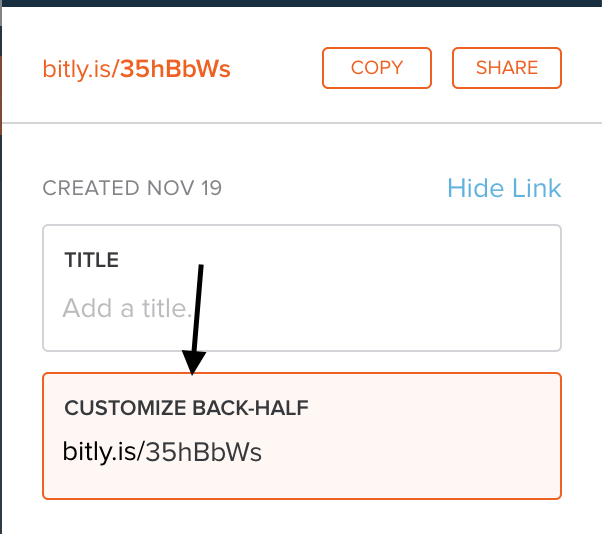
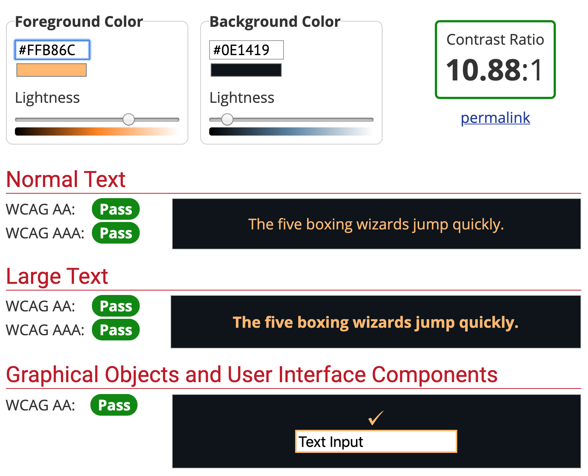
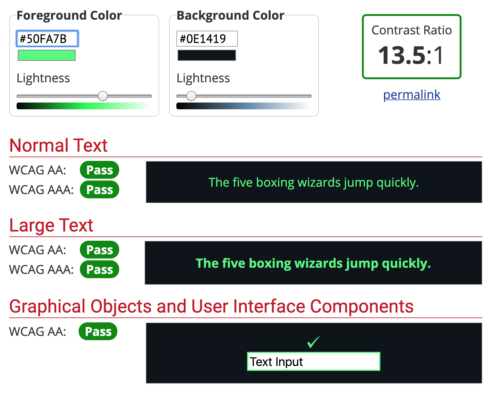
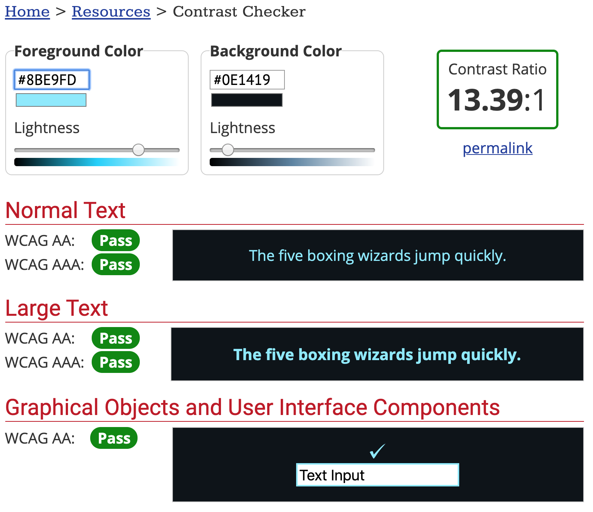
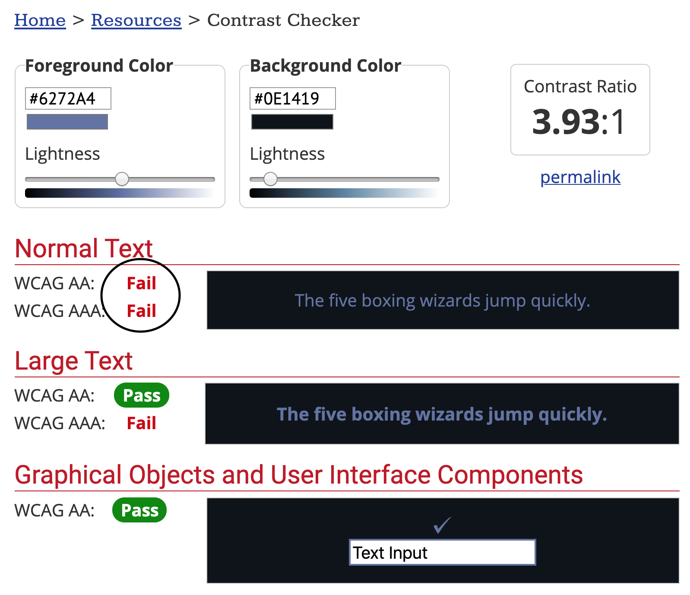

Hey friends! Wedding planning is starting to heat up with five months left to go. I was pretty ambitious about my writing schedule when I started my second year of blogging. I figured I had so much more free time on my hands versus what I had six months ago. But I didn’t account for the timeliness of my wedding and my other goals. Whoops. This blog is a work in progress, just like me.

Anyways, about a month ago, I presented at a11yTO conference. It was the first time that I had spoken in a while. It reminded me of how much I’ve learned about accessibility beyond the web. Speaking at an accessibility conference forced me to think about my speaker tendencies. For example, I tend to forget words when I’m nervous. I wanted to make sure I wasn’t unintentionally excluding people due to my nerves. So I practiced my presentation several times. I thought critically about everything that I said that could exclude others. I even made a few mistakes that I will be fixing in the future.

Here are my 10 tips for what I’ve learned from this past month.

## Introducing yourself with your pronouns

I foresee a future where pronouns are standard. I’ve been adding my pronouns to as many places as I can. I added it to my email signature and my Twitter handle. It wasn’t until I spoke last that I thought, “why don’t I add it to my speaker slides?”

However, it’s not enough to write your pronouns onto your slides. Introducing yourself with your pronouns is vital. Here’s the format I try to take on:

> "Hi! I am Lindsey Kopacz. My pronouns are she/her. Today we will be talking about [insert presentation name]."

Simple and Inclusive!

## Creating readable shortened links

Whenever I link out to **anything**, I ensure that I use bit.ly to create a shortened version. However, it’s not ideal to have "bit.ly/37oSXR". Did you know that if you have a free account with bit.ly, you can customize the link name?

Here's how to get started:

1. Go to the [bit.ly](https://bitly.com/) website and sign up for free.
1. Once you're signed in and set up, go to your dashboard
1. In the upper right-hand corner, click on “Create”
1. In the Paste URL field, put your link.
1. After you created your link, go to the “Customize Back-Half” field. After "bit.ly," type in your custom URL! (Note you cannot do custom domains unless you pay)
1. Press save and copy!

Before:

and After:

And voilà! There you have it!

When you include the visual text for this link, don't include the `http://`. It doesn’t look sightly, and when your users go without it, it won’t impact your link!

Including the link is not enough. Physically read it. Don’t say, “here’s the link if you want to check it out.” Instead, say:

> "If it's easier for you to follow along on your computer, the link is bit dot L Y slash testing dash out dash B I T L Y."

I’ll talk more about the phonetics a little later. But it’s essential actually to say your link. It helps those who are not able to see your slides.

## Include your slide link at the beginning

Now you have customized links! So your first slide after your introduction is your link to your slides. If someone prefers to use their assistive tech to go through your slides, they can.

Also, for those who have trouble keeping up, your audience can take a look at the slide if they missed something. For example, I have ADHD and sometimes need to re-read certain things for the information to seep in.

As a bonus, sometimes it’s helpful to include your link on all slides (in an unobtrusive way, of course). If you do this, you don't need to read it out on every slide, only on that first one.

## Spell out abbreviations, especially for links

We don’t want to make any assumptions that people know how to spell abbreviations that we use. We also don't want to assume how we pronounce something that isn’t a common word is how someone else may interpret it.

A lot of my bit.ly’s have the word “a11y” in them, and I have made the mistake of pronouncing it “ally” during a presentation. Even at an accessibility conference, how would the audience know that I am not saying “ally?” Instead, what I should be saying is “A eleven Y.”

To take it a step further for necessary information (like links), I can ensure I spell out everything. So let's rewrite how I would announce the link in the section:

> "If it's easier for you to follow along on your computer, here's the link spelled out: B I T dot L Y slash T E S T I N G dash O U T dash B I T L Y."

Also, as a note, make sure you enunciate and speak slowly while you do this.

## Having proper contrast on your slides (and code samples!)

Have you ever been watching a presentation, and you cannot see what the slides say? You have to think about contrast even more than you would for a web site. When you consider glare and fluorescent lighting, your slides could be washed out.

Sometimes “pretty” slides aren’t the best contrast. I would much prefer that people were able to read my content. Something I’ve started doing is taking my blog theme and using those colors for my slides. That way, it’s very “on brand” and also high contrast.

I will say, the biggest offender I've seen is when people go over code samples. Have you checked your VSCode theme for contrast? What about your CodeSandbox theme?

So many code themes are notoriously lousy contrast. For example, I use the [Dracula At Night](https://marketplace.visualstudio.com/items?itemName=bceskavich.theme-dracula-at-night) VSCode theme. While most of the colors have excellent contrast, comments only past for large text. Usually, if you use a VSCode theme, they have a Github repo where they tell you all the colors. If it’s not in the README, it’s usually in the code repo somewhere. I found mine in this [TypeScript file](https://github.com/bceskavich/dracula-at-night/blob/master/src/themes/DraculaAtNight.ts).

So the orange, green, and blue texts below have accessible contrast for my code theme (Note: I used WebAim's [Contrast Checker](https://webaim.org/resources/contrastchecker/) to check the contrast):

But the comments, which I find essential to communicating to an audience what I am doing, is not:

The comments **technically** pass for large text. But how would that look on a screen where there’s glare?

If you're not using VSCode and using [CodeSandbox](https://codesandbox.io/), test out the theme. Write some comments and some code and use the wave tool or Google Dev Tools to check out the contrast. I always use the High Contrast theme for CodeSandbox.

## Articulate alt text

I am a big fan of being descriptive and creative in your alt text. One of my first blog posts was about [Writing Alternative Text that Matter](/blog/writing-alternative-text-matters). A lot of times, we will use images as visual aids in our presentations. They’re fun and help you with storytelling. But you are excluding your visually disabled audience when you present the image without comment.

So, before you present your gif or meme without comment, articulate it. Why do you have it in your presentation? Are you posting a gif that shows your annoyance when a client says something? Describe what the gif is doing and say it's a metaphor for how you feel.

## Avoid using vague words

I tend to use vague words, instead of articulating what I mean. I'll point to items on the screen and say, "here we do this" or "this means." I've been trying to improve my word usage in my writing as well.

I challenge myself to ask myself: “what is here?” Or “What is this?” The only time I use "this" now is when I am referencing JavaScript `this`. But even then, I will be sure to clarify to my audience about its usage.

## Content Warnings before Gifs

In my blog post about [Reducing Motion](/blog/reducing-motion-improve-accessibility), you learn that too much animation can be problematic. Certain animations from gifs cause dizziness and vertigo for those with vestibular disorders.

There are a few gifs that I frequently see on Twitter that bother me for this reason. Give a content warning before you post a slide that has a gif.

## Not using too much slide animation

Most slide animation is unnecessary. People are coming to your talk because they want to hear you speak. They aren't coming because they want to see fancy slide animations.

If you want to reduce motion, I would go with fade animation versus sliding animation.

## Ensure the conference is accessible

We don’t have optimal control over the conference itself. But as speakers, we have a unique ability to influence. I mean, without speakers, conference organizers wouldn’t have a conference, right? Using your influence is especially important if the conference is **for profit**. I don’t speak as often as I used to. But now, when I do, I feel that I can be particular. Tatiana Mac’s [Speaker Rider](https://gist.github.com/tatianamac/493ca668ee7f7c07a5b282f6d9132552#conference-logistics), particularly the conference logistics section, has inspired me.

If the conference says they cannot afford it, I wonder:

- Do they provide an open bar at their festivities?
- Do they have unnecessary swag?
- Do they have random giveaways?
- What's the price of their ticket? Is it a free conference?
- Are there free ways to make the event more accessible?

Here are some inclusive conference examples that I've seen:

- Onsite post-conference events or Accessible transportation to them
- Transcriptionist or Sign Language Interpreter (or both)
- Ramps everywhere
- Alternatives to Speaker Podiums
- Elevators

## Conclusion

I’ve said this before, and I’ll repeat it. Accessibility isn’t about coding (even though this blog talks mostly about coding). Accessibility is about **people**. Accessibility is about including and protecting people in minoritized groups. So I hope these tips help you! Let me know what tips you have!

Stay in touch! If you liked this article:

- Let me know on [Twitter](https://twitter.com/LittleKope) and share this article with your friends! Also, feel free to tweet me any follow up questions or thoughts.
- Support me on [patreon](https://www.patreon.com/a11ywithlindsey)! If you like my work, consider making a monthly pledge. I also do a monthly Ask Me Anything Session for all Patrons!
- [Be the first to learn about my posts](https://pages.convertkit.com/4218bd5fb5/68dc4e412a) for more accessibility funsies!

Cheers! Have a great week and a great holiday if you're in America!
