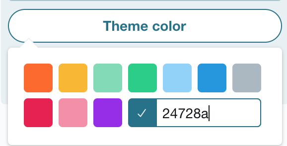

I wrote a tweet thread a while back where I started talking about ways to keep accessibility in mind on the platforms we use such as Twitter. Sometimes we don’t have control over the platforms we use, and the best we can do is ensure our content is accessible. This tweet thread got a decent amount of attention, but unfortunately, it’s easy for things to get lost in the Twitterverse. I decided to write a blog post elaborating a bit more on each of the critical points I made while also ensuring that you could find them more easily.

## Be careful with your emoji use

<blockquote class="twitter-tweet" data-lang="en">
Thank 👏 you 👏 Kent! (don&#39;t do the clap thing either, it&#39;s a huge pain in screen readers)
&mdash; Marcy Sutton (@marcysutton) <a href="https://twitter.com/marcysutton/status/1083074150749503488?ref_src=twsrc%5Etfw">January 9, 2019</a></blockquote>

Marcy pointed out here how the clapping hands are actually a pain for screenreaders. Here’s what it sounds like if you turn on your screenreader:

<video controls>
  <source src="/marcy-sutton-clapping-tweet.mp4" type="video/mp4">
</video>

“Thank clapping hands you clapping hands Kent.” Can you imagine if it was done between every single word on a longer sentence? I see passionate people do this all the time, particularly when they want to say something regarding social issues. I get torn between two worlds because I know how awful it is for screenreaders, but usually, there is a message behind the tweet that I support.

In general, we should be careful about our emoji use. I created a tweet just for the purposes of this blog post. If we clog an entire tweet with just emojis and no words, this is what it sounds like:

<video controls>
  <source src="/emojis-screenreader.mp4" type="video/mp4">
</video>

I love emojis, but let's not abuse them. We should use words more!

## Don’t use special characters in your handle or your tweets

I’ve already mentioned this tweet in previous posts, but I’ll repeat it:

<blockquote class="twitter-tweet" data-lang="en">
You 𝘵𝘩𝘪𝘯𝘬 it&#39;s 𝒸𝓊𝓉ℯ to 𝘄𝗿𝗶𝘁𝗲 your tweets and usernames 𝖙𝖍𝖎𝖘 𝖜𝖆𝖞. But have you 𝙡𝙞𝙨𝙩𝙚𝙣𝙚𝙙 to what it 𝘴𝘰𝘶𝘯𝘥𝘴 𝘭𝘪𝘬𝘦 with assistive technologies like 𝓥𝓸𝓲𝓬𝓮𝓞𝓿𝓮𝓻? <a href="https://t.co/CywCf1b3Lm">pic.twitter.com/CywCf1b3Lm</a>
&mdash; Kent C. Dodds (@kentcdodds) <a href="https://twitter.com/kentcdodds/status/1083073242330361856?ref_src=twsrc%5Etfw">January 9, 2019</a></blockquote>

If you listen to his video, can you hear how much it doesn’t make any sense? It may not be as cute or as fancy, but it's usually a good idea to not try to use fonts that are unsupported on the platform. Twitter doesn't give you the ability to choose a font, so you shouldn't try without testing to ensure it works for everyone.

## Enable Alternative Text on your Tweets

And actually use them! If you’re on your Desktop computer, you can enable them by:

1. Click on your Profile Picture and go to Settings & Privacy
2. Go to the Accessibility Section in the left sidebar
3. Check “Compose image descriptions”

Look, I even recorded it for you!

Once you get this enabled, you should be able to see an “Add Description” on your images. Also, Twitter, why isn't this enabled by default?

## Test your Profile’s Page Contrast

Have you ever tested the color contrast on your Twitter Profile theme? After checking the default themes on my Twitter profile, I discovered that they have shockingly poor contrast. I use the [Webaim Color Contrast Checker](https://webaim.org/resources/contrastchecker/) to see what the contrast is. The minimum contrast for Large Text is 3:1 and for small text is 4.5:1. Here are the contrast colors:

1. **Orange Theme** - The background color is `#FE6A1F` on a white foreground color which has a contrast of 2:88:1. (FAIL)
2. **Yellow Theme** - The background color is `#FAB81D` on a white foreground color which has a contrast of 1.76:1. (FAIL)
3. **Light Mint Theme** - The background color is `#7FDBB6` on a white foreground color which has a contrast of 1.65:1. (FAIL)
4. **Mint Theme** - The background color is `#19CE86` on white foreground color which has a contrast of 2.06:1. (FAIL)
5. **Periwinkle Theme** - The background color is `#91D1FA` on a white foreground color which has a contrast of 1.65:1. (FAIL)
6. **Blue Theme** - The background color is `#1A94E0` on a white foreground color which has a contrast of 3.30:1. (PASS large text only)
7. **Gray Theme** - The background color is `#ABB8C1` on a white foreground color which has a contrast of 2.03:1. (FAIL)
8. **Dark Pink Theme** - The background color is `#E81C4F` on a white foreground color which has a contrast of 4.46:1. (PASS large text only)
9. **Light Pink Theme** - The background color is `#F58EA7` on a white foreground color which has a contrast of 2.26:1. (FAIL)
10. **Purple Theme** - The background color is `#981CEB` on a white foreground color which has a contrast of 5.67:1. (PASS both large and small text)

So if you count that, out of 10 themes only 1 (!!) has a passing contrast on both large and small text. 2 pass with larger text. The rest fail. This stinks on Twitter's part, but you can also add your own custom HEX Color Code! I just changed mine to have it be one of the colors in my design on my site.

## Communicate with words, not symbols making a picture

“Today’s tea” seems to be pretty popular on Twitter, but I can’t stop thinking about what this sounds like on a screen reader.

<blockquote class="twitter-tweet" data-lang="en">
Today&#39;s tea:                       (             (           )        ) _(_____)____(_____(____(_  \          Grad students /_    \       should be         /    |      \      paid livable    /___|        \    wages for     /          \   their hard   /            \_   work     _/
&mdash; Jay Shelat (@jshelat1) <a href="https://twitter.com/jshelat1/status/1093314977077911558?ref_src=twsrc%5Etfw">February 7, 2019</a></blockquote>

Because I couldn't stop thinking about it, I found a tweet and turned on my screen reader. This is what it sounds like:

<video controls>
  <source src="todays-tea.mov">
</video>

So, uh, yeah. Not sure how to fix it aside from not doing it.

## Transcribe Memes and Gifs

As of this writing, there is no way to add alt text to gifs. I usually do this by typing in `[gif alt: Descriptive phrase]` in the body whenever I add a gif. Sometimes I see people respond back to me with a gif message and a gif alt back, and that makes my heart sing. You should do the same with Memes, especially once you have enabled Alternative Text on your photos using the tip above. (Source: [Life of a Blind Girl: 6 ways to make your social media posts accessible for people with a visual impairment](https://lifeofablindgirl.com/2018/10/31/6-ways-to-make-your-social-media-posts-accessible-for-people-with-a-visual-impairment/))

## Capitalize the words in your hashtags

This one is new to me, but it makes a lot of sense. Without it, it makes a lot of screen readers mash up the words and sound like a jumbled mess. (Source: [Life of a Blind Girl: 6 ways to make your social media posts accessible for people with a visual impairment](https://lifeofablindgirl.com/2018/10/31/6-ways-to-make-your-social-media-posts-accessible-for-people-with-a-visual-impairment/))

## Conclusion

I want to thank people who write blog posts like the one mentioned for the source of the last two sections. If you haven't already, I would read that article because there are items that I wanted to include, but this post was starting to get too long. Even as an accessibility person, I still have a ton to learn about these platforms. I have also learned a lot from great advocates in tech as well, such as [Marcy Sutton](https://twitter.com/marcysutton), [Deborah Edwards-Onoro](https://twitter.com/redcrew), and [Tatiana Mac](https://twitter.com/tatianatmac)! Accessibility isn’t just about coding, it’s about real people who use products that have become everyday use and commonplace.

Remember to think before you tweet. Who are you potentially excluding from reading your Twitter content? If you have any thoughts on this post, feel free to reach out to me on, you guessed it, [Twitter](https://twitter.com/LittleKope/).
