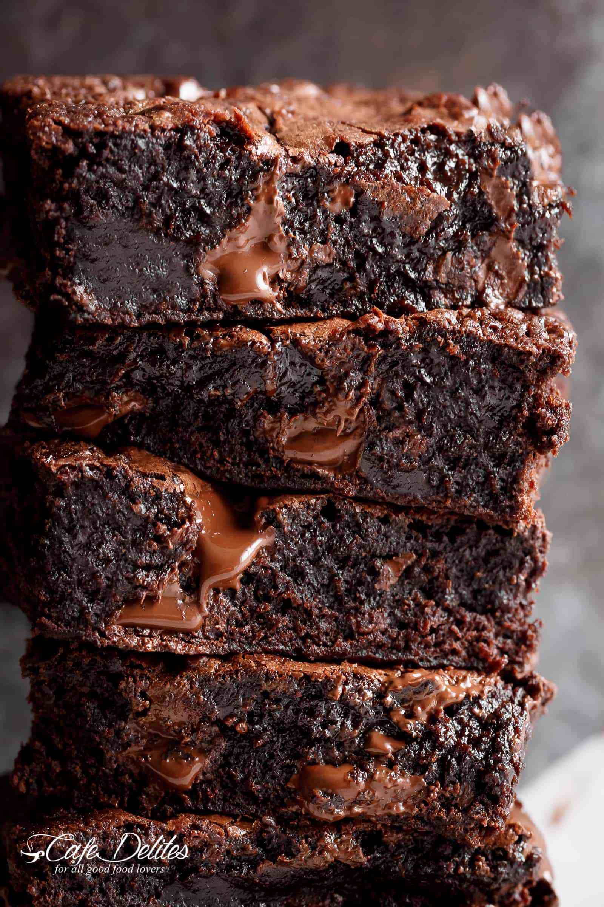

If I ask anyone what accessibility means to them, usually the first thing that they can identify is “Adding alt text!” All you have to do is add alt tags to your images makes your site way more accessible, right? I love the enthusiasm to reduce accessibility errors, but I am about to give you an infuriating response. **It depends**.

Adding alt text may mean that you don’t get pesky errors about missing alternative text on an Accessibility Scan, but it doesn’t necessarily mean that your images have a better meaning. Sometimes an empty alt tag is actually what you need for a more accessible image. Are you envisioning the mind blown emoji and/or gif yet?


That’s how I felt when I was learning about it, and it made me realize how much bad advice I had given to others about fixing alt text. Hopefully, my conscience is clear after this blog post! I used to think that every single image had to have alternative text, and didn't really put much thought into how to write it. I would love to give some of my tips to not only help you avoid accessibility errors but to think more critically and strategically about how you are giving your visually impaired users the best experience possible.  

I have a few strategies to start writing better alternative text, I usually ask myself the below questions.

##Is it decorative?

The first thing I want anyone to think about before they start diving into their CMS's media gallery is not technical at all. It's strategic. What is the _purpose_ of that image being there? If we took away that image for visually able users, would we still get the information we needed? The reason I mention this first is because this is relatively simple to ask yourself before you get started. Let's start off with a practical example that lots of organization websites have - Biography pages. 


Let’s say we have a “Team” page on our site where we can click a link that directs us to the person's page to read more information. We click into the CEO’s page and there’s a headshot of the CEO of the business. A lot of the time, the CEO's photo doesn't screw with your accessibility testing because you will see something in the alt text such as “Photo of the CEO, John Paul.” For headshots like this, this type of information is pretty useless and redundant to those with visual impairments. All the important information is about the CEO is likely right next to his photo. That would make this photo decorative, and therefore an empty alt="" would suffice.

Another time where I can think about alternative text being empty is when we are using image icons. As a note, when I say image icons I do not mean using icon fonts like Font Awesome. Take the below example:


In this instance, we are not using these image icons to convey any meaning. This is just to _decorate_ every list item in the "Powerful Features" list. It is adding some design pizazz, but not really adding any syntactical value that a visually impaired user would be missing out on.

From an empathetic standpoint, when you put non-empty alternative text on a decorative image, what does it do for a visually impaired user? If I were in their shoes, and I wanted to learn about what the powerful features were, I think I would be annoyed hearing images read out that did not communicate any value to me. This is usually the question I ask myself when I think about whether something is decorative or not. 

##What is the context of this image?

Before thinking about the descriptor, sometimes we need to ask the question first: form or function? Sometimes the easiest way to think of this is “Is this a link or a button, or is this content?” Granted, this doesn’t cover all your bases, but asking yourself whether it _does something_ like go to another page or _describes something_ that adds context to our content is usually a good first start.

### Images that do things

First, let's cover an example that **does something**. Let's take the following code here. It's a Facebook icon that directs to the organization's Facebook page. Currently, it does not have any alt text.
```
<a href="https://www.facebook.com/DrupalGovCon">
  
</a>
```

Sometimes it's tempting to add alt text here that would describe the image. Like this:
```
<a href="https://www.facebook.com/DrupalGovCon">
  
</a>
```

The problem with this is that describing it doesn't really help add context to what this image does. Someone using a screen reader may be able to take a logical guess about where the link is going based on all the other context of the entire site. However, I don't want my users to guess, I want them to know! If one clicks on this image, it will go to the DrupalGovCon Facebook page. Let's make it super clear to the end user, regardless of visual ability where this link is going:

```
<a href="https://www.facebook.com/DrupalGovCon">
  
</a>
```

### Images that Describe Things

Now let's go over an example that **describes something**. I really love following food bloggers (although I usually hate how long their pages take to load, haha), and seeing what recipes they have. Admittedly, this is not a food blogger I follow, but I googled "best brownie recipe" and this was the first recipe I found. And holy guacamole, do these brownies look amazing based off the pictures!


<div class="source">Source: <a href="https://cafedelites.com/worlds-best-fudgiest-brownies/">Cafe Delights</a></div>

How would you create this image's alt text? This is a really fun time to get creative! Because this is a food blogger, you'd probably want to describe it in a way that sounds appetizing and makes you think "I don't care if I am cutting my sugar intake, I must make those brownies now!" 

Here's what I did:
```

```


##What is your content strategy?

Are we writing alternative text for images that are embedded in our copywriting? Is this an image that the designer specifically wanted to communicate our brand? We need to think about who is involved in these decisions because that is who we will want to be involved in writing our alternative text. 

Now let's go to another area of the site that focuses more on marketing a new cookbook. Let's say that the marketing department had spent a lot of time researching their target audience using focus groups, survey's, etc. Then they put a lot of effort into their marketing plan and decided that the visuals were really important to their marketing. They partnered with a photographer and got new images of delicious recipes. Wouldn't you want the _purpose_ of those photographs to be reflected with assistive technology? We probably want to describe the recipe the same way a TV Cooking Show host might: "spicy Italian sausage and peppers with plenty of green herbs."

>Wouldn't you want the _purpose_ of those photographs to be reflected with assistive technology?

 
That's why strategy is more important than the technical aspect. This means that you _should_ be partnering with your Marketing Strategy team about writing alternative text. If that team doesn't exist, at the very least we thought about the purpose of the image being there. My favorite example is the example to the right from [WebAim's documentation on Alt Text](https://webaim.org/techniques/alttext/#context). There is an image of George Washington in a battle, but if we were on a site about history or if we were on a site about art, this same image would have very different alternative text.

##Don't overthink it

If you are having difficulty with this, try to take these three questions with you in this order. It decreases your chances of overthinking it (which frankly, I am the queen of doing). And remember, it's a work in progress. Your alternative text can adapt and improve over time :).
